# 技术架构

## 📑 目录

-   [架构概览](#架构概览)
-   [MonoRepo 架构设计](#monorepo-架构设计)
    -   [架构设计理念](#架构设计理念)
    -   [依赖管理策略](#依赖管理策略)
    -   [任务编排系统](#任务编排系统)
-   [模块架构](#模块架构)
    -   [应用层（apps）](#应用层apps)
    -   [库层（libs）](#库层libs)
    -   [备份层（backup）](#备份层backup)
-   [数据库架构](#数据库架构)
    -   [数据库设计原则](#数据库设计原则)
    -   [实体关系模型](#实体关系模型)
    -   [索引策略](#索引策略)
    -   [数据迁移策略](#数据迁移策略)
-   [认证架构](#认证架构)
    -   [认证流程](#认证流程)
    -   [OAuth 2.0 集成](#oauth-20-集成)
    -   [JWT 令牌管理](#jwt-令牌管理)
    -   [令牌黑名单](#令牌黑名单)
-   [多租户架构](#多租户架构)
    -   [租户隔离策略](#租户隔离策略)
    -   [租户上下文管理](#租户上下文管理)
    -   [数据隔离实现](#数据隔离实现)
    -   [租户性能优化](#租户性能优化)
-   [权限控制架构](#权限控制架构)
    -   [RBAC 模型](#rbac-模型)
    -   [权限验证流程](#权限验证流程)
    -   [角色权限关联](#角色权限关联)
    -   [动态权限管理](#动态权限管理)
-   [插件系统架构](#插件系统架构)
    -   [插件生命周期](#插件生命周期)
    -   [插件依赖管理](#插件依赖管理)
    -   [插件通信机制](#插件通信机制)
    -   [插件热加载](#插件热加载)
-   [审计系统架构](#审计系统架构)
    -   [审计日志模型](#审计日志模型)
    -   [审计拦截器](#审计拦截器)
    -   [审计日志查询](#审计日志查询)
    -   [审计性能优化](#审计性能优化)
-   [消息队列架构](#消息队列架构)
    -   [队列设计](#队列设计)
    -   [任务处理器](#任务处理器)
    -   [队列监控](#队列监控)
    -   [失败重试机制](#失败重试机制)
-   [API 网关架构](#api-网关架构)
    -   [请求路由](#请求路由)
    -   [中间件链](#中间件链)
    -   [限流策略](#限流策略)
    -   [缓存策略](#缓存策略)
-   [缓存架构](#缓存架构)
    -   [缓存层级](#缓存层级)
    -   [缓存策略](#缓存策略)
    -   [缓存失效](#缓存失效)
    -   [缓存监控](#缓存监控)
-   [监控和日志架构](#监控和日志架构)
    -   [日志系统](#日志系统)
    -   [指标监控](#指标监控)
    -   [链路追踪](#链路追踪)
    -   [告警系统](#告警系统)
-   [部署架构](#部署架构)
    -   [容器化部署](#容器化部署)
    -   [环境配置](#环境配置)
    -   [水平扩展](#水平扩展)
    -   [高可用设计](#高可用设计)

---

## 架构概览

OKSAI 平台采用现代化的微服务架构，基于 MonoRepo（单仓库）模式，使用 NestJS 框架构建，支持多租户 SAAS 业务场景。

**核心架构特点：**

-   **MonoRepo 架构** - 单一仓库管理所有代码，使用 pnpm + Turbo 进行依赖管理和任务编排
-   **模块化设计** - 清晰的模块边界，支持独立开发和部署
-   **多租户支持** - 原生支持多租户架构，实现数据隔离和个性化配置
-   **插件化扩展** - 基于插件系统，支持功能的动态扩展和定制
-   **RBAC 权限控制** - 基于角色的访问控制，支持细粒度权限管理
-   **完整审计追踪** - 提供全面的操作日志和审计功能

**整体架构图：**

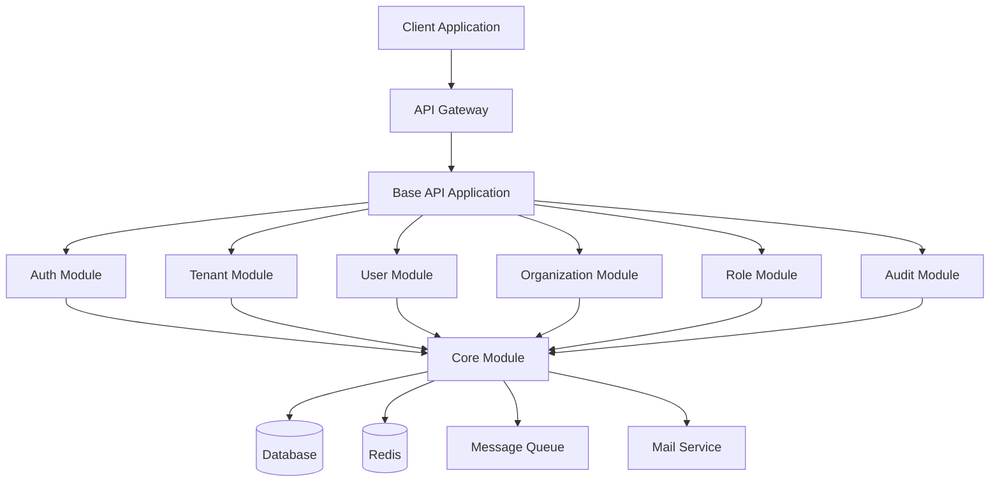

---

## MonoRepo 架构设计

### 架构设计理念

MonoRepo（Monorepo）架构将所有相关项目存储在同一个代码仓库中，提供统一的依赖管理、构建流程和版本控制。

**优势：**

-   **统一的依赖管理** - 通过 pnpm workspace 统一管理所有包的依赖
-   **代码共享** - 方便在不同包之间共享代码和类型定义
-   **原子性提交** - 跨包的变更可以在单个提交中完成
-   **构建优化** - Turbo 提供智能的构建缓存和并行构建
-   **简化 CI/CD** - 单一仓库简化了持续集成和部署流程

**架构图：**

```mermaid
graph TB
    Root[Root Workspace]
    Root --> Apps[apps/]
    Root --> Libs[libs/]
    Root --> Backup[backup/]
    Root --> Docs[docs/]

    Apps --> BaseAPI[base-api]
    Apps --> MCP[mcp-server]
    Apps --> MCPAuth[mcp-auth]

    Libs --> Auth[@oksai/auth]
    Libs --> Core[@oksai/core]
    Libs --> Tenant[@oksai/tenant]
    Libs --> User[@oksai/user]
    Libs --> Org[@oksai/organization]
    Libs --> Role[@oksai/role]
    Libs --> Audit[@oksai/audit]
    Libs --> Plugin[@oksai/plugin]
    Libs --> Common[@oksai/common]
    Libs --> Config[@oksai/config]
    Libs --> Constants[@oksai/constants]
    Libs --> Contracts[@oksai/contracts]
    Libs --> Utils[@oksai/utils]

    Backup --> BackupAuth[backup/auth]
    Backup --> BackupCore[backup/core]
    Backup --> BackupPlugins[backup/plugins]
```

### 依赖管理策略

使用 pnpm workspace 进行依赖管理，通过 `pnpm-workspace.yaml` 配置包路径和依赖关系。

**workspace 配置示例：**

```yaml
packages:
    - 'apps/*'
    - 'packages/*'
    - 'libs/*'
    - 'apps/base-api'

catalog:
    '@nestjs/common': '^11.1.12'
    '@nestjs/core': '^11.1.12'
    '@mikro-orm/core': '^6.6.5'
    '@mikro-orm/nestjs': '^6.1.1'
```

**依赖策略：**

-   **内部依赖** - 使用 `workspace:*` 协议引用内部包
-   **外部依赖** - 使用 catalog 统一管理版本
-   **开发依赖** - 使用 `devDependencies` 配置
-   **对等依赖** - 使用 `peerDependencies` 声明

### 任务编排系统

使用 Turbo 进行任务编排，提供智能的构建缓存和并行执行。

**Turbo 配置示例：**

```json
{
	"tasks": {
		"build": {
			"dependsOn": ["^build"],
			"outputs": ["dist/**"],
			"env": ["NODE_ENV"]
		},
		"test": {
			"dependsOn": ["^build"],
			"outputs": ["coverage/**"],
			"cache": false
		},
		"lint": {
			"outputs": [],
			"cache": false
		}
	}
}
```

**任务执行流程：**

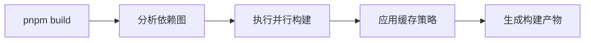

---

## 模块架构

### 应用层（apps）

应用层包含所有可运行的应用程序，每个应用都是独立的 NestJS 应用。

**base-api 应用架构：**

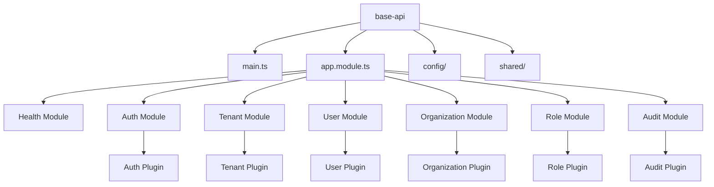

**主要应用：**

-   **base-api** - 主 API 应用，提供 RESTful API 接口
-   **mcp-server** - MCP（Model Context Protocol）服务器
-   **mcp-auth** - MCP 认证服务

### 库层（libs）

库层包含所有可复用的 @oksai/\* 包，按照功能模块组织。

**依赖层次：**

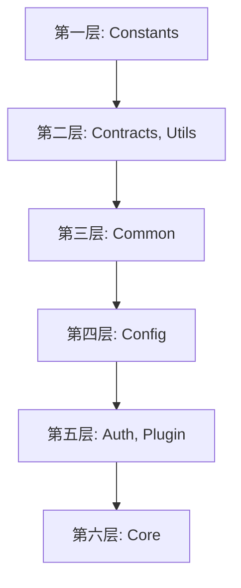

**主要库：**

-   **@oksai/auth** - 认证模块，提供用户认证和授权功能
-   **@oksai/core** - 核心模块，提供邮件、队列、JWT 等核心功能
-   **@oksai/tenant** - 租户模块，提供多租户管理功能
-   **@oksai/user** - 用户模块，提供用户管理功能
-   **@oksai/organization** - 组织模块，提供组织管理功能
-   **@oksai/role** - 角色权限模块，提供 RBAC 功能
-   **@oksai/audit** - 审计日志模块，提供操作日志功能
-   **@oksai/plugin** - 插件系统，提供插件化架构

### 备份层（backup）

备份层包含旧项目代码，作为参考保留，不进行修改。

**备份内容：**

-   **backup/auth** - 旧认证模块参考
-   **backup/core** - 旧核心模块参考
-   **backup/plugins** - 旧插件参考（23 个插件）

**使用原则：**

-   不修改 backup 目录的代码结构和代码内容（注释除外）
-   优先复用 backup 中的代码，避免重复造轮子
-   新开发的代码组织结构应当保持与 backup 目录一致

---

## 数据库架构

### 数据库设计原则

采用 MikroORM 作为 ORM 框架，遵循以下设计原则：

-   **单一数据库** - 默认使用 PostgreSQL，后续支持 MongoDB 和 Better-SQLite
-   **实体继承** - 所有实体继承 BaseEntity，提供统一的基础字段
-   **软删除** - 所有实体支持软删除，使用 deletedAt 字段标记
-   **时间戳** - 所有实体自动管理 createdAt 和 updatedAt 时间戳
-   **UUID 主键** - 所有实体使用 UUID 作为主键

### 实体关系模型

**核心实体关系图：**

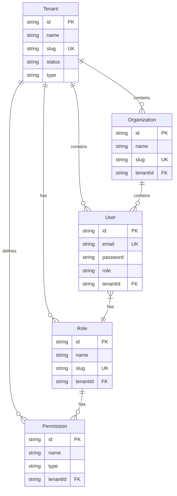

### 索引策略

为提高查询性能，在关键字段上创建索引：

**Tenant 索引：**

```typescript
@Entity({ tableName: 'tenants' })
@Index({ name: 'idx_tenant_status', properties: ['status'] })
@Index({ name: 'idx_tenant_type', properties: ['type'] })
@Index({ name: 'idx_tenant_status_slug', properties: ['status', 'slug'] })
export class Tenant extends BaseEntity {
	// ...
}
```

**User 索引：**

```typescript
@Entity({ tableName: 'users' })
@Index({ name: 'idx_user_tenant', properties: ['tenantId'] })
@Index({ name: 'idx_user_tenant_email', properties: ['tenantId', 'email'] })
export class User extends BaseEntity {
	// ...
}
```

### 数据迁移策略

使用 MikroORM 的迁移系统管理数据库结构变更。

**迁移命令：**

```bash
# 创建新的迁移
pnpm migration:create

# 生成迁移（基于实体变更）
pnpm migration:generate

# 运行迁移
pnpm migration:run

# 回滚迁移
pnpm migration:revert
```

**迁移工作流程：**

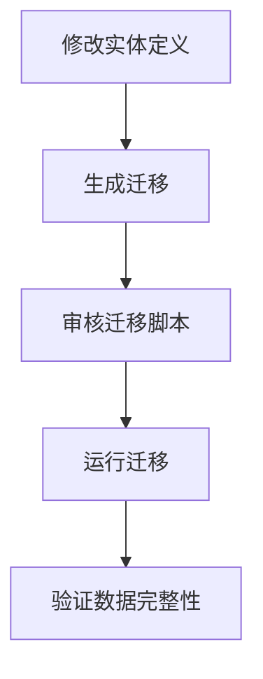

---

## 认证架构

### 认证流程

认证流程采用 JWT（JSON Web Token）令牌机制，支持多种认证方式。

**登录流程图：**

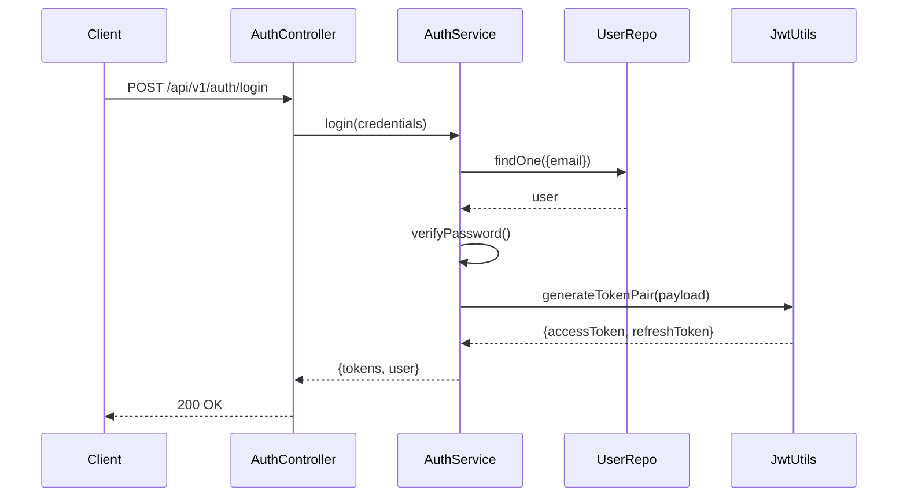

**令牌刷新流程：**

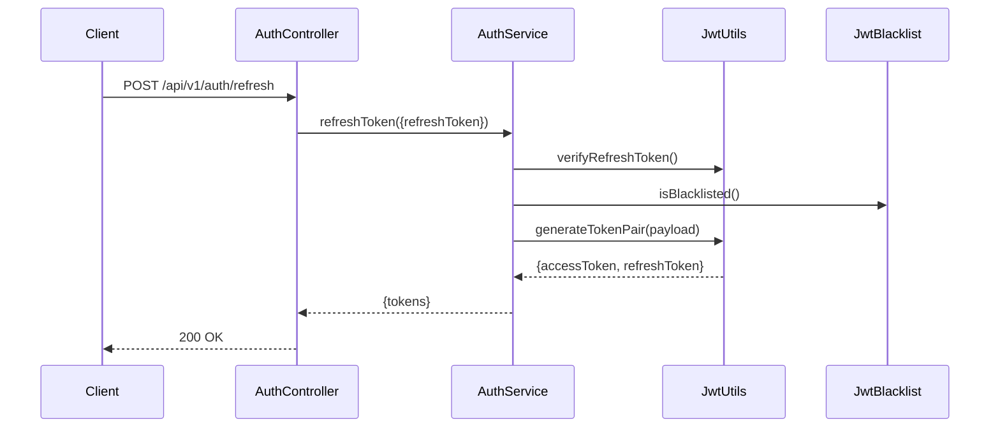

### OAuth 2.0 集成

支持多种 OAuth 2.0 第三方认证：Google、GitHub、Auth0、Microsoft。

**OAuth 流程图：**

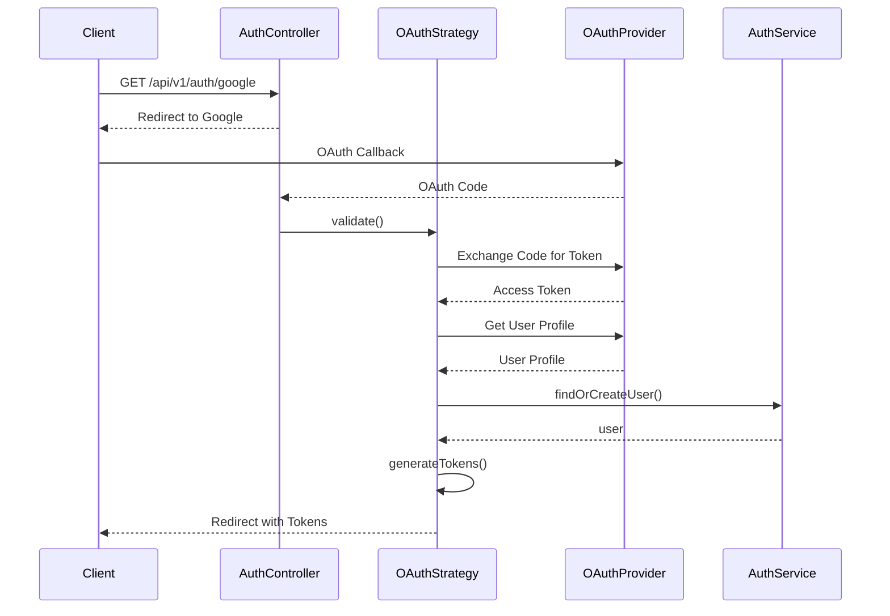

### JWT 令牌管理

JWT 令牌分为访问令牌和刷新令牌：

**访问令牌（Access Token）：**

-   有效期：1 天（可配置）
-   用途：访问受保护的 API
-   存储：客户端本地存储

**刷新令牌（Refresh Token）：**

-   有效期：7 天（可配置）
-   用途：刷新访问令牌
-   存储：客户端本地存储

**令牌配置：**

```typescript
interface JwtConfig {
	accessSecret: string;
	refreshSecret: string;
	accessExpiresIn: string;
	refreshExpiresIn: string;
}
```

### 令牌黑名单

使用 Redis 实现令牌黑名单，支持令牌失效。

**黑名单工作流程：**

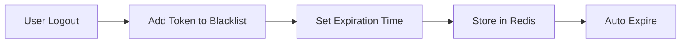

---

## 多租户架构

### 租户隔离策略

采用数据库级别的租户隔离策略，每个租户的数据通过 tenantId 字段进行隔离。

**租户隔离架构：**

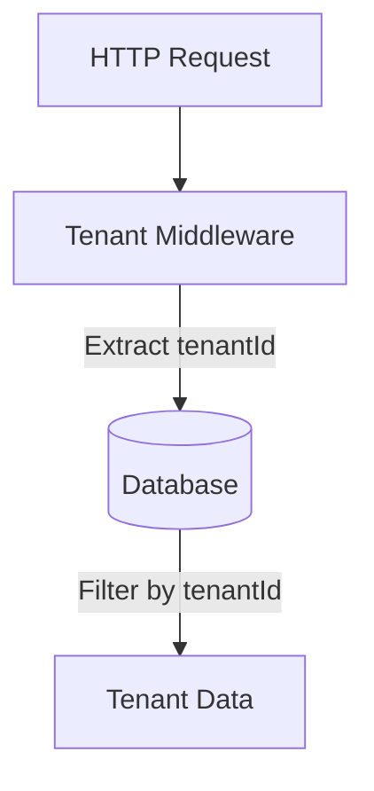

**隔离级别：**

-   **数据库级** - 所有表包含 tenantId 字段
-   **应用级** - 所有查询自动过滤 tenantId
-   **API 级** - 所有接口验证租户权限

### 租户上下文管理

使用 NestJS 中间件和装饰器管理租户上下文。

**租户上下文：**

```typescript
export interface TenantContext {
	tenantId: string;
	tenantSlug: string;
	tenantName: string;
}

@UseGuards(TenantGuard)
@Controller('organizations')
export class OrganizationController {
	// ...
}
```

### 数据隔离实现

通过 MikroORM 的过滤机制实现数据隔离。

**数据隔离示例：**

```typescript
@Injectable()
export class OrganizationService {
	async findAll(tenantId: string): Promise<Organization[]> {
		return await this.orgRepo.find({ tenantId });
	}
}
```

### 租户性能优化

为提高多租户环境下的性能，采用以下优化策略：

-   **索引优化** - 在 tenantId 字段上创建索引
-   **查询优化** - 使用 tenantId 过滤减少查询范围
-   **缓存策略** - 按租户缓存数据

---

## 权限控制架构

### RBAC 模型

采用基于角色的访问控制（RBAC）模型，支持灵活的权限管理。

**RBAC 模型图：**

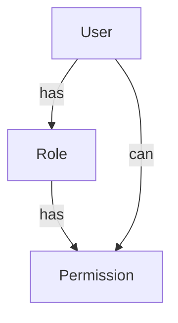

**核心概念：**

-   **用户（User）** - 系统使用者
-   **角色（Role）** - 权限的集合
-   **权限（Permission）** - 具体的操作权限

### 权限验证流程

使用 NestJS 守卫（Guard）和装饰器进行权限验证。

**权限验证流程图：**

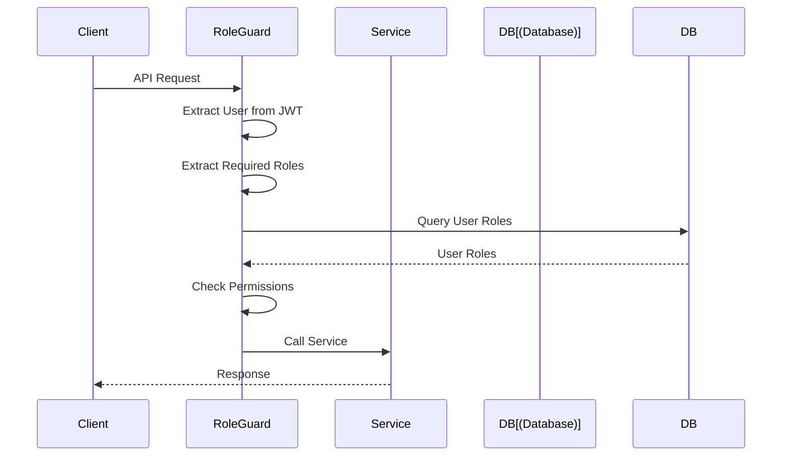

### 角色权限关联

角色和权限通过多对多关系关联。

**角色权限关联：**

```typescript
@Entity()
export class Role extends BaseEntity {
	@ManyToMany(() => Permission)
	permissions?: Collection<Permission>;
}
```

### 动态权限管理

支持动态权限管理，无需重启应用。

**动态权限更新：**

```typescript
async updateRolePermissions(roleId: string, permissionIds: string[]) {
    const role = await this.roleRepo.findOne({ id: roleId });
    role.permissions = await this.permissionRepo.find({ id: { $in: permissionIds } });
    await this.em.persistAndFlush(role);
}
```

---

## 插件系统架构

### 插件生命周期

插件系统支持完整的生命周期管理，包括启动、销毁等。

**插件生命周期：**

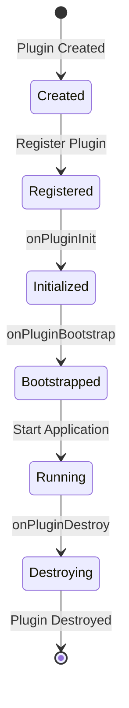

### 插件依赖管理

插件可以声明依赖关系，确保按正确顺序加载。

**插件依赖示例：**

```typescript
export class TenantPlugin implements IOksaisPluginBootstrap {
	dependencies = ['@oksai/core', '@oksai/plugin'];

	async onPluginBootstrap(): Promise<void> {
		// 插件初始化逻辑
	}
}
```

### 插件通信机制

插件通过事件机制进行通信。

**插件通信示例：**

```typescript
@Injectable()
export class TenantPlugin {
	constructor(private eventEmitter: EventEmitter2) {}

	async onPluginBootstrap(): Promise<void> {
		this.eventEmitter.emit('tenant.created', { tenantId: 'xxx' });
	}
}
```

### 插件热加载

支持插件的热加载，无需重启应用。

**热加载流程：**

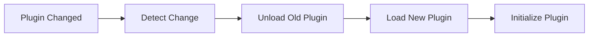

---

## 审计系统架构

### 审计日志模型

审计日志记录所有关键操作，包括创建、更新、删除等。

**审计日志实体：**

```typescript
@Entity({ tableName: 'audit_logs' })
export class AuditLog {
	id: string = randomUUID();
	userId?: string;
	tenantId!: string;
	entityType!: AuditLogEntityType;
	action!: AuditLogAction;
	entityId?: string;
	oldValue?: string;
	newValue?: string;
	ipAddress?: string;
	userAgent?: string;
}
```

### 审计拦截器

使用 NestJS 拦截器自动记录审计日志。

**审计拦截器：**

```typescript
@Injectable()
export class AuditInterceptor implements NestInterceptor {
	intercept(context: ExecutionContext, next: CallHandler): Observable<any> {
		return next.handle().pipe(
			tap(() => {
				// 记录审计日志
			})
		);
	}
}
```

### 审计日志查询

提供灵活的审计日志查询功能。

**查询示例：**

```typescript
async findAuditLogs(query: AuditQueryDto): Promise<AuditLog[]> {
    const { userId, tenantId, action, entityType } = query;
    return await this.auditRepo.find({ userId, tenantId, action, entityType });
}
```

### 审计性能优化

为提高审计性能，采用以下优化策略：

-   **异步写入** - 使用消息队列异步写入审计日志
-   **批量处理** - 批量写入审计日志，减少数据库操作
-   **索引优化** - 在常用查询字段上创建索引

---

## 消息队列架构

### 队列设计

使用 BullMQ 实现消息队列，支持任务的异步处理。

**队列架构：**

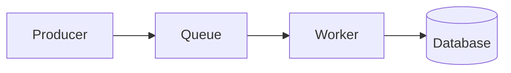

### 任务处理器

每个任务类型对应一个处理器。

**任务处理器示例：**

```typescript
@Processor('email')
export class EmailProcessor {
	@Process('send')
	async sendEmail(job: Job): Promise<void> {
		const { to, subject, html } = job.data;
		await this.mailService.send({ to, subject, html });
	}
}
```

### 队列监控

提供队列监控和管理功能。

**监控指标：**

-   队列长度
-   任务处理速度
-   失败任务数
-   重试次数

### 失败重试机制

支持任务失败后的自动重试。

**重试配置：**

```typescript
const queue = new Queue('email', {
	connection: redis,
	defaultJobOptions: {
		attempts: 3,
		backoff: {
			type: 'exponential',
			delay: 2000
		}
	}
});
```

---

## API 网关架构

### 请求路由

API 网关负责将请求路由到相应的后端服务。

**路由策略：**

-   **路径路由** - 根据请求路径路由
-   **服务路由** - 根据服务标识路由
-   **负载均衡** - 在多个实例间均衡负载

### 中间件链

使用中间件链处理请求。

**中间件链：**

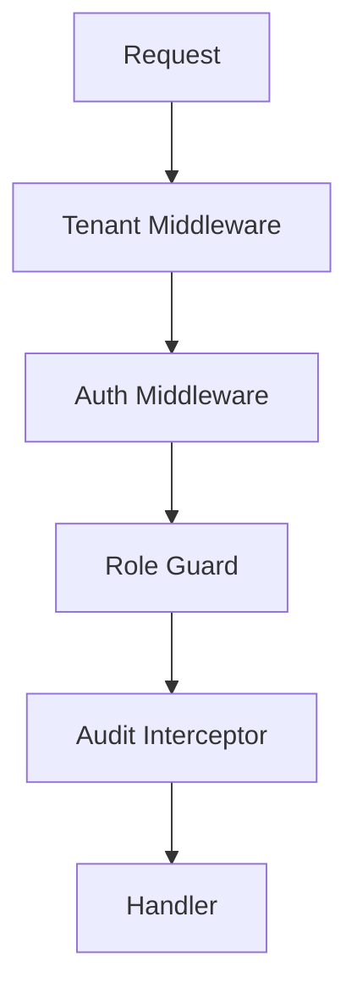

### 限流策略

使用限流策略防止 API 滥用。

**限流配置：**

```typescript
import { ThrottlerModule } from '@nestjs/throttler';

ThrottlerModule.forRoot([
	{
		ttl: 60000,
		limit: 100
	}
]);
```

### 缓存策略

使用缓存减少数据库查询。

**缓存策略：**

-   **内存缓存** - 使用内存缓存热点数据
-   **Redis 缓存** - 使用 Redis 缓存分布式数据
-   **CDN 缓存** - 使用 CDN 缓存静态资源

---

## 缓存架构

### 缓存层级

采用多级缓存策略，提高数据访问速度。

**缓存层级：**

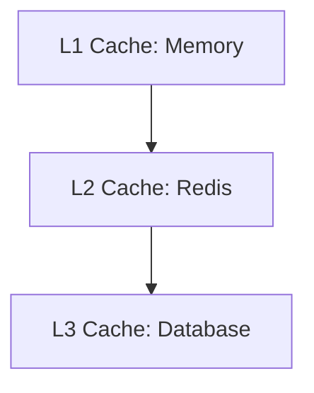

### 缓存策略

支持多种缓存策略：

-   **Cache-Aside** - 应用管理缓存
-   **Read-Through** - 缓存管理数据加载
-   **Write-Through** - 写入时更新缓存
-   **Write-Behind** - 异步更新缓存

### 缓存失效

使用 TTL（Time To Live）自动失效缓存。

**TTL 配置：**

```typescript
const cacheConfig = {
	ttl: 300, // 5 分钟
	max: 1000 // 最大缓存数
};
```

### 缓存监控

监控缓存命中率和缓存大小。

**监控指标：**

-   缓存命中率
-   缓存大小
-   缓存过期时间
-   缓存驱逐策略

---

## 监控和日志架构

### 日志系统

使用 NestJS Logger 记录日志。

**日志级别：**

-   DEBUG - 调试信息
-   INFO - 一般信息
-   WARN - 警告信息
-   ERROR - 错误信息

**日志输出：**

```typescript
this.logger.debug('调试信息');
this.logger.log('一般信息');
this.logger.warn('警告信息');
this.logger.error('错误信息');
```

### 指标监控

使用 Prometheus 收集指标。

**指标类型：**

-   **Counter** - 计数器
-   **Gauge** - 仪表盘
-   **Histogram** - 直方图
-   **Summary** - 摘要

### 链路追踪

使用 OpenTelemetry 进行链路追踪。

**追踪架构：**

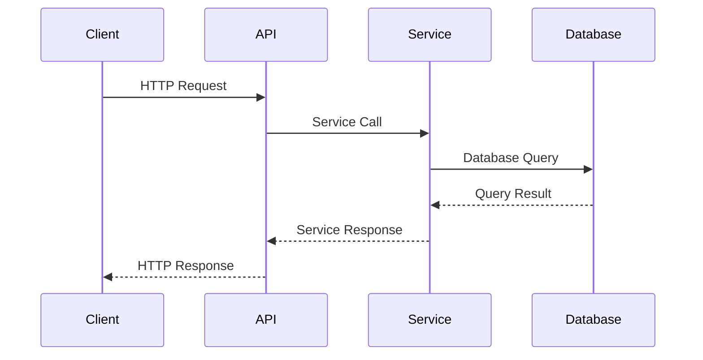

### 告警系统

配置告警规则，及时发现问题。

**告警类型：**

-   **错误告警** - 系统错误时告警
-   **性能告警** - 性能下降时告警
-   **资源告警** - 资源不足时告警
-   **业务告警** - 业务异常时告警

---

## 部署架构

### 容器化部署

使用 Docker 进行容器化部署。

**Docker 架构：**

```mermaid
graph TD
    A[Docker Compose] --> B[App Container]
    A --> C[DB Container]
    A --> D[Redis Container]
    A --> E[Queue Worker Container]
```

### 环境配置

支持多环境配置：开发、测试、生产。

**环境配置：**

-   **.env.development** - 开发环境配置
-   **.env.test** - 测试环境配置
-   **.env.production** - 生产环境配置

### 水平扩展

支持水平扩展，提高系统容量。

**扩展策略：**

-   **无状态设计** - 应用无状态，易于扩展
-   **负载均衡** - 使用 Nginx 进行负载均衡
-   **自动扩展** - 使用 Kubernetes 自动扩展

### 高可用设计

采用高可用设计，确保系统稳定运行。

**高可用策略：**

-   **冗余部署** - 多实例部署
-   **故障转移** - 自动故障转移
-   **数据备份** - 定期数据备份
-   **灾备恢复** - 快速灾备恢复

---

## 版本信息

-   **文档版本：** 1.0.0
-   **最后更新：** 2026-02-04
-   **维护者：** OKSAI 平台团队
