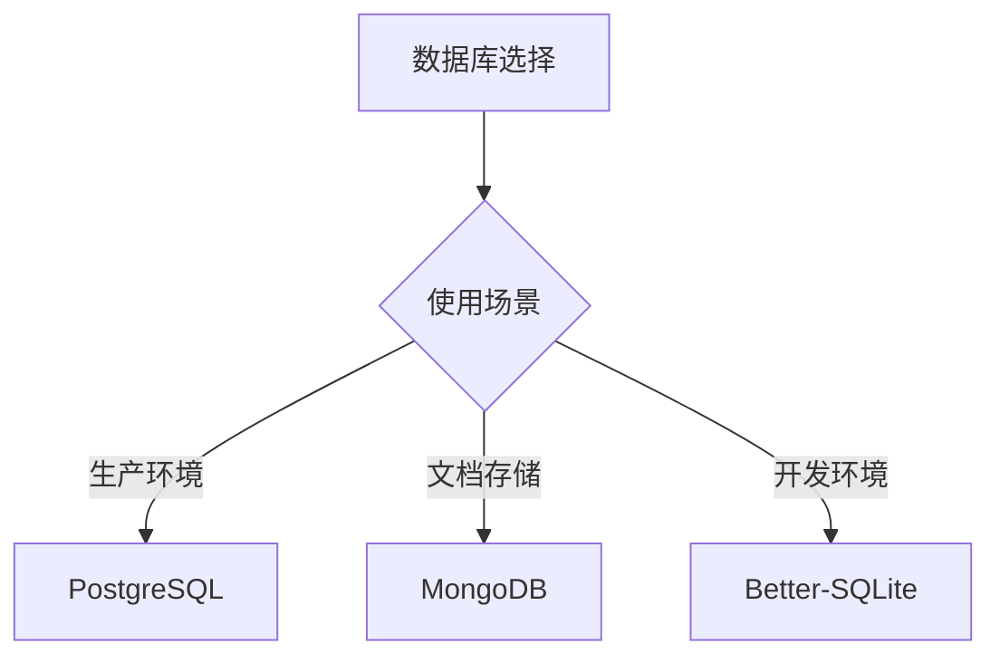
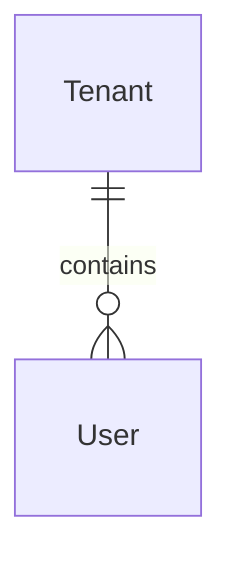
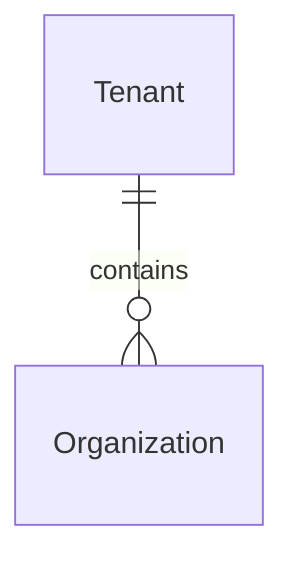
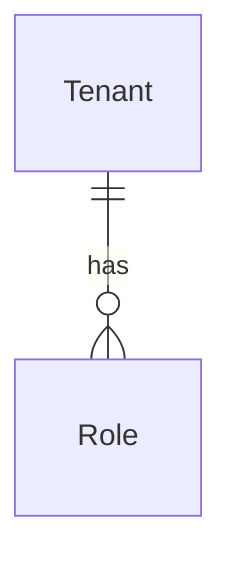
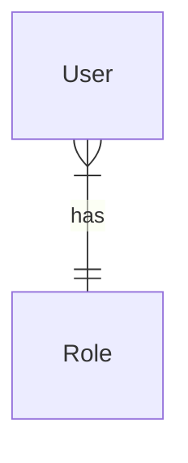
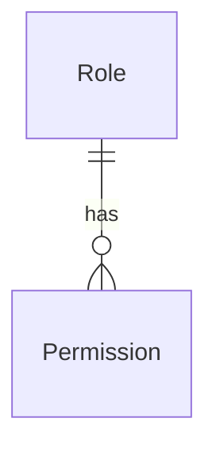

# 数据库模型

## 📑 目录

-   [数据库设计概述](#数据库设计概述)
    -   [数据库设计原则](#数据库设计原则)
    -   [数据库类型](#数据库类型)
    -   [数据库选择策略](#数据库选择策略)
-   [核心实体](#核心实体)
    -   [BaseEntity](#baseentity)
    -   [Tenant](#tenant)
    -   [User](#user)
    -   [Organization](#organization)
    -   [Role](#role)
    -   [Permission](#permission)
-   [实体关系](#实体关系)
    -   [租户与用户](#租户与用户)
    -   [租户与组织](#租户与组织)
    -   [租户与角色](#租户与角色)
    -   [用户与角色](#用户与角色)
    -   [角色与权限](#角色与权限)
-   [索引设计](#索引设计)
    -   [单列索引](#单列索引)
    -   [复合索引](#复合索引)
    -   [唯一索引](#唯一索引)
    -   [索引优化策略](#索引优化策略)
-   [数据迁移](#数据迁移)
    -   [迁移策略](#迁移策略)
    -   [迁移命令](#迁移命令)
    -   [迁移最佳实践](#迁移最佳实践)
-   [数据库优化](#数据库优化)
    -   [查询优化](#查询优化)
    -   [连接池优化](#连接池优化)
    -   [缓存优化](#缓存优化)
    -   [分区优化](#分区优化)
-   [数据库备份](#数据库备份)
    -   [备份策略](#备份策略)
    -   [备份命令](#备份命令)
    -   [恢复策略](#恢复策略)
-   [数据库监控](#数据库监控)
    -   [性能监控](#性能监控)
    -   [日志监控](#日志监控)
    -   [告警配置](#告警配置)
-   [常见问题](#常见问题)
    -   [设计相关](#设计相关)
    -   [迁移相关](#迁移相关)
    -   [优化相关](#优化相关)

---

## 数据库设计概述

### 数据库设计原则

**设计原则：**

-   **规范化设计** - 遵循数据库规范化原则
-   **性能优先** - 在规范化和性能之间找到平衡
-   **可扩展性** - 设计支持未来的扩展需求
-   **数据完整性** - 使用外键和约束保证数据完整性
-   **索引优化** - 在常用查询字段上创建索引

### 数据库类型

**支持的数据库类型：**

-   **PostgreSQL** - 主数据库，支持复杂查询和事务
-   **MongoDB** - 文档型数据库，支持灵活的数据模型
-   **Better-SQLite** - 嵌入式数据库，用于开发环境

### 数据库选择策略

**选择策略：**



---

## 核心实体

### BaseEntity

所有实体的基类，提供统一的基础字段。

**实体定义：**

```typescript
import { PrimaryKey, Property } from '@mikro-orm/core';
import { randomUUID } from 'crypto';

export abstract class BaseEntity {
	@PrimaryKey()
	id: string = randomUUID();

	@Property({ defaultRaw: 'now()' })
	createdAt = new Date();

	@Property({ defaultRaw: 'now()', onUpdate: () => new Date() })
	updatedAt = new Date();

	@Property({ nullable: true })
	deletedAt?: Date;
}
```

**字段说明：**

-   `id` - 主键，自动生成 UUID
-   `createdAt` - 创建时间，自动设置
-   `updatedAt` - 更新时间，自动更新
-   `deletedAt` - 删除时间，支持软删除

---

### Tenant

租户实体，表示多租户系统中的租户。

**实体定义：**

```typescript
import { Entity, Property, Enum, Index } from '@mikro-orm/core';
import { BaseEntity } from '@oksai/core';

export enum TenantStatus {
	ACTIVE = 'ACTIVE',
	SUSPENDED = 'SUSPENDED',
	INACTIVE = 'INACTIVE'
}

export enum TenantType {
	ORGANIZATION = 'ORGANIZATION',
	INDIVIDUAL = 'INDIVIDUAL'
}

@Entity({ tableName: 'tenants' })
@Index({ name: 'idx_tenant_status', properties: ['status'] })
@Index({ name: 'idx_tenant_type', properties: ['type'] })
@Index({ name: 'idx_tenant_status_slug', properties: ['status', 'slug'] })
export class Tenant extends BaseEntity {
	@Property({ unique: true })
	name!: string;

	@Property({ unique: true })
	slug!: string;

	@Property({ nullable: true })
	logo?: string;

	@Property({ nullable: true })
	website?: string;

	@Property({ nullable: true })
	description?: string;

	@Property({ default: TenantStatus.ACTIVE })
	@Enum(() => TenantStatus)
	status: TenantStatus = TenantStatus.ACTIVE;

	@Property({ default: TenantType.ORGANIZATION })
	@Enum(() => TenantType)
	type: TenantType = TenantType.ORGANIZATION;

	@Property({ defaultRaw: 'now()' })
	trialEndDate?: Date;

	@Property({ nullable: true })
	subscriptionPlan?: string;

	@Property({ default: 0 })
	maxUsers?: number = 0;

	@Property({ default: true })
	allowSelfRegistration?: boolean = true;

	@Property({ nullable: true })
	contactEmail?: string;

	@Property({ nullable: true })
	contactPhone?: string;

	@Property({ nullable: true })
	address?: string;

	@Property({ nullable: true })
	city?: string;

	@Property({ nullable: true })
	country?: string;

	@Property({ nullable: true })
	locale?: string = 'en';

	@Property({ nullable: true })
	timezone?: string = 'UTC';
}
```

**字段说明：**

-   `name` - 租户名称（唯一）
-   `slug` - 租户标识（唯一，用于 URL 和查询）
-   `logo` - 租户 Logo URL
-   `website` - 租户网站地址
-   `description` - 租户描述信息
-   `status` - 租户状态（ACTIVE、SUSPENDED、INACTIVE）
-   `type` - 租户类型（ORGANIZATION、INDIVIDUAL）
-   `trialEndDate` - 试用结束日期
-   `subscriptionPlan` - 订阅计划
-   `maxUsers` - 最大用户数
-   `allowSelfRegistration` - 是否允许用户自行注册
-   `contactEmail` - 联系邮箱
-   `contactPhone` - 联系电话
-   `address` - 地址信息
-   `city` - 城市信息
-   `country` - 国家信息
-   `locale` - 语言设置
-   `timezone` - 时区设置

**索引：**

-   `idx_tenant_status` - 租户状态索引
-   `idx_tenant_type` - 租户类型索引
-   `idx_tenant_status_slug` - 租户状态和标识复合索引

---

### User

用户实体，表示系统中的用户。

**实体定义：**

```typescript
import { Entity, Property, Enum, Index } from '@mikro-orm/core';
import { BaseEntity } from '@oksai/core';

export enum UserRole {
	ADMIN = 'ADMIN',
	USER = 'USER',
	GUEST = 'GUEST'
}

@Entity({ tableName: 'users' })
@Index({ name: 'idx_user_tenant', properties: ['tenantId'] })
@Index({ name: 'idx_user_tenant_email', properties: ['tenantId', 'email'] })
export class User extends BaseEntity {
	@Property({ unique: true })
	email!: string;

	@Property()
	password!: string;

	@Property()
	firstName!: string;

	@Property()
	lastName!: string;

	@Property({ default: UserRole.USER })
	@Enum(() => UserRole)
	role: UserRole = UserRole.USER;

	@Property()
	tenantId!: string;

	@Property({ default: true })
	isActive: boolean = true;

	@Property({ nullable: true })
	emailVerifiedAt?: Date;

	@Property({ nullable: true })
	avatar?: string;

	@Property({ nullable: true })
	phoneNumber?: string;

	@Property({ nullable: true })
	timezone?: string;

	@Property({ nullable: true })
	locale?: string;

	@Property({ nullable: true })
	preferredLanguage?: string;

	@Property({ defaultRaw: 'now()' })
	lastLoginAt?: Date;

	@Property({ default: 0 })
	loginCount: number = 0;
}
```

**字段说明：**

-   `email` - 用户邮箱（唯一）
-   `password` - 用户密码（加密存储）
-   `firstName` - 用户名
-   `lastName` - 用户姓
-   `role` - 用户角色（ADMIN、USER、GUEST）
-   `tenantId` - 所属租户 ID
-   `isActive` - 是否活跃
-   `emailVerifiedAt` - 邮箱验证时间
-   `avatar` - 头像 URL
-   `phoneNumber` - 电话号码
-   `timezone` - 时区设置
-   `locale` - 语言设置
-   `preferredLanguage` - 偏好语言
-   `lastLoginAt` - 最后登录时间
-   `loginCount` - 登录次数

**索引：**

-   `idx_user_tenant` - 租户 ID 索引
-   `idx_user_tenant_email` - 租户 ID 和邮箱复合索引

---

### Organization

组织实体，表示租户下的组织单元。

**实体定义：**

```typescript
import { Entity, Property, Enum, Index } from '@mikro-orm/core';
import { BaseEntity } from '@oksai/core';

export enum OrganizationStatus {
	ACTIVE = 'ACTIVE',
	SUSPENDED = 'SUSPENDED',
	INACTIVE = 'INACTIVE'
}

@Entity({ tableName: 'organizations' })
@Index({ name: 'idx_org_tenant', properties: ['tenantId'] })
@Index({ name: 'idx_org_status', properties: ['status'] })
@Index({ name: 'idx_org_tenant_status', properties: ['tenantId', 'status'] })
export class Organization extends BaseEntity {
	@Property()
	name!: string;

	@Property({ unique: true })
	slug!: string;

	@Property({ nullable: true, length: 500 })
	logo!: string;

	@Property({ nullable: true, length: 5000 })
	website!: string;

	@Property({ nullable: true })
	phoneNumber!: string;

	@Property({ nullable: true, length: 500 })
	email!: string;

	@Property({ nullable: true, length: 20 })
	currency!: string;

	@Property({ nullable: true, length: 50 })
	timeZone!: string;

	@Property({ nullable: true })
	address!: string;

	@Property({ nullable: true })
	city!: string;

	@Property({ nullable: true })
	country!: string;

	@Property({ nullable: true, length: 10 })
	postalCode!: string;

	@Property({ nullable: true, length: 5000 })
	description!: string;

	@Enum(() => OrganizationStatus)
	status: OrganizationStatus = OrganizationStatus.ACTIVE;

	@Property()
	tenantId!: string;
}
```

**字段说明：**

-   `name` - 组织名称
-   `slug` - 组织标识（唯一，用于 URL 和查询）
-   `logo` - 组织 Logo URL
-   `website` - 组织网站地址
-   `phoneNumber` - 组织电话号码
-   `email` - 组织邮箱
-   `currency` - 货币代码（如：USD、CNY）
-   `timeZone` - 时区设置
-   `address` - 组织地址
-   `city` - 组织所在城市
-   `country` - 组织所在国家
-   `postalCode` - 邮政编码
-   `description` - 组织描述信息
-   `status` - 组织状态（ACTIVE、SUSPENDED、INACTIVE）
-   `tenantId` - 所属租户 ID

**索引：**

-   `idx_org_tenant` - 租户 ID 索引
-   `idx_org_status` - 组织状态索引
-   `idx_org_tenant_status` - 租户 ID 和状态复合索引

---

### Role

角色实体，表示系统中的角色。

**实体定义：**

```typescript
import { Entity, Property, Enum, ManyToMany, Collection, Index } from '@mikro-orm/core';
import { BaseEntity } from '@oksai/core';
import { Permission } from './permission.entity';

export enum RoleType {
	ADMIN = 'ADMIN',
	MANAGER = 'MANAGER',
	USER = 'USER',
	GUEST = 'GUEST'
}

@Entity({ tableName: 'roles' })
@Index({ name: 'idx_role_tenant', properties: ['tenantId'] })
@Index({ name: 'idx_role_enabled', properties: ['isEnabled'] })
@Index({ name: 'idx_role_tenant_enabled', properties: ['tenantId', 'isEnabled'] })
export class Role extends BaseEntity {
	@Property()
	name!: string;

	@Property({ unique: true })
	slug!: string;

	@Enum(() => RoleType)
	type: RoleType = RoleType.USER;

	@Property({ nullable: true, length: 1000 })
	description!: string;

	@Property()
	tenantId!: string;

	@Property({ default: true })
	isEnabled: boolean = true;

	@ManyToMany(() => Permission, undefined, { name: 'role_permissions' })
	permissions?: Collection<Permission>;
}
```

**字段说明：**

-   `name` - 角色名称
-   `slug` - 角色标识（唯一，用于查询和权限判断）
-   `type` - 角色类型（ADMIN、MANAGER、USER、GUEST）
-   `description` - 角色描述
-   `tenantId` - 所属租户 ID
-   `isEnabled` - 是否启用
-   `permissions` - 角色关联的权限列表

**索引：**

-   `idx_role_tenant` - 租户 ID 索引
-   `idx_role_enabled` - 是否启用索引
-   `idx_role_tenant_enabled` - 租户 ID 和是否启用复合索引

---

### Permission

权限实体，表示系统中的权限。

**实体定义：**

```typescript
import { Entity, Property, Enum } from '@mikro-orm/core';
import { BaseEntity } from '@oksai/core';

export enum PermissionType {
	ORGANIZATION = 'ORGANIZATION',
	USER = 'USER',
	ROLE = 'ROLE',
	PERMISSION = 'PERMISSION'
}

export enum PermissionAction {
	VIEW = 'VIEW',
	CREATE = 'CREATE',
	EDIT = 'EDIT',
	DELETE = 'DELETE',
	ASSIGN = 'ASSIGN',
	REVOKE = 'REVOKE'
}

@Entity({ tableName: 'permissions' })
export class Permission extends BaseEntity {
	@Property()
	name!: string;

	@Enum(() => PermissionType)
	type!: PermissionType;

	@Enum(() => PermissionAction)
	action!: PermissionAction;

	@Property({ nullable: true, length: 1000 })
	description!: string;

	@Property()
	tenantId!: string;

	@Property({ nullable: true })
	resource!: string;

	@Property({ default: true })
	isEnabled: boolean = true;
}
```

**字段说明：**

-   `name` - 权限名称
-   `type` - 权限类型（ORGANIZATION、USER、ROLE、PERMISSION）
-   `action` - 权限操作（VIEW、CREATE、EDIT、DELETE、ASSIGN、REVOKE）
-   `description` - 权限描述
-   `tenantId` - 所属租户 ID
-   `resource` - 权限资源（如：user、tenant、organization 等）
-   `isEnabled` - 是否启用

---

## 实体关系

### 租户与用户

**关系：** 一对多

**关系说明：** 一个租户可以包含多个用户

**ERD：**



---

### 租户与组织

**关系：** 一对多

**关系说明：** 一个租户可以包含多个组织

**ERD：**



---

### 租户与角色

**关系：** 一对多

**关系说明：** 一个租户可以包含多个角色

**ERD：**



---

### 用户与角色

**关系：** 多对一（用户属于一个角色）

**关系说明：** 一个用户可以拥有一个角色

**ERD：**



---

### 角色与权限

**关系：** 多对多

**关系说明：** 一个角色可以拥有多个权限，一个权限可以属于多个角色

**ERD：**



---

## 索引设计

### 单列索引

**单列索引示例：**

```typescript
@Entity({ tableName: 'tenants' })
@Index({ name: 'idx_tenant_status', properties: ['status'] })
export class Tenant extends BaseEntity {
	@Property()
	status: TenantStatus;
}
```

### 复合索引

**复合索引示例：**

```typescript
@Entity({ tableName: 'users' })
@Index({ name: 'idx_user_tenant_email', properties: ['tenantId', 'email'] })
export class User extends BaseEntity {
	@Property()
	tenantId: string;

	@Property()
	email: string;
}
```

### 唯一索引

**唯一索引示例：**

```typescript
@Entity({ tableName: 'tenants' })
export class Tenant extends BaseEntity {
	@Property({ unique: true })
	slug!: string;
}
```

### 索引优化策略

**索引优化策略：**

-   **选择性索引** - 在选择性高的字段上创建索引
-   **复合索引** - 根据查询模式创建复合索引
-   **覆盖索引** - 创建包含所有查询字段的索引
-   **定期维护** - 定期重建索引和统计信息

---

## 数据迁移

### 迁移策略

**迁移策略：**

-   **版本化迁移** - 每个迁移都有版本号
-   **增量迁移** - 只迁移变更的部分
-   **回滚支持** - 支持迁移回滚
-   **幂等性** - 迁移可以重复执行

### 迁移命令

**创建迁移：**

```bash
pnpm migration:create
```

**生成迁移：**

```bash
pnpm migration:generate
```

**运行迁移：**

```bash
pnpm migration:run
```

**回滚迁移：**

```bash
pnpm migration:revert
```

### 迁移最佳实践

**最佳实践：**

-   **在开发环境测试** - 在开发环境充分测试迁移
-   **备份生产数据** - 运行迁移前备份生产数据
-   **分步执行** - 大型迁移分步执行
-   **监控迁移过程** - 监控迁移过程和性能

---

## 数据库优化

### 查询优化

**查询优化策略：**

-   **使用索引** - 确保查询使用索引
-   **避免全表扫描** - 避免全表扫描
-   **限制返回结果** - 使用 LIMIT 限制返回结果
-   **避免 SELECT \*** - 只查询需要的字段

### 连接池优化

**连接池配置：**

```typescript
{
    type: 'postgres',
    host: 'localhost',
    port: 5432,
    user: 'postgres',
    password: 'password',
    database: 'oksai',
    poolSize: 10,
    connectionTimeoutMillis: 10000,
    idleTimeoutMillis: 30000
}
```

### 缓存优化

**缓存优化策略：**

-   **查询缓存** - 缓存常用的查询结果
-   **Redis 缓存** - 使用 Redis 缓存热点数据
-   **缓存预热** - 启动时预加载热点数据
-   **缓存失效** - 合理设置缓存过期时间

### 分区优化

**分区优化策略：**

-   **水平分区** - 按租户 ID 分区
-   **时间分区** - 按时间范围分区
-   **哈希分区** - 按哈希值分区

---

## 数据库备份

### 备份策略

**备份策略：**

-   **全量备份** - 每天凌晨进行全量备份
-   **增量备份** - 每小时进行增量备份
-   **异地备份** - 备份数据存储到异地
-   **备份保留** - 保留最近 30 天的备份

### 备份命令

**全量备份：**

```bash
pg_dump -h postgres -U oksai_prod -d oksai_prod > backup.sql
```

**增量备份：**

```bash
pg_dump -h postgres -U oksai_prod -d oksai_prod --format=custom --file=backup.dump
```

### 恢复策略

**恢复策略：**

-   **全量恢复** - 从全量备份恢复
-   **增量恢复** - 从增量备份恢复
-   **时间点恢复** - 恢复到指定时间点

---

## 数据库监控

### 性能监控

**性能监控指标：**

-   **查询响应时间** - 监控查询响应时间
-   **慢查询** - 记录和分析慢查询
-   **连接池使用率** - 监控连接池使用率
-   **数据库连接数** - 监控数据库连接数

### 日志监控

**日志监控：**

-   **错误日志** - 监控数据库错误日志
-   **慢查询日志** - 监控慢查询日志
-   **连接日志** - 监控数据库连接日志

### 告警配置

**告警规则：**

-   **数据库不可用** - 数据库不可用时告警
-   **慢查询** - 慢查询超过阈值时告警
-   **连接池耗尽** - 连接池耗尽时告警
-   **磁盘空间不足** - 磁盘空间不足时告警

---

## 常见问题

### 设计相关

**Q: 如何设计多租户数据库？**

A: 使用租户 ID 字段区分不同租户的数据，在查询时过滤租户 ID。

**Q: 如何处理软删除？**

A: 使用 deletedAt 字段标记删除的记录，在查询时过滤 deletedAt 为 null 的记录。

### 迁移相关

**Q: 如何创建数据库迁移？**

A: 使用 MikroORM 的迁移工具创建迁移：

```bash
pnpm migration:generate
```

**Q: 如何回滚数据库迁移？**

A: 使用 MikroORM 的回滚工具回滚迁移：

```bash
pnpm migration:revert
```

### 优化相关

**Q: 如何优化查询性能？**

A: 参考 [数据库优化](#数据库优化) 章节。

**Q: 如何优化数据库性能？**

A: 参考 [数据库优化](#数据库优化) 章节。

---

## 版本信息

-   **文档版本：** 1.0.0
-   **最后更新：** 2026-02-04
-   **维护者：** OKSAI 平台团队
