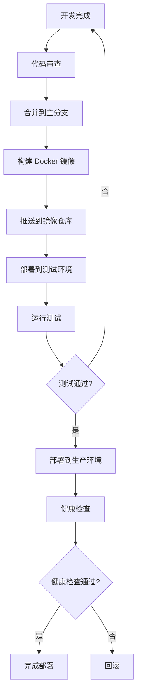
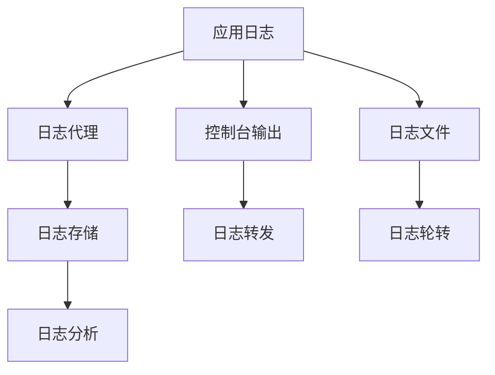
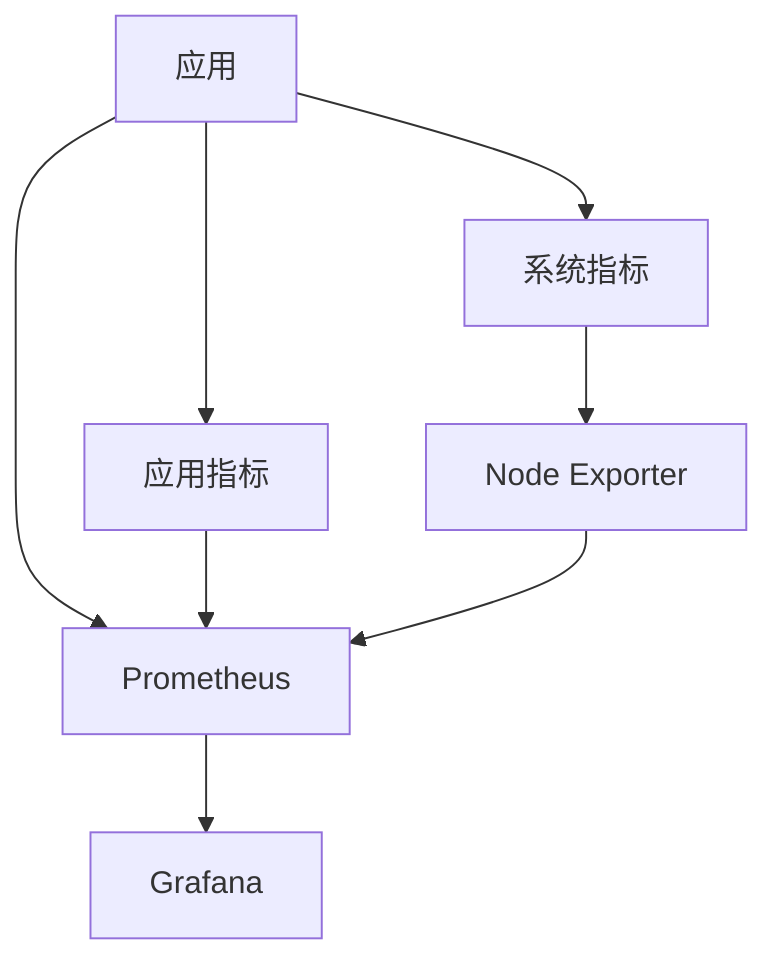
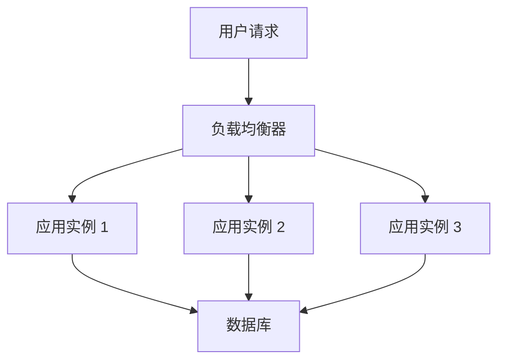
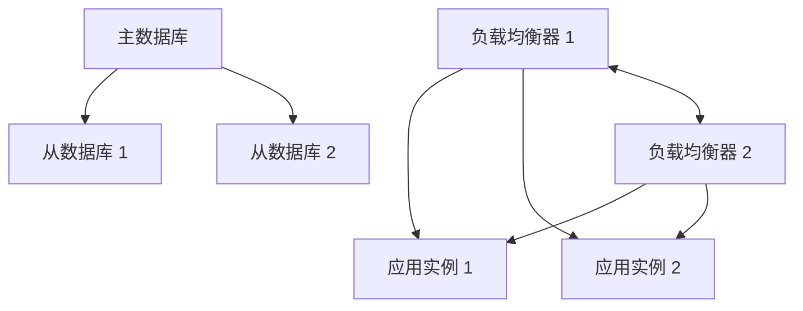
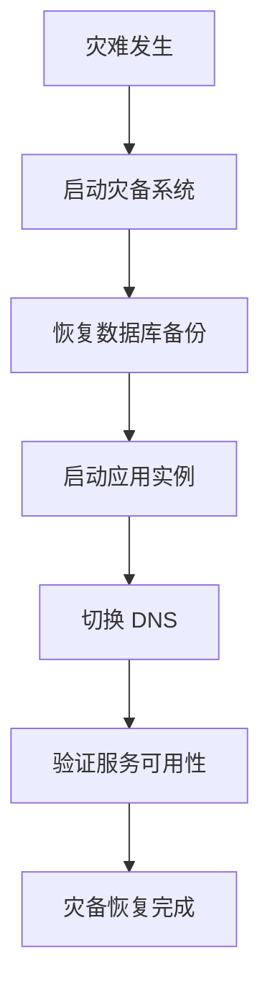
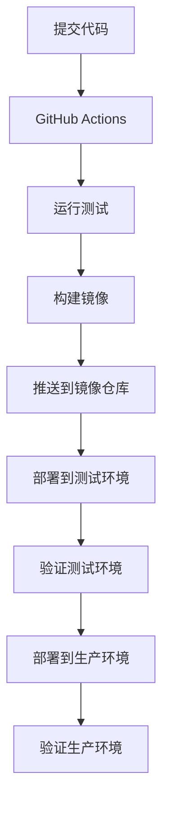

# 部署指南

## 📑 目录

-   [部署概述](#部署概述)
    -   [部署环境](#部署环境)
    -   [部署策略](#部署策略)
    -   [部署流程](#部署流程)
-   [环境配置](#环境配置)
    -   [开发环境](#开发环境)
    -   [测试环境](#测试环境)
    -   [生产环境](#生产环境)
-   [容器化部署](#容器化部署)
    -   [Docker 构建](#docker-构建)
    -   [Docker Compose](#docker-compose)
    -   [Kubernetes 部署](#kubernetes-部署)
-   [数据库部署](#数据库部署)
    -   [PostgreSQL 部署](#postgresql-部署)
    -   [MongoDB 部署](#mongodb-部署)
    -   [数据库迁移](#数据库迁移)
-   [应用部署](#应用部署)
    -   [构建应用](#构建应用)
    -   [启动应用](#启动应用)
    -   [健康检查](#健康检查)
-   [监控和日志](#监控和日志)
    -   [日志收集](#日志收集)
    -   [指标监控](#指标监控)
    -   [告警配置](#告警配置)
-   [水平扩展](#水平扩展)
    -   [无状态设计](#无状态设计)
    -   [负载均衡](#负载均衡)
    -   [自动扩展](#自动扩展)
-   [高可用设计](#高可用设计)
    -   [冗余部署](#冗余部署)
    -   [故障转移](#故障转移)
    -   [数据备份](#数据备份)
    -   [灾备恢复](#灾备恢复)
-   [持续集成和部署](#持续集成和部署)
    -   [CI/CD 流程](#cicd-流程)
    -   [自动化部署](#自动化部署)
    -   [回滚策略](#回滚策略)
-   [性能优化](#性能优化)
    -   [应用优化](#应用优化)
    -   [数据库优化](#数据库优化)
    -   [缓存优化](#缓存优化)
    -   [网络优化](#网络优化)
-   [安全配置](#安全配置)
    -   [网络安全](#网络安全)
    -   **数据安全** (数据安全)
    -   **认证安全** (认证安全)
    -   **审计日志** (审计日志)
-   **常见问题** (常见问题)
    -   **部署相关** (部署相关)
    -   **性能相关** (性能相关)
    -   **安全相关** (安全相关)

---

## 部署概述

### 部署环境

OKSAI 平台支持多种部署环境，包括开发环境、测试环境和生产环境。

**环境类型：**

-   **开发环境** - 用于本地开发和测试
-   **测试环境** - 用于集成测试和用户验收测试
-   **生产环境** - 用于正式上线运行

### 部署策略

采用多阶段部署策略，确保部署的安全性和可靠性。

**部署策略：**

-   **蓝绿部署** - 同时维护两个版本，快速切换
-   **滚动更新** - 逐步更新实例，保证服务可用
-   **金丝雀发布** - 先向小部分用户发布，验证后再全面推广

### 部署流程

**部署流程图：**



---

## 环境配置

### 开发环境

开发环境用于本地开发和测试，使用 Docker Compose 快速启动。

**开发环境配置：**

```bash
# .env.development
NODE_ENV=development
PORT=3000
API_PREFIX=api

# 数据库配置
DB_TYPE=postgres
DB_HOST=localhost
DB_PORT=5432
DB_NAME=oksai_dev
DB_USER=postgres
DB_PASSWORD=postgres

# JWT 配置
JWT_SECRET=dev-secret-change-in-production
JWT_REFRESH_SECRET=dev-refresh-secret-change-in-production
JWT_EXPIRES_IN=1d
JWT_REFRESH_EXPIRES_IN=7d

# Redis 配置
REDIS_HOST=localhost
REDIS_PORT=6379
REDIS_PASSWORD=
REDIS_DB=0
```

### 测试环境

测试环境用于集成测试和用户验收测试，模拟生产环境配置。

**测试环境配置：**

```bash
# .env.test
NODE_ENV=test
PORT=3000
API_PREFIX=api

# 数据库配置
DB_TYPE=postgres
DB_HOST=test-db.example.com
DB_PORT=5432
DB_NAME=oksai_test
DB_USER=oksai_test
DB_PASSWORD=secure_password

# JWT 配置
JWT_SECRET=test-secret
JWT_REFRESH_SECRET=test-refresh-secret
JWT_EXPIRES_IN=1d
JWT_REFRESH_EXPIRES_IN=7d

# Redis 配置
REDIS_HOST=test-redis.example.com
REDIS_PORT=6379
REDIS_PASSWORD=secure_password
REDIS_DB=0
```

### 生产环境

生产环境用于正式上线运行，使用高可用配置和安全配置。

**生产环境配置：**

```bash
# .env.production
NODE_ENV=production
PORT=3000
API_PREFIX=api

# 数据库配置
DB_TYPE=postgres
DB_HOST=prod-db.example.com
DB_PORT=5432
DB_NAME=oksai_prod
DB_USER=oksai_prod
DB_PASSWORD=very_secure_password

# JWT 配置
JWT_SECRET=your-very-secure-random-jwt-access-secret-at-least-32-characters-long
JWT_REFRESH_SECRET=your-very-secure-random-jwt-refresh-secret-at-least-32-characters-long
JWT_EXPIRES_IN=1h
JWT_REFRESH_EXPIRES_IN=7d

# Redis 配置
REDIS_HOST=prod-redis.example.com
REDIS_PORT=6379
REDIS_PASSWORD=very_secure_redis_password
REDIS_DB=0

# OAuth 配置
GOOGLE_CLIENT_ID=your-production-google-client-id
GOOGLE_CLIENT_SECRET=your-production-google-client-secret
GITHUB_CLIENT_ID=your-production-github-client-id
GITHUB_CLIENT_SECRET=your-production-github-client-secret

# 邮件配置
SMTP_HOST=smtp.example.com
SMTP_PORT=587
SMTP_SECURE=false
SMTP_USER=noreply@oksai.io
SMTP_PASS=secure_smtp_password

# API 配置
API_BASE_URL=https://api.oksai.io
CLIENT_BASE_URL=https://app.oksai.io

# 邮件告警配置
ADMIN_EMAIL=admin@oksai.io
```

---

## 容器化部署

### Docker 构建

使用 Docker 构建应用镜像。

**Dockerfile：**

```dockerfile
FROM node:20-alpine

WORKDIR /app

# 复制 package.json 和 pnpm-lock.yaml
COPY package.json pnpm-lock.yaml ./

# 安装 pnpm
RUN npm install -g pnpm@10.11.0

# 安装依赖
RUN pnpm install --frozen-lockfile

# 复制源代码
COPY . .

# 构建应用
RUN pnpm run build

# 暴露端口
EXPOSE 3000

# 启动应用
CMD ["node", "dist/main.js"]
```

**构建镜像：**

```bash
# 构建镜像
docker build -t oksai-api:latest .

# 构建生产镜像
docker build -t oksai-api:1.0.0 .
```

### Docker Compose

使用 Docker Compose 快速启动开发和测试环境。

**docker-compose.yml：**

```yaml
version: '3.8'

services:
    postgres:
        image: postgres:15-alpine
        container_name: oksai-postgres
        environment:
            POSTGRES_USER: postgres
            POSTGRES_PASSWORD: postgres
            POSTGRES_DB: oksai_dev
        ports:
            - '5432:5432'
        volumes:
            - postgres_data:/var/lib/postgresql/data

    redis:
        image: redis:7-alpine
        container_name: oksai-redis
        ports:
            - '6379:6379'
        volumes:
            - redis_data:/data

    api:
        build:
            context: .
            dockerfile: Dockerfile
        container_name: oksai-api
        environment:
            NODE_ENV: development
            DB_HOST: postgres
            DB_PORT: 5432
            DB_NAME: oksai_dev
            DB_USER: postgres
            DB_PASSWORD: postgres
            REDIS_HOST: redis
            REDIS_PORT: 6379
        ports:
            - '3000:3000'
        depends_on:
            - postgres
            - redis
        volumes:
            - .:/app
            - /app/node_modules

volumes:
    postgres_data:
    redis_data:
```

**启动服务：**

```bash
# 启动所有服务
docker-compose up -d

# 查看日志
docker-compose logs -f

# 停止所有服务
docker-compose down
```

### Kubernetes 部署

使用 Kubernetes 进行生产环境部署。

**Deployment 配置：**

```yaml
apiVersion: apps/v1
kind: Deployment
metadata:
    name: oksai-api
    labels:
        app: oksai-api
spec:
    replicas: 3
    selector:
        matchLabels:
            app: oksai-api
    template:
        metadata:
            labels:
                app: oksai-api
        spec:
            containers:
                - name: oksai-api
                  image: oksai-api:1.0.0
                  ports:
                      - containerPort: 3000
                  env:
                      - name: NODE_ENV
                        value: 'production'
                      - name: DB_HOST
                        valueFrom:
                            secretKeyRef:
                                name: oksai-secrets
                                key: db-host
                      - name: DB_PASSWORD
                        valueFrom:
                            secretKeyRef:
                                name: oksai-secrets
                                key: db-password
                  resources:
                      requests:
                          memory: '256Mi'
                          cpu: '250m'
                      limits:
                          memory: '512Mi'
                          cpu: '500m'
                  livenessProbe:
                      httpGet:
                          path: /api/v1/health
                          port: 3000
                      initialDelaySeconds: 30
                      periodSeconds: 10
                  readinessProbe:
                      httpGet:
                          path: /api/v1/health
                          port: 3000
                      initialDelaySeconds: 5
                      periodSeconds: 5
---
apiVersion: v1
kind: Service
metadata:
    name: oksai-api
spec:
    selector:
        app: oksai-api
    ports:
        - protocol: TCP
          port: 80
          targetPort: 3000
    type: LoadBalancer
```

**部署命令：**

```bash
# 创建命名空间
kubectl create namespace oksai

# 应用配置
kubectl apply -f k8s/deployment.yaml -n oksai

# 查看部署状态
kubectl get pods -n oksai

# 查看日志
kubectl logs -f deployment/oksai-api -n oksai
```

---

## 数据库部署

### PostgreSQL 部署

**PostgreSQL 配置：**

```yaml
# postgres-deployment.yaml
apiVersion: apps/v1
kind: Deployment
metadata:
    name: postgres
spec:
    replicas: 1
    selector:
        matchLabels:
            app: postgres
    template:
        metadata:
            labels:
                app: postgres
        spec:
            containers:
                - name: postgres
                  image: postgres:15-alpine
                  env:
                      - name: POSTGRES_DB
                        value: oksai_prod
                      - name: POSTGRES_USER
                        valueFrom:
                            secretKeyRef:
                                name: postgres-secrets
                                key: username
                      - name: POSTGRES_PASSWORD
                        valueFrom:
                            secretKeyRef:
                                name: postgres-secrets
                                key: password
                  ports:
                      - containerPort: 5432
                  volumeMounts:
                      - name: postgres-storage
                        mountPath: /var/lib/postgresql/data
            volumes:
                - name: postgres-storage
                  persistentVolumeClaim:
                      claimName: postgres-pvc
---
apiVersion: v1
kind: Service
metadata:
    name: postgres
spec:
    selector:
        app: postgres
    ports:
        - port: 5432
    clusterIP: None
---
apiVersion: v1
kind: PersistentVolumeClaim
metadata:
    name: postgres-pvc
spec:
    accessModes:
        - ReadWriteOnce
    resources:
        requests:
            storage: 10Gi
```

### MongoDB 部署

**MongoDB 配置：**

```yaml
# mongodb-deployment.yaml
apiVersion: apps/v1
kind: Deployment
metadata:
    name: mongodb
spec:
    replicas: 1
    selector:
        matchLabels:
            app: mongodb
    template:
        metadata:
            labels:
                app: mongodb
        spec:
            containers:
                - name: mongodb
                  image: mongo:7
                  env:
                      - name: MONGO_INITDB_ROOT_USERNAME
                        valueFrom:
                            secretKeyRef:
                                name: mongodb-secrets
                                key: username
                      - name: MONGO_INITDB_ROOT_PASSWORD
                        valueFrom:
                            secretKeyRef:
                                name: mongodb-secrets
                                key: password
                      - name: MONGO_INITDB_DATABASE
                        value: oksai_prod
                  ports:
                      - containerPort: 27017
                  volumeMounts:
                      - name: mongodb-storage
                        mountPath: /data/db
            volumes:
                - name: mongodb-storage
                  persistentVolumeClaim:
                      claimName: mongodb-pvc
---
apiVersion: v1
kind: Service
metadata:
    name: mongodb
spec:
    selector:
        app: mongodb
    ports:
        - port: 27017
    clusterIP: None
---
apiVersion: v1
kind: PersistentVolumeClaim
metadata:
    name: mongodb-pvc
spec:
    accessModes:
        - ReadWriteOnce
    resources:
        requests:
            storage: 10Gi
```

### 数据库迁移

**运行数据库迁移：**

```bash
# 开发环境迁移
pnpm migration:run

# 生产环境迁移
NODE_ENV=production pnpm migration:run

# 使用 Docker 运行迁移
docker-compose exec api pnpm migration:run

# 使用 Kubernetes 运行迁移
kubectl exec -it deployment/oksai-api -n oksai -- pnpm migration:run
```

---

## 应用部署

### 构建应用

**构建命令：**

```bash
# 开发环境构建
pnpm run build

# 生产环境构建
NODE_ENV=production pnpm run build

# Docker 构建
docker build -t oksai-api:latest .
```

### 启动应用

**启动命令：**

```bash
# 开发环境启动
cd apps/base-api && pnpm run start:dev

# 生产环境启动
cd apps/base-api && pnpm run build && pnpm run start

# Docker 启动
docker run -p 3000:3000 oksai-api:latest

# Kubernetes 启动
kubectl apply -f k8s/deployment.yaml
```

### 健康检查

**健康检查端点：**

```bash
# 健康检查
curl http://localhost:3000/api/v1/health

# 响应示例
{
  "success": true,
  "data": {
    "status": "healthy",
    "timestamp": "2024-01-01T00:00:00.000Z",
    "version": "1.0.0",
    "environment": "production",
    "uptime": 3600
  }
}
```

---

## 监控和日志

### 日志收集

**日志收集策略：**



**日志配置：**

```typescript
import { WinstonModule } from 'nest-winston';

@Module({
    imports: [
        WinstonModule.forRoot({
            transports: [
                new winston.transports.Console({
                    format: winston.format.combine(
                        winston.format.timestamp(),
                        winston.format.colorize(),
                        winston.format.printf(({ timestamp, level, message }) => {
                            return `${timestamp} [${level}]: ${message}`;
                        })
                    )
                }),
                new winston.transports.File({
                    filename: 'logs/error.log',
                    level: 'error'
                }),
                new winston.transports.File({
                    filename: 'logs/combined.log'
                })
            ]
        })
    ]
})
```

### 指标监控

**指标监控架构：**



**Prometheus 配置：**

```yaml
# prometheus.yml
global:
    scrape_interval: 15s

scrape_configs:
    - job_name: 'oksai-api'
      metrics_path: '/metrics'
      static_configs:
          - targets: ['oksai-api:3000']

    - job_name: 'postgres'
      static_configs:
          - targets: ['postgres-exporter:9187']

    - job_name: 'redis'
      static_configs:
          - targets: ['redis-exporter:9121']
```

### 告警配置

**告警规则：**

```yaml
# alerting.yml
groups:
    - name: oksai-api
      interval: 30s
      rules:
          - alert: HighErrorRate
            expr: rate(http_requests_total{status=~"5.."}[5m]) > 0.1
            for: 5m
            labels:
                severity: critical
            annotations:
                summary: '高错误率'
                description: '错误率超过 10%'

          - alert: HighMemoryUsage
            expr: process_resident_memory_bytes / 1024 / 1024 > 512
            for: 5m
            labels:
                severity: warning
            annotations:
                summary: '内存使用率高'
                description: '内存使用超过 512MB'
```

---

## 水平扩展

### 无状态设计

**无状态设计原则：**

-   应用无状态，可以随意扩展
-   会话状态存储在外部（Redis）
-   文件存储在对象存储（S3）

### 负载均衡

**负载均衡架构：**



**Nginx 配置：**

```nginx
upstream oksai-api {
    least_conn;
    server api-1:3000;
    server api-2:3000;
    server api-3:3000;
}

server {
    listen 80;
    server_name api.oksai.io;

    location / {
        proxy_pass http://oksai-api;
        proxy_set_header Host $host;
        proxy_set_header X-Real-IP $remote_addr;
        proxy_set_header X-Forwarded-For $proxy_add_x_forwarded_for;
    }
}
```

### 自动扩展

**Kubernetes 自动扩展：**

```yaml
apiVersion: autoscaling/v2
kind: HorizontalPodAutoscaler
metadata:
    name: oksai-api-hpa
spec:
    scaleTargetRef:
        apiVersion: apps/v1
        kind: Deployment
        name: oksai-api
    minReplicas: 3
    maxReplicas: 10
    metrics:
        - type: Resource
          resource:
              name: cpu
              target:
                  type: Utilization
                  averageUtilization: 70
        - type: Resource
          resource:
              name: memory
              target:
                  type: Utilization
                  averageUtilization: 80
```

---

## 高可用设计

### 冗余部署

**冗余部署架构：**



### 故障转移

**故障转移流程：**

```mermaid
sequenceDiagram
    participant M as 主数据库
    participant S1 as 从数据库 1
    participant S2 as 从数据库 2
    participant A as 应用

    A->>M: 写入请求
    M-->>S1: 复制数据
    M-->>S2: 复制数据
    M->>A: 写入成功

    Note over M,S1,S2: 主数据库故障

    A->>S1: 写入请求
    S1->>A: 写入成功（主数据库切换为 S1）
```

### 数据备份

**备份策略：**

-   **全量备份** - 每天凌晨进行全量备份
-   **增量备份** - 每小时进行增量备份
-   **异地备份** - 备份数据存储到异地
-   **备份保留** - 保留最近 30 天的备份

**备份脚本：**

```bash
#!/bin/bash

# 数据库备份脚本
DATE=$(date +%Y%m%d_%H%M%S)
BACKUP_DIR="/backups/postgres"
DB_NAME="oksai_prod"

# 创建备份目录
mkdir -p $BACKUP_DIR

# 全量备份
pg_dump -h postgres -U oksai_prod -d $DB_NAME > $BACKUP_DIR/$DB_NAME_$DATE.sql

# 压缩备份
gzip $BACKUP_DIR/$DB_NAME_$DATE.sql

# 上传到 S3
aws s3 cp $BACKUP_DIR/$DB_NAME_$DATE.sql.gz s3://oksai-backups/postgres/
```

### 灾备恢复

**灾备恢复流程：**



---

## 持续集成和部署

### CI/CD 流程

**CI/CD 流程图：**



**GitHub Actions 配置：**

```yaml
# .github/workflows/deploy.yml
name: Deploy

on:
    push:
        branches:
            - main

jobs:
    test:
        runs-on: ubuntu-latest
        steps:
            - uses: actions/checkout@v3
            - uses: actions/setup-node@v3
              with:
                  node-version: '20'
            - run: pnpm install
            - run: pnpm test

    build:
        needs: test
        runs-on: ubuntu-latest
        steps:
            - uses: actions/checkout@v3
            - name: Build Docker image
              run: docker build -t oksai-api:${{ github.sha }} .

    deploy-test:
        needs: build
        runs-on: ubuntu-latest
        steps:
            - name: Deploy to test environment
              run: kubectl apply -f k8s/test-deployment.yaml

    deploy-prod:
        needs: deploy-test
        runs-on: ubuntu-latest
        if: github.ref == 'refs/heads/main'
        steps:
            - name: Deploy to production
              run: kubectl apply -f k8s/prod-deployment.yaml
```

### 自动化部署

**部署自动化工具：**

-   **GitHub Actions** - GitHub 原生 CI/CD
-   **GitLab CI/CD** - GitLab 原生 CI/CD
-   **Jenkins** - 开源自动化服务器
-   **CircleCI** - 云端 CI/CD 平台

### 回滚策略

**回滚策略：**

-   **快速回滚** - 使用 Git 版本控制快速回滚
-   **蓝绿部署** - 切换到备用环境
-   **滚动回滚** - 逐步回滚到上一个版本

**回滚命令：**

```bash
# Git 回滚
git revert <commit-hash>
git push

# Kubernetes 回滚
kubectl rollout undo deployment/oksai-api

# Docker 回滚
docker run -p 3000:3000 oksai-api:previous-version
```

---

## 性能优化

### 应用优化

**应用优化策略：**

-   **代码优化** - 优化算法和数据结构
-   **缓存优化** - 使用 Redis 缓存热点数据
-   **异步处理** - 使用消息队列异步处理耗时任务
-   **连接池** - 使用数据库连接池

### 数据库优化

**数据库优化策略：**

-   **索引优化** - 在常用查询字段上创建索引
-   **查询优化** - 优化慢查询
-   **分库分表** - 分库分表处理大数据量
-   **读写分离** - 使用读写分离减轻主库压力

### 缓存优化

**缓存优化策略：**

-   **多级缓存** - 使用多级缓存提高命中率
-   **缓存预热** - 启动时预加载热点数据
-   **缓存更新** - 使用 Write-Through 策略更新缓存
-   **缓存失效** - 合理设置缓存过期时间

### 网络优化

**网络优化策略：**

-   **CDN 加速** - 使用 CDN 加速静态资源
-   **HTTP/2** - 使用 HTTP/2 提高性能
-   **压缩** - 使用 Gzip/Brotli 压缩响应
-   **长连接** - 使用长连接减少握手开销

---

## 安全配置

### 网络安全

**网络安全配置：**

-   **防火墙** - 配置防火墙规则
-   **SSL/TLS** - 使用 SSL/TLS 加密通信
-   **HTTPS** - 强制使用 HTTPS
-   **CORS** - 配置 CORS 策略

### 数据安全

**数据安全配置：**

-   **数据加密** - 加密敏感数据
-   **备份加密** - 加密备份数据
-   **访问控制** - 控制数据库访问
-   **审计日志** - 记录数据访问日志

### 认证安全

**认证安全配置：**

-   **强密码策略** - 强制使用强密码
-   **多因素认证** - 支持多因素认证
-   **令牌过期** - 设置合理的令牌过期时间
-   **令牌刷新** - 支持令牌刷新机制

### 审计日志

**审计日志配置：**

-   **操作日志** - 记录所有关键操作
-   **访问日志** - 记录所有 API 访问
-   **错误日志** - 记录所有错误信息
-   **性能日志** - 记录性能指标

---

## 常见问题

### 部署相关

**Q: 如何快速部署应用？**

A: 使用 Docker Compose 快速部署：

```bash
docker-compose up -d
```

**Q: 如何升级应用版本？**

A: 使用 Kubernetes 进行滚动升级：

```bash
kubectl set image deployment/oksai-api oksai-api=oksai-api:new-version
```

**Q: 如何查看应用日志？**

A: 使用 Kubernetes 查看日志：

```bash
kubectl logs -f deployment/oksai-api -n oksai
```

### 性能相关

**Q: 如何优化应用性能？**

A: 参考 [性能优化](#性能优化) 章节。

**Q: 如何处理高并发？**

A: 使用水平扩展和负载均衡：

```bash
kubectl scale deployment/oksai-api --replicas=10
```

### 安全相关

**Q: 如何加强应用安全？**

A: 参考 [安全配置](#安全配置) 章节。

**Q: 如何处理安全漏洞？**

A: 定期更新依赖，使用安全扫描工具：

```bash
npm audit fix
```

---

## 版本信息

-   **文档版本：** 1.0.0
-   **最后更新：** 2026-02-04
-   **维护者：** OKSAI 平台团队
