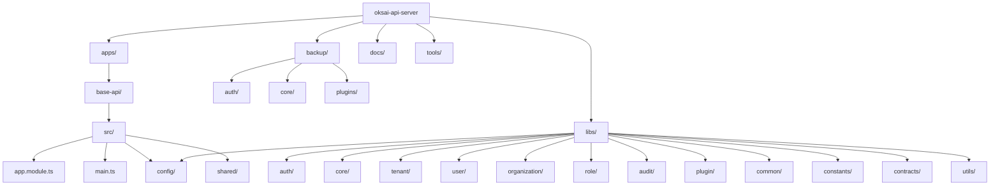
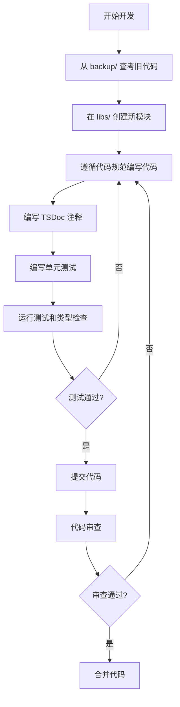
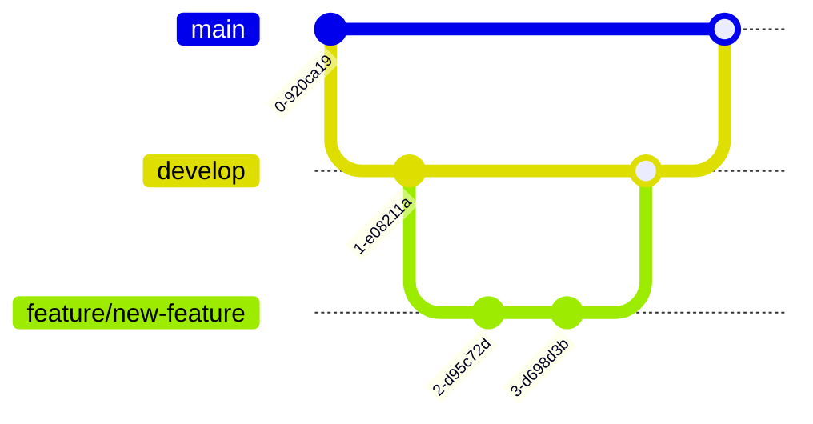

# 开发指南

## 📑 目录

-   [环境搭建](#环境搭建)
    -   [前置要求](#前置要求)
    -   [安装步骤](#安装步骤)
-   [项目结构详解](#项目结构详解)
-   [开发工作流程](#开发工作流程)
-   [常用开发命令](#常用开发命令)
    -   [启动开发服务](#启动开发服务)
    -   [构建命令](#构建命令)
    -   [测试命令](#测试命令)
    -   [代码检查命令](#代码检查命令)
    -   [数据库迁移命令](#数据库迁移命令)
-   [创建新模块指南](#创建新模块指南)
    -   [创建模块目录](#创建模块目录)
    -   [创建实体](#创建实体)
    -   [创建 DTO](#创建-dto)
    -   [创建 Service](#创建-service)
    -   [创建 Controller](#创建-controller)
    -   [创建 Module](#创建-module)
    -   [创建 Plugin](#创建-plugin)
    -   [在 AppModule 中注册](#在-appmodule-中注册)
-   [从 backup 复用代码指南](#从-backup-复用代码指南)
    -   [如何查找参考代码](#如何查找参考代码)
    -   [如何简化旧代码](#如何简化旧代码)
    -   [注意事项](#注意事项)
-   [开发配置](#开发配置)
    -   [数据库配置](#数据库配置)
    -   [JWT 配置](#jwt-配置)
    -   [OAuth 配置](#oauth-配置)
    -   [邮件配置](#邮件配置)
    -   [Redis 配置](#redis-配置)
-   [调试技巧](#调试技巧)
    -   [VS Code 调试配置](#vs-code-调试配置)
    -   [日志输出规范](#日志输出规范)
    -   [常见错误排查](#常见错误排查)
-   [Git 工作流](#git-工作流)
    -   [分支策略](#分支策略)
    -   [提交信息规范](#提交信息规范)
    -   [代码审查流程](#代码审查流程)
-   [常见问题](#常见问题)
    -   [开发环境相关](#开发环境相关)
    -   [构建和部署相关](#构建和部署相关)
    -   [数据库相关](#数据库相关)

---

## 环境搭建

### 前置要求

在开始开发之前，请确保您的开发环境满足以下要求：

-   **Node.js** 20.x 或更高版本
-   **pnpm** 10.11.0 或更高版本
-   **PostgreSQL** 12.x 或更高版本
-   **Redis**（可选，用于邮件队列）
-   **Git**

### 安装步骤

#### 1. 克隆项目仓库

```bash
git clone https://github.com/oksais/platform.git
cd oksai-api-server
```

#### 2. 安装依赖

```bash
pnpm install
```

#### 3. 配置环境变量

复制 `.env.example` 文件为 `.env`，并根据实际情况修改配置：

```bash
cp .env.example .env
```

编辑 `.env` 文件，配置以下关键参数：

```bash
# 应用配置
NODE_ENV=development
PORT=3000

# 数据库配置
DB_TYPE=postgres
DB_HOST=localhost
DB_PORT=5432
DB_NAME=oksai_platform
DB_USER=postgres
DB_PASSWORD=your_password

# JWT 配置
JWT_SECRET=your_jwt_secret
JWT_REFRESH_SECRET=your_refresh_secret
JWT_EXPIRES_IN=1d
JWT_REFRESH_EXPIRES_IN=7d

# OAuth 配置（可选）
GOOGLE_CLIENT_ID=your_google_client_id
GOOGLE_CLIENT_SECRET=your_google_client_secret
GITHUB_CLIENT_ID=your_github_client_id
GITHUB_CLIENT_SECRET=your_github_client_secret
```

#### 4. 初始化数据库

```bash
# 创建数据库迁移
pnpm migration:generate --name=init

# 运行数据库迁移
pnpm migration:run
```

#### 5. 启动开发服务

```bash
cd apps/base-api && pnpm run start:dev
```

服务启动后，访问 `http://localhost:3000/api/v1/health` 检查服务状态。

---

## 项目结构详解



**目录说明：**

-   **apps/** - 应用层，包含所有应用代码
    -   **base-api/** - 主 NestJS 应用
    -   **mcp/** - MCP 服务器
    -   **mcp-auth/** - MCP 认证服务
-   **libs/** - 新开发的 @oksai/\* 包
    -   **auth/** - 认证模块
    -   **core/** - 核心模块
    -   **tenant/** - 租户模块
    -   **user/** - 用户模块
    -   **organization/** - 组织模块
    -   **role/** - 角色权限
    -   **audit/** - 审计日志
    -   **plugin/** - 插件系统
    -   **common/** - 公共模块
    -   **config/** - 配置模块
    -   **constants/** - 常量定义
    -   **contracts/** - 契约/接口定义
    -   **utils/** - 工具函数
-   **backup/** - 旧项目代码（参考，不修改）
-   **docs/** - 项目文档
-   **tools/** - 工具脚本

---

## 开发工作流程



**详细说明：**

1. **从 backup/ 查考旧代码** - 在 `backup/` 目录中查找相关功能的参考代码
2. **在 libs/ 创建新模块** - 在 `libs/` 目录下创建新的 @oksai/\* 包
3. **遵循代码规范编写代码** - 按照 [代码规范](./CODING_STANDARDS.md) 编写代码
4. **编写 TSDoc 注释** - 为公共 API 添加完整的 TSDoc 注释
5. **编写单元测试** - 编写单元测试（覆盖率 ≥ 80%）
6. **运行测试和类型检查** - 运行测试和类型检查，确保代码质量
7. **提交代码** - 提交代码（Git 提交信息使用英文）
8. **代码审查** - 代码审查
9. **合并代码** - 合并代码

---

## 常用开发命令

### 启动开发服务

```bash
# 启动 base-api 应用（开发模式）
cd apps/base-api && pnpm run start:dev

# 启动 base-api 应用（生产模式）
cd apps/base-api && pnpm run build && pnpm run start

# 使用 Turbo 启动所有应用
pnpm dev
```

### 构建命令

```bash
# 构建指定的 @oksai 包
pnpm run build --filter="@oksai/<package-name>"

# 构建所有 @oksai 包
pnpm run build --filter="@oksai/**"

# 构建所有包
pnpm run build

# 从 libs/ 目录构建单个包
cd libs/<package-name> && pnpm run build
```

### 测试命令

```bash
# 运行所有测试
pnpm test

# 运行指定包的测试
cd libs/<package-name> && pnpm test

# 运行单个测试文件
cd libs/<package-name> && pnpm test user.service.spec.ts

# 以监听模式运行测试
cd libs/<package-name> && pnpm run test:watch

# 运行测试并生成覆盖率报告
cd libs/<package-name> && pnpm run test:cov
```

### 代码检查命令

```bash
# 检查所有包
pnpm run lint

# 检查指定包
cd libs/<package-name> && pnpm run lint

# 类型检查（所有包）
pnpm run typecheck

# 类型检查（指定包）
cd libs/<package-name> && pnpm run typecheck
```

### 数据库迁移命令

```bash
# 创建新的迁移
pnpm migration:create

# 生成迁移（基于实体变更）
pnpm migration:generate

# 运行迁移
pnpm migration:run

# 回滚迁移
pnpm migration:revert
```

---

## 创建新模块指南

### 创建模块目录

在 `libs/` 目录下创建新的模块目录：

```bash
mkdir -p libs/<module-name>/src/lib/entities
mkdir -p libs/<module-name>/src/lib/dto
```

### 创建实体

创建 `libs/<module-name>/src/lib/entities/<entity-name>.entity.ts`：

```typescript
import { Entity, Property, Enum, Index } from '@mikro-orm/core';
import { BaseEntity } from '@oksai/core';

/**
 * 状态枚举
 */
export enum EntityStatus {
	/** 活跃状态 */
	ACTIVE = 'ACTIVE',
	/** 暂停状态 */
	SUSPENDED = 'SUSPENDED'
}

/**
 * 实体名称
 *
 * 实体描述信息
 */
@Entity({ tableName: '<table_name>' })
@Index({ name: 'idx_entity_tenant', properties: ['tenantId'] })
@Index({ name: 'idx_entity_status', properties: ['status'] })
export class EntityName extends BaseEntity {
	/** 实体名称 */
	@Property()
	name!: string;

	/** 实体状态（默认：ACTIVE） */
	@Property({ default: EntityStatus.ACTIVE })
	@Enum(() => EntityStatus)
	status: EntityStatus = EntityStatus.ACTIVE;

	/** 所属租户 ID */
	@Property()
	tenantId!: string;
}
```

### 创建 DTO

创建 `libs/<module-name>/src/lib/dto/<entity-name>.dto.ts`：

```typescript
/**
 * 创建实体 DTO
 */
export interface CreateEntityDto {
	/** 实体名称 */
	name: string;
	/** 实体状态 */
	status?: string;
	/** 所属租户 ID */
	tenantId: string;
}

/**
 * 更新实体 DTO
 */
export interface UpdateEntityDto {
	/** 实体名称 */
	name?: string;
	/** 实体状态 */
	status?: string;
}

/**
 * 查询实体 DTO
 */
export interface QueryEntityDto {
	/** 状态 */
	status?: string;
	/** 搜索关键词 */
	search?: string;
}
```

### 创建 Service

创建 `libs/<module-name>/src/lib/<module-name>.service.ts`：

```typescript
import { Injectable, NotFoundException, BadRequestException, Logger } from '@nestjs/common';
import { InjectRepository } from '@mikro-orm/nestjs';
import { EntityRepository, EntityManager } from '@mikro-orm/core';
import { EntityName, EntityStatus } from './entities/<entity-name>.entity';
import { CreateEntityDto, UpdateEntityDto, QueryEntityDto } from './dto/<entity-name>.dto';

@Injectable()
export class EntityNameService {
	private readonly logger = new Logger(EntityNameService.name);

	constructor(
		@InjectRepository(EntityName)
		private readonly entityRepo: EntityRepository<EntityName>
	) {}

	private get em(): EntityManager {
		return this.entityRepo.getEntityManager();
	}

	/**
	 * 创建新实体
	 *
	 * @param data - 实体创建数据
	 * @returns 已创建的实体
	 * @throws BadRequestException 如果实体名称已存在
	 */
	async create(data: CreateEntityDto): Promise<EntityName> {
		// 检查实体名称是否已存在
		const existing = await this.entityRepo.findOne({ name: data.name });
		if (existing) {
			throw new BadRequestException('实体名称已存在');
		}

		// 创建新实体并设置默认状态
		const entity = this.entityRepo.create({
			...data,
			status: data.status ? EntityStatus[data.status] : EntityStatus.ACTIVE
		} as any);

		this.em.persist(entity);
		await this.em.flush();

		this.logger.log(`已创建新实体：${entity.id}`);
		return entity;
	}

	/**
	 * 查询实体列表
	 *
	 * @param query - 查询参数
	 * @returns 包含实体列表和总数的响应
	 */
	async findAll(query: QueryEntityDto = {}): Promise<{ data: EntityName[]; total: number }> {
		const where: any = {};

		if (query.status) {
			where.status = EntityStatus[query.status];
		}

		if (query.search) {
			where.name = { $like: `%${query.search}%` };
		}

		const [data, total] = await this.entityRepo.findAndCount(where);

		return { data, total };
	}

	/**
	 * 根据 ID 查找实体
	 *
	 * @param id - 实体 ID
	 * @returns 实体实体（如果找到），否则抛出异常
	 * @throws NotFoundException 当实体不存在时
	 */
	async findOne(id: string): Promise<EntityName> {
		const entity = await this.entityRepo.findOne({ id } as any);

		if (!entity) {
			throw new NotFoundException(`未找到 ID 为 ${id} 的实体`);
		}

		return entity;
	}

	/**
	 * 更新实体
	 *
	 * @param id - 实体 ID
	 * @param data - 更新数据
	 * @returns 已更新的实体
	 * @throws NotFoundException 当实体不存在时
	 */
	async update(id: string, data: UpdateEntityDto): Promise<EntityName> {
		const entity = await this.findOne(id);

		Object.assign(entity, data);

		if (data.status) {
			entity.status = EntityStatus[data.status];
		}

		this.em.persist(entity);
		await this.em.flush();

		this.logger.log(`已更新实体：${entity.id}`);
		return entity;
	}

	/**
	 * 删除实体（软删除）
	 *
	 * @param id - 实体 ID
	 * @returns Promise<void> 无返回值
	 */
	async remove(id: string): Promise<void> {
		const entity = await this.findOne(id);

		this.em.remove(entity);
		await this.em.flush();

		this.logger.log(`已删除实体：${id}`);
	}
}
```

### 创建 Controller

创建 `libs/<module-name>/src/lib/<module-name>.controller.ts`：

```typescript
import { Controller, Get, Post, Put, Delete, Body, Param, Query } from '@nestjs/common';
import { EntityNameService } from './<module-name>.service';
import { CreateEntityDto, UpdateEntityDto, QueryEntityDto } from './dto/<entity-name>.dto';

/**
 * 实体控制器
 *
 * 提供实体的 HTTP API 接口
 */
@Controller('entities')
export class EntityNameController {
	constructor(private readonly entityService: EntityNameService) {}

	/**
	 * 创建实体
	 *
	 * @param data - 实体创建数据
	 * @returns 已创建的实体
	 */
	@Post()
	async create(@Body() data: CreateEntityDto): Promise<EntityName> {
		return await this.entityService.create(data);
	}

	/**
	 * 查询实体列表
	 *
	 * @param query - 查询参数
	 * @returns 包含实体列表和总数的响应
	 */
	@Get()
	async findAll(@Query() query: QueryEntityDto): Promise<{ data: EntityName[]; total: number }> {
		return await this.entityService.findAll(query);
	}

	/**
	 * 根据 ID 查找实体
	 *
	 * @param id - 实体 ID
	 * @returns 实体实体
	 */
	@Get(':id')
	async findOne(@Param('id') id: string): Promise<EntityName> {
		return await this.entityService.findOne(id);
	}

	/**
	 * 更新实体
	 *
	 * @param id - 实体 ID
	 * @param data - 更新数据
	 * @returns 已更新的实体
	 */
	@Put(':id')
	async update(@Param('id') id: string, @Body() data: UpdateEntityDto): Promise<EntityName> {
		return await this.entityService.update(id, data);
	}

	/**
	 * 删除实体
	 *
	 * @param id - 实体 ID
	 * @returns 无返回值
	 */
	@Delete(':id')
	async remove(@Param('id') id: string): Promise<void> {
		return await this.entityService.remove(id);
	}
}
```

### 创建 Module

创建 `libs/<module-name>/src/lib/<module-name>.module.ts`：

```typescript
import { Module } from '@nestjs/common';
import { MikroOrmModule } from '@mikro-orm/nestjs';
import { EntityNameService } from './<module-name>.service';
import { EntityNameController } from './<module-name>.controller';
import { EntityName } from './entities/<entity-name>.entity';

/**
 * 实体模块
 *
 * 提供实体的功能模块
 */
@Module({
	imports: [MikroOrmModule.forFeature([EntityName])],
	providers: [EntityNameService],
	controllers: [EntityNameController],
	exports: [EntityNameService]
})
export class EntityNameModule {}
```

### 创建 Plugin

创建 `libs/<module-name>/src/lib/<module-name>.plugin.ts`：

```typescript
import * as chalk from 'chalk';
import { IOksaisPluginBootstrap, IOksaisPluginDestroy } from '@oksai/plugin';

export class EntityNamePlugin implements IOksaisPluginBootstrap, IOksaisPluginDestroy {
	private logEnabled = true;

	async onPluginBootstrap(): Promise<void> {
		if (this.logEnabled) {
			console.log(chalk.green('✓ Entity Name Plugin initialized'));
		}
	}

	async onPluginDestroy(): Promise<void> {
		if (this.logEnabled) {
			console.log(chalk.red('✗ Entity Name Plugin destroyed'));
		}
	}
}
```

### 在 AppModule 中注册

编辑 `apps/base-api/src/app.module.ts`，添加新模块：

```typescript
import { Module } from '@nestjs/common';
import { EntityNameModule } from '@oksai/<module-name>';
import { EntityNamePlugin } from '@oksai/<module-name>';

@Module({
	imports: [
		// 其他模块...
		EntityNameModule
	],
	providers: [
		// 其他插件...
		EntityNamePlugin
	]
})
export class AppModule {}
```

---

## 从 backup 复用代码指南

### 如何查找参考代码

在 `backup/` 目录中查找相关功能的参考代码：

```bash
# 查找 backup 中的实体文件
find backup/ -name "*.entity.ts"

# 查找 backup 中的服务文件
find backup/ -name "*.service.ts"

# 查找 backup 中的控制器文件
find backup/ -name "*.controller.ts"
```

### 如何简化旧代码

简化旧代码时，应遵循以下原则：

1. **移除 TypeORM 代码** - 只保留 MikroORM 相关代码
2. **移除 ORM 抽象层** - 直接使用 MikroORM
3. **简化数据库模型** - 移除不必要的字段和关联
4. **遵循新的代码规范** - 按照 [代码规范](./CODING_STANDARDS.md) 重构代码
5. **添加完整的 TSDoc 注释** - 为公共 API 添加完整的 TSDoc 注释

### 注意事项

**重要原则：**

-   **不修改原则**：不改动 `backup/` 目录的代码结构和代码内容（注释除外）
-   **参考复用**：优先使用可复用的旧代码，避免重复造轮子
-   **对齐结构**：新开发的代码组织结构应当保持与 `backup` 目录下的旧项目代码组织结构一致

---

## 开发配置

### 数据库配置

在 `.env` 文件中配置数据库连接：

```bash
# 数据库类型（postgres、mysql、sqlite）
DB_TYPE=postgres

# PostgreSQL 配置
DB_HOST=localhost
DB_PORT=5432
DB_NAME=oksai_platform
DB_USER=postgres
DB_PASSWORD=your_password

# MySQL 配置（备选）
# DB_TYPE=mysql
# DB_HOST=localhost
# DB_PORT=3306
# DB_NAME=oksai_platform
# DB_USER=root
# DB_PASSWORD=your_password

# SQLite 配置（备选）
# DB_TYPE=sqlite
# DB_DATABASE=./data/oksai.db
```

### JWT 配置

在 `.env` 文件中配置 JWT：

```bash
# JWT 访问令牌密钥（必须安全）
JWT_ACCESS_SECRET=your_secure_random_string

# JWT 刷新令牌密钥（必须安全）
JWT_REFRESH_SECRET=your_secure_random_string

# 访问令牌过期时间
JWT_ACCESS_EXPIRES_IN=1d

# 刷新令牌过期时间
JWT_REFRESH_EXPIRES_IN=7d
```

### OAuth 配置

在 `.env` 文件中配置 OAuth：

```bash
# Google OAuth
GOOGLE_CLIENT_ID=your_google_client_id.apps.googleusercontent.com
GOOGLE_CLIENT_SECRET=your_google_client_secret
ENABLE_GOOGLE_LOGIN=true

# GitHub OAuth
GITHUB_CLIENT_ID=your_github_client_id
GITHUB_CLIENT_SECRET=your_github_client_secret
ENABLE_GITHUB_LOGIN=true

# Microsoft OAuth
MICROSOFT_CLIENT_ID=your_microsoft_client_id
MICROSOFT_CLIENT_SECRET=your_microsoft_client_secret
MICROSOFT_AUTHORIZATION_URL=https://login.microsoftonline.com/common/oauth2/v2.0/authorize
MICROSOFT_TOKEN_URL=https://login.microsoftonline.com/common/oauth2/v2.0/token
ENABLE_MICROSOFT_LOGIN=true

# Auth0 OAuth
AUTH0_CLIENT_ID=your_auth0_client_id
AUTH0_CLIENT_SECRET=your_auth0_client_secret
AUTH0_DOMAIN=your_auth0_domain
ENABLE_AUTH0_LOGIN=true
```

### 邮件配置

在 `.env` 文件中配置邮件：

```bash
# SMTP 服务器配置
SMTP_HOST=smtp.gmail.com
SMTP_PORT=587
SMTP_SECURE=false
SMTP_USER=your-email@gmail.com
SMTP_PASS=your-app-password

# 邮件发件人信息
SMTP_FROM_NAME=OKSAI Platform
SMTP_FROM_EMAIL=noreply@oksai.io

# API 配置
API_BASE_URL=http://localhost:3000
CLIENT_BASE_URL=http://localhost:4200
```

### Redis 配置

在 `.env` 文件中配置 Redis（用于邮件队列）：

```bash
# Redis 连接配置
REDIS_HOST=localhost
REDIS_PORT=6379
REDIS_PASSWORD=
REDIS_DB=0

# 邮件告警配置
ADMIN_EMAIL=admin@oksai.io
```

---

## 调试技巧

### VS Code 调试配置

在项目根目录创建 `.vscode/launch.json`：

```json
{
	"version": "0.2.0",
	"configurations": [
		{
			"type": "node",
			"request": "launch",
			"name": "Debug Base API",
			"program": "${workspaceFolder}/apps/base-api/dist/main.js",
			"preLaunchTask": "tsc: build - apps/base-api/tsconfig.app.json",
			"outFiles": ["${workspaceFolder}/apps/base-api/dist/**/*.js"],
			"runtimeArgs": ["--nolazy", "-r", "ts-node/register"],
			"sourceMaps": true,
			"cwd": "${workspaceFolder}",
			"console": "integratedTerminal",
			"internalConsoleOptions": "neverOpen"
		}
	]
}
```

### 日志输出规范

使用 NestJS Logger 记录日志，日志消息使用中文：

```typescript
import { Logger } from '@nestjs/common';

@Injectable()
export class UserService {
	private readonly logger = new Logger(UserService.name);

	async create(data: CreateUserDto): Promise<User> {
		this.logger.debug(`正在创建用户：${data.email}`);

		const user = this.userRepo.create(data);
		await this.em.persistAndFlush(user);

		this.logger.log(`已创建新用户：${user.id}`);
		return user;
	}
}
```

### 常见错误排查

#### 数据库连接失败

**错误信息：** `Connection error: could not connect to database`

**解决方法：**

1. 检查 `.env` 文件中的数据库配置
2. 确保 PostgreSQL 服务已启动
3. 检查数据库用户名和密码是否正确
4. 检查防火墙设置

#### JWT 令牌验证失败

**错误信息：** `UnauthorizedException: 无效的令牌`

**解决方法：**

1. 检查 JWT 密钥配置
2. 检查令牌是否过期
3. 检查令牌格式是否正确

#### 依赖冲突

**错误信息：** `Error: Cannot find module 'xxx'`

**解决方法：**

1. 运行 `pnpm install` 重新安装依赖
2. 检查 `package.json` 中的依赖版本
3. 运行 `pnpm dedupe` 解决依赖冲突

---

## Git 工作流

### 分支策略



**分支说明：**

-   **main** - 主分支，用于生产环境
-   **develop** - 开发分支，用于集成新功能
-   **feature/xxx** - 功能分支，用于开发新功能
-   **hotfix/xxx** - 修复分支，用于紧急修复

### 提交信息规范

Git 提交信息必须使用英文描述，遵循 Conventional Commits 规范：

```bash
# 格式
<type>(<scope>): <subject>

# 示例
feat(auth): add Google OAuth login support
fix(tenant): fix tenant creation bug
docs(readme): update project description
style(core): fix code formatting
refactor(user): simplify user service logic
test(auth): add unit tests for auth service
chore(deps): update NestJS to version 11.1.12
```

**类型说明：**

-   `feat` - 新功能
-   `fix` - 修复 Bug
-   `docs` - 文档更新
-   `style` - 代码格式调整
-   `refactor` - 重构代码
-   `test` - 测试相关
-   `chore` - 构建、工具相关

### 代码审查流程

1. **提交 Pull Request** - 提交 PR 到 `develop` 分支
2. **代码审查** - 由其他开发者进行代码审查
3. **修改代码** - 根据审查意见修改代码
4. **合并代码** - 审查通过后合并代码
5. **删除分支** - 删除已合并的功能分支

---

## 常见问题

### 开发环境相关

#### Q: 如何创建新的 @oksai/ 包？

A: 参考 [创建新模块指南](#创建新模块指南)，在 `libs/` 目录下创建新的包目录，并按照规范创建实体、DTO、Service、Controller、Module 和 Plugin。

#### Q: 如何从 backup 复用代码？

A: 参考 [从 backup 复用代码指南](#从-backup-复用代码指南)，在 `backup/` 目录中查找相关功能的参考代码，并按照新的代码规范进行简化。

#### Q: 如何解决依赖冲突？

A: 运行 `pnpm install` 重新安装依赖，或运行 `pnpm dedupe` 解决依赖冲突。

### 构建和部署相关

#### Q: 如何构建生产版本？

A: 运行 `pnpm run build:prod` 构建生产版本。

#### Q: 如何配置生产环境？

A: 参考 [开发配置](#开发配置)，在 `.env` 文件中配置生产环境的参数。

### 数据库相关

#### Q: 如何进行数据库迁移？

A: 参考 [数据库迁移命令](#数据库迁移命令)，使用 `pnpm migration:generate` 生成迁移，使用 `pnpm migration:run` 运行迁移。

#### Q: 如何回滚数据库迁移？

A: 运行 `pnpm migration:revert` 回滚最后一次迁移。

---

## 版本信息

-   **文档版本：** 1.0.0
-   **最后更新：** 2026-02-04
-   **维护者：** OKSAI 平台团队
