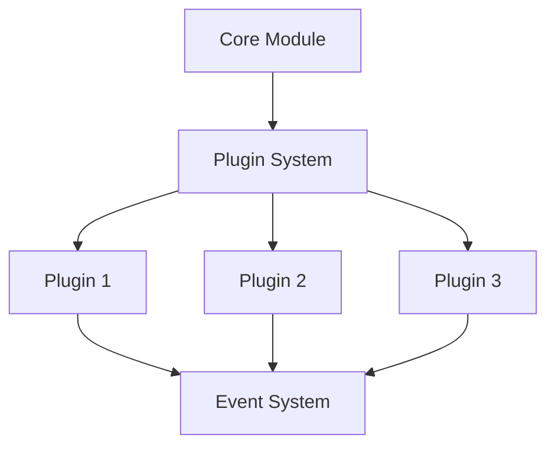
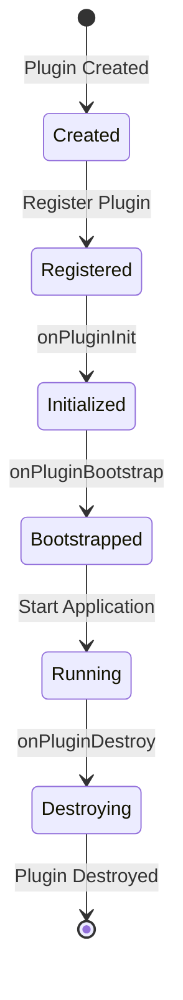
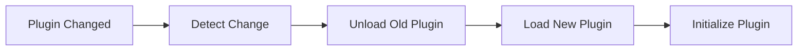

# 插件开发指南

## 📑 目录

-   [插件系统概述](#插件系统概述)
    -   [插件系统架构](#插件系统架构)
    -   [插件生命周期](#插件生命周期)
    -   [插件依赖管理](#插件依赖管理)
-   [创建插件](#创建插件)
    -   [创建插件目录](#创建插件目录)
    -   [定义插件接口](#定义插件接口)
    -   [实现插件逻辑](#实现插件逻辑)
    -   [注册插件](#注册插件)
-   [插件开发最佳实践](#插件开发最佳实践)
    -   [插件设计原则](#插件设计原则)
    -   [插件测试](#插件测试)
    -   [插件文档](#插件文档)
    -   [插件版本管理](#插件版本管理)
-   [插件示例](#插件示例)
    -   [Hello World 插件](#hello-world-插件)
    -   [数据插件](#数据插件)
    -   [API 插件](#api-插件)
    -   [集成插件](#集成插件)
-   [插件通信](#插件通信)
    -   [事件机制](#事件机制)
    -   [服务调用](#服务调用)
    -   [数据共享](#数据共享)
-   [插件热加载](#插件热加载)
    -   [热加载机制](#热加载机制)
    -   [热加载配置](#热加载配置)
    -   [热加载最佳实践](#热加载最佳实践)
-   [现有插件参考](#现有插件参考)
    -   [集成类插件](#集成类插件)
    -   [业务功能插件](#业务功能插件)
    -   [插件参考代码](#插件参考代码)
-   [插件发布](#插件发布)
    -   [插件打包](#插件打包)
    -   [插件发布到 npm](#插件发布到-npm)
    -   [插件发布到私有仓库](#插件发布到私有仓库)
-   [常见问题](#常见问题)
    -   [开发相关](#开发相关)
    -   [测试相关](#测试相关)
    -   [部署相关](#部署相关)

---

## 插件系统概述

### 插件系统架构

OKSAI 平台采用插件化架构，支持功能的动态扩展和定制。

**插件系统架构：**



### 插件生命周期

插件生命周期包括创建、注册、初始化、运行、销毁等阶段。

**插件生命周期：**



### 插件依赖管理

插件可以声明依赖关系，确保按正确顺序加载。

**插件依赖关系：**

```mermaid
graph TD
    Plugin1[Plugin 1]
    Plugin2[Plugin 2]
    Plugin3[Plugin 3]
    Core[@oksai/core]

    Plugin1 --> Core
    Plugin2 --> Core
    Plugin2 --> Plugin1
    Plugin3 --> Core
    Plugin3 --> Plugin2
```

---

## 创建插件

### 创建插件目录

在 `libs/` 目录下创建新的插件目录：

```bash
mkdir -p libs/plugins/<plugin-name>/src/lib
```

### 定义插件接口

实现插件接口，定义插件的生命周期方法。

**插件接口定义：**

```typescript
import { IOksaisPluginBootstrap, IOksaisPluginDestroy } from '@oksai/plugin';

export class MyPlugin implements IOksaisPluginBootstrap, IOksaisPluginDestroy {
	dependencies = ['@oksai/core'];

	async onPluginBootstrap(): Promise<void> {
		console.log('MyPlugin initialized');
	}

	async onPluginDestroy(): Promise<void> {
		console.log('MyPlugin destroyed');
	}
}
```

### 实现插件逻辑

实现插件的业务逻辑，包括 Service、Controller、Entity 等。

**插件 Service：**

```typescript
@Injectable()
export class MyPluginService {
	private readonly logger = new Logger(MyPluginService.name);

	async doSomething(): Promise<string> {
		this.logger.log('Doing something...');
		return 'Done';
	}
}
```

**插件 Controller：**

```typescript
@Controller('my-plugin')
export class MyPluginController {
	constructor(private readonly myPluginService: MyPluginService) {}

	@Get()
	async index(): Promise<string> {
		return await this.myPluginService.doSomething();
	}
}
```

**插件 Module：**

```typescript
@Module({
	providers: [MyPluginService],
	controllers: [MyPluginController]
})
export class MyPluginModule {}
```

### 注册插件

在 `AppModule` 中注册插件：

```typescript
@Module({
	imports: [MyPluginModule],
	providers: [MyPlugin]
})
export class AppModule {}
```

---

## 插件开发最佳实践

### 插件设计原则

**插件设计原则：**

-   **单一职责** - 每个插件只负责一个功能
-   **依赖最小化** - 最小化插件之间的依赖
-   **接口隔离** - 使用接口隔离插件
-   **易于扩展** - 设计易于扩展的插件

### 插件测试

**插件测试示例：**

```typescript
import { Test, TestingModule } from '@nestjs/testing';
import { MyPluginService } from './my-plugin.service';

describe('MyPluginService', () => {
	let service: MyPluginService;

	beforeEach(async () => {
		const module: TestingModule = await Test.createTestingModule({
			providers: [MyPluginService]
		}).compile();

		service = module.get<MyPluginService>(MyPluginService);
	});

	it('should be defined', () => {
		expect(service).toBeDefined();
	});

	it('should do something', async () => {
		const result = await service.doSomething();
		expect(result).toBe('Done');
	});
});
```

### 插件文档

**插件文档应该包含：**

-   插件简介
-   功能说明
-   安装指南
-   配置说明
-   使用示例
-   API 文档

### 插件版本管理

**插件版本管理：**

-   遵循语义化版本（Semantic Versioning）
-   版本号格式：`MAJOR.MINOR.PATCH`
-   `MAJOR` - 不兼容的 API 变更
-   `MINOR` - 向后兼容的功能性新增
-   `PATCH` - 向后兼容的问题修正

---

## 插件示例

### Hello World 插件

**插件代码：**

```typescript
import { Injectable } from '@nestjs/common';
import * as chalk from 'chalk';
import { IOksaisPluginBootstrap, IOksaisPluginDestroy } from '@oksai/plugin';

@Injectable()
export class HelloWorldPlugin implements IOksaisPluginBootstrap, IOksaisPluginDestroy {
	async onPluginBootstrap(): Promise<void> {
		console.log(chalk.green('✓ Hello World Plugin initialized'));
	}

	async onPluginDestroy(): Promise<void> {
		console.log(chalk.red('✗ Hello World Plugin destroyed'));
	}
}
```

### 数据插件

**插件实体：**

```typescript
import { Entity, Property } from '@mikro-orm/core';
import { BaseEntity } from '@oksai/core';

@Entity({ tableName: 'my_plugin_data' })
export class MyPluginData extends BaseEntity {
	@Property()
	name!: string;

	@Property()
	value!: string;
}
```

**插件 Service：**

```typescript
@Injectable()
export class MyPluginDataService {
	constructor(
		@InjectRepository(MyPluginData)
		private readonly repo: EntityRepository<MyPluginData>
	) {}

	async create(name: string, value: string): Promise<MyPluginData> {
		const data = this.repo.create({ name, value });
		await this.em.persistAndFlush(data);
		return data;
	}

	async findAll(): Promise<MyPluginData[]> {
		return await this.repo.findAll();
	}
}
```

### API 插件

**插件 Controller：**

```typescript
@Controller('my-plugin')
export class MyPluginController {
	constructor(private readonly myPluginDataService: MyPluginDataService) {}

	@Post()
	async create(@Body() body: { name: string; value: string }): Promise<MyPluginData> {
		return await this.myPluginDataService.create(body.name, body.value);
	}

	@Get()
	async findAll(): Promise<MyPluginData[]> {
		return await this.myPluginDataService.findAll();
	}
}
```

### 集成插件

**集成插件示例：**

```typescript
import { Injectable } from '@nestjs/common';
import { HttpService } from '@nestjs/axios';
import { IOksaisPluginBootstrap } from '@oksai/plugin';

@Injectable()
export class IntegrationPlugin implements IOksaisPluginBootstrap {
	constructor(private readonly httpService: HttpService) {}

	async onPluginBootstrap(): Promise<void> {
		console.log('Integration Plugin initialized');
		await this.connectToExternalService();
	}

	private async connectToExternalService(): Promise<void> {
		const response = await this.httpService.get('https://api.example.com').toPromise();
		console.log('Connected to external service', response.data);
	}
}
```

---

## 插件通信

### 事件机制

插件可以通过事件机制进行通信。

**发送事件：**

```typescript
@Injectable()
export class MyPluginService {
	constructor(private readonly eventEmitter: EventEmitter2) {}

	async doSomething(): Promise<void> {
		this.eventEmitter.emit('my-plugin.event', { data: 'something' });
	}
}
```

**监听事件：**

```typescript
@Injectable()
export class OtherPluginService {
	@OnEvent('my-plugin.event')
	handleMyPluginEvent(payload: any): void {
		console.log('Received event:', payload);
	}
}
```

### 服务调用

插件可以通过依赖注入调用其他插件的服务。

**调用其他插件服务：**

```typescript
@Injectable()
export class MyPluginService {
	constructor(private readonly otherPluginService: OtherPluginService) {}

	async doSomething(): Promise<void> {
		await this.otherPluginService.doSomethingElse();
	}
}
```

### 数据共享

插件可以通过共享的数据库模型或共享的缓存进行数据共享。

**共享数据库模型：**

```typescript
// 共享的实体
@Entity({ tableName: 'shared_data' })
export class SharedData extends BaseEntity {
	@Property()
	data!: string;
}
```

---

## 插件热加载

### 热加载机制

插件热加载允许在不重启应用的情况下动态加载和卸载插件。

**热加载流程：**



### 热加载配置

**热加载配置：**

```typescript
@Module({
	providers: [
		{
			provide: 'PLUGIN_LOADER',
			useFactory: () => ({
				watchPlugins: true,
				autoReload: true
			})
		}
	]
})
export class AppModule {}
```

### 热加载最佳实践

**热加载最佳实践：**

-   **无状态设计** - 插件应该设计为无状态
-   **资源清理** - 插件销毁时应该清理资源
-   **错误处理** - 热加载失败时应该有错误处理机制

---

## 现有插件参考

### 集成类插件

**集成类插件列表：**

1. **integration-github** - GitHub 集成
2. **integration-jira** - Jira 集成
3. **integration-zapier** - Zapier 集成
4. **integration-upwork** - Upwork 集成
5. **integration-hubstaff** - Hubstaff 集成
6. **integration-wakatime** - Wakatime 集成
7. **integration-activepieces** - Activepieces 集成
8. **integration-make-com** - Make.com 集成
9. **sentry-tracing** - Sentry 追踪
10. **posthog** - Posthog 分析
11. **jitsu-analytics** - Jitsu 分析
12. **integration-ai** - AI 集成

### 业务功能插件

**业务功能插件列表：**

13. **changelog** - 变更日志
14. **knowledge-base** - 知识库
15. **registry** - 插件注册表
16. **job-proposal** - 工作提案
17. **job-search** - 工作搜索
18. **product-reviews** - 产品评论
19. **videos** - 视频
20. **camshot** - 摄像截图
21. **soundshot** - 声音截图

### 插件参考代码

所有插件参考代码位于 `backup/plugins/` 目录，可以参考这些插件的结构和实现。

---

## 插件发布

### 插件打包

**构建插件：**

```bash
cd libs/plugins/<plugin-name>
pnpm run build
```

**插件包结构：**

```
<plugin-name>/
├── dist/
│   ├── lib/
│   │   ├── index.js
│   │   ├── index.d.ts
│   │   ├── <plugin-name>.module.js
│   │   └── ...
├── package.json
└── README.md
```

### 插件发布到 npm

**发布插件：**

```bash
cd libs/plugins/<plugin-name>
pnpm publish
```

**package.json 配置：**

```json
{
	"name": "@oksai/plugin-<plugin-name>",
	"version": "1.0.0",
	"description": "Plugin description",
	"main": "dist/index.js",
	"types": "dist/index.d.ts",
	"files": ["dist"],
	"repository": {
		"type": "git",
		"url": "https://github.com/oksais/platform"
	},
	"keywords": ["oksai", "plugin"],
	"author": "OKSAI Platform Team",
	"license": "AGPL-3.0"
}
```

### 插件发布到私有仓库

**发布到私有仓库：**

```bash
cd libs/plugins/<plugin-name>
pnpm publish --registry=https://registry.npmjs.org/
```

---

## 常见问题

### 开发相关

**Q: 如何创建一个新的插件？**

A: 参考 [创建插件](#创建插件) 章节。

**Q: 如何调试插件？**

A: 使用 VS Code 的调试功能，设置断点调试插件代码。

**Q: 如何在插件中使用数据库？**

A: 使用 MikroORM 的 EntityManager 在插件中访问数据库。

### 测试相关

**Q: 如何测试插件？**

A: 参考 [插件测试](#插件测试) 章节。

**Q: 如何模拟插件的依赖？**

A: 使用 Jest 的 Mock 功能模拟插件的依赖。

### 部署相关

**Q: 如何部署插件？**

A: 插件随应用一起部署，无需单独部署。

**Q: 如何更新插件？**

A: 更新插件版本，重新构建和部署应用。

---

## 版本信息

-   **文档版本：** 1.0.0
-   **最后更新：** 2026-02-04
-   **维护者：** OKSAI 平台团队
