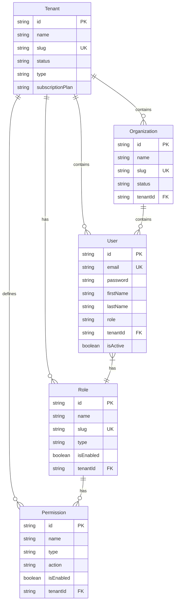
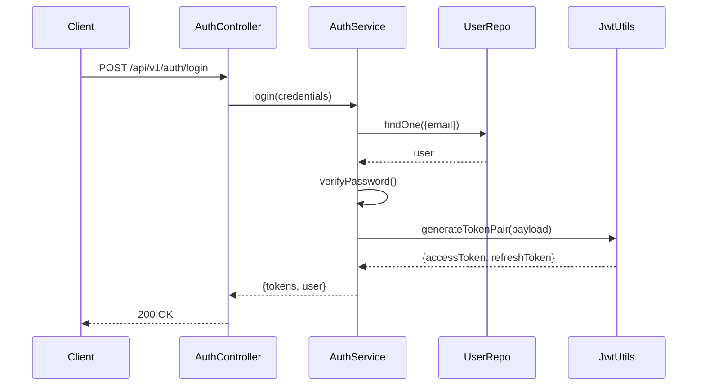
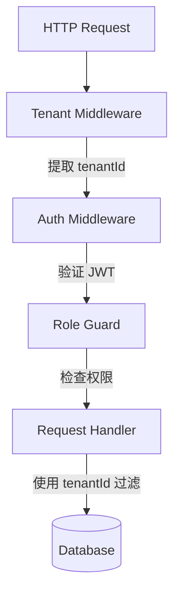

# 项目概览

## 📑 目录

-   [项目简介](#项目简介)
-   [项目目标](#项目目标)
-   [技术架构概览](#技术架构概览)
    -   [MonoRepo 架构](#monorepo-架构)
    -   [技术栈清单](#技术栈清单)
    -   [模块依赖关系](#模块依赖关系)
    -   [数据模型设计](#数据模型设计)
    -   [认证流程](#认证流程)
    -   [多租户隔离架构](#多租户隔离架构)
-   [核心功能模块](#核心功能模块)
    -   [认证模块（@oksai/auth）](#认证模块oksai/auth)
    -   [多租户管理（@oksai/tenant）](#多租户管理oksai/tenant)
    -   [用户管理（@oksai/user）](#用户管理oksai/user)
    -   [组织管理（@oksai/organization）](#组织管理oksai/organization)
    -   [角色权限（@oksai/role）](#角色权限oksai/role)
    -   [审计日志（@oksai/audit）](#审计日志oksai/audit)
    -   [插件系统（@oksai/plugin）](#插件系统oksai/plugin)
-   [项目特色](#项目特色)
-   [项目现状](#项目现状)
    -   [已完成功能](#已完成功能)
    -   [正在开发功能](#正在开发功能)
    -   [计划功能](#计划功能)
    -   [参考的 backup 插件列表](#参考的-backup-插件列表)

---

## 项目简介

OKSAI 平台是一个基于 MonoRepo 架构的多租户 SAAS 服务端应用，提供 ERP/CRM/HRM/ATS/PM 等综合业务管理功能。该项目基于开源项目 [Ever Gauzy](https://github.com/ever-co/ever-gauzy) 进行重构和简化，旨在构建一个轻量级、可扩展、易于维护的企业级应用平台。

### 项目愿景

构建一个现代化的企业级 SAAS 平台，通过插件化架构和微服务设计，为企业提供灵活、高效、安全的业务管理解决方案。

### 核心价值主张

-   **多租户支持**：原生支持多租户架构，实现数据隔离和个性化配置
-   **插件化设计**：基于插件系统，支持功能的灵活扩展和定制
-   **完整审计追踪**：提供全面的操作日志和审计功能，满足合规要求
-   **灵活权限控制**：基于 RBAC 的细粒度权限管理
-   **现代化技术栈**：采用 NestJS + MikroORM + PostgreSQL 等主流技术

---

## 项目目标

OKSAI 平台的核心目标是对 `backup` 目录下的旧项目代码进行简化和重构，具体包括：

### 删减不必要的第三方认证集成

已移除的第三方认证：

-   Facebook
-   Fiverr
-   Keycloak
-   LinkedIn
-   Twitter

保留的第三方认证：

-   ✅ Google OAuth 2.0
-   ✅ Microsoft OAuth 2.0
-   ✅ GitHub OAuth 2.0
-   ✅ Auth0

### 简化 ORM 层

-   移除 TypeORM 支持
-   统一使用 MikroORM 6.x
-   移除 ORM 抽象层
-   不再支持多 ORM

### 简化数据库模型

-   默认使用 PostgreSQL
-   后续支持 MongoDB
-   后续支持 Better-SQLite

### 代码复用策略

**重要原则**：新开发的代码组织结构应当保持与 `backup` 目录下的旧项目代码组织结构一致，并优先使用可复用的旧代码，避免重复造轮子。

---

## 技术架构概览

### MonoRepo 架构

项目采用 MonoRepo（单仓库）架构，使用 pnpm + Turbo 进行依赖管理和任务编排，确保所有包之间的依赖关系清晰、构建高效。

```mermaid
graph TB
    Root[oksai-api-server]
    Root --> Apps[apps/]
    Root --> Libs[libs/]
    Root --> Backup[backup/]

    Apps --> BaseAPI[base-api/]
    Apps --> MCP[mcp/]
    Apps --> MCPAuth[mcp-auth/]

    Libs --> Auth[@oksai/auth]
    Libs --> Core[@oksai/core]
    Libs --> Tenant[@oksai/tenant]
    Libs --> User[@oksai/user]
    Libs --> Org[@oksai/organization]
    Libs --> Role[@oksai/role]
    Libs --> Audit[@oksai/audit]
    Libs --> Plugin[@oksai/plugin]
    Libs --> Common[@oksai/common]
    Libs --> Config[@oksai/config]
    Libs --> Constants[@oksai/constants]
    Libs --> Contracts[@oksai/contracts]
    Libs --> Utils[@oksai/utils]

    Backup --> BackupAuth[auth/]
    Backup --> BackupCore[core/]
    Backup --> BackupPlugins[plugins/]
```

### 技术栈清单

#### 核心框架

-   **NestJS** 11.x - 企业级 Node.js 框架
-   **TypeScript** 5.8.0 - 超集 JavaScript

#### 数据库与 ORM

-   **MikroORM** 6.6.5 - 现代 TypeScript ORM
-   **PostgreSQL** 12+ - 主数据库
-   **Better-SQLite** - 嵌入式数据库（开发环境）
-   **MySQL** - 关系型数据库（备选）

#### 包管理与构建

-   **pnpm** 10.11.0 - 快速、节省磁盘空间的包管理器
-   **Turbo** 2.0.0 - 高性能构建系统

#### 认证与授权

-   **JWT** (jsonwebtoken 9.0.2) - 令牌认证
-   **Passport** (passport-google-oauth20, passport-github2, passport-auth0, passport-microsoft) - OAuth 2.0 认证
-   **bcrypt** 5.1.1 - 密码加密

#### 邮件与队列

-   **BullMQ** 5.26.2 - 任务队列
-   **Nodemailer** 6.9.14 - 邮件发送
-   **ioredis** 5.4.1 - Redis 客户端

#### 验证与转换

-   **class-validator** 0.14.2 - 数据验证
-   **class-transformer** 0.5.1 - 数据转换

#### 测试

-   **Jest** 29.7.0 - 单元测试框架
-   **ts-jest** 29.4.6 - TypeScript 预处理器
-   **Supertest** 6.3.3 - HTTP 测试

#### 工具库

-   **chalk** 4.1.0 - 终端输出着色
-   **moment** 2.30.1 - 日期处理
-   **handlebars** 4.7.8 - 模板引擎

### 模块依赖关系

```mermaid
graph TD
    BaseAPI[base-api]
    Core[@oksai/core]
    Auth[@oksai/auth]
    Tenant[@oksai/tenant]
    User[@oksai/user]
    Org[@oksai/organization]
    Role[@oksai/role]
    Audit[@oksai/audit]
    Plugin[@oksai/plugin]

    BaseAPI --> Auth
    BaseAPI --> Tenant
    BaseAPI --> User
    BaseAPI --> Org
    BaseAPI --> Role
    BaseAPI --> Audit
    BaseAPI --> Core

    Auth --> Core
    Tenant --> Core
    User --> Core
    Org --> Core
    Role --> Core
    Audit --> Core

    Auth --> Plugin
    Tenant --> Plugin
    User --> Plugin
    Org --> Plugin
    Role --> Plugin
    Audit --> Plugin
```

### 数据模型设计



### 认证流程



### 多租户隔离架构



---

## 核心功能模块

### 认证模块（@oksai/auth）

提供完整的用户认证和授权功能，支持多种认证方式。

**核心功能：**

-   JWT 令牌管理（访问令牌、刷新令牌）
-   用户注册和登录
-   密码重置
-   邮箱验证
-   OAuth 2.0 第三方登录（Google、GitHub、Auth0、Microsoft）
-   令牌黑名单（支持 Redis）

**主要接口：**

-   `AuthService.login()` - 用户登录
-   `AuthService.register()` - 用户注册
-   `AuthService.refreshToken()` - 刷新令牌
-   `AuthService.logout()` - 用户登出
-   `AuthService.forgotPassword()` - 忘记密码
-   `AuthService.resetPassword()` - 重置密码
-   `AuthService.verifyEmail()` - 验证邮箱

**相关实体：**

-   `User` - 用户实体

---

### 多租户管理（@oksai/tenant）

实现完整的多租户管理功能，支持租户的创建、查询、更新和删除。

**核心功能：**

-   租户创建和管理
-   租户状态管理（活跃、暂停、非活跃）
-   租户类型支持（组织、个人）
-   租户订阅计划管理
-   租户用户数限制
-   租户个性化配置（语言、时区等）

**主要接口：**

-   `TenantService.create()` - 创建租户
-   `TenantService.findAll()` - 查询租户列表
-   `TenantService.findOne()` - 查询单个租户
-   `TenantService.findBySlug()` - 根据标识查询租户
-   `TenantService.update()` - 更新租户
-   `TenantService.remove()` - 删除租户（软删除）
-   `TenantService.suspend()` - 暂停租户
-   `TenantService.activate()` - 激活租户

**相关实体：**

-   `Tenant` - 租户实体

---

### 用户管理（@oksai/user）

提供完整的用户管理功能，支持用户的创建、查询、更新和删除。

**核心功能：**

-   用户创建和管理
-   用户角色管理（管理员、普通用户、访客）
-   用户状态管理
-   用户个性化设置（时区、语言等）
-   用户活跃度追踪

**主要接口：**

-   `UserService.create()` - 创建用户
-   `UserService.findAll()` - 查询用户列表
-   `UserService.findOne()` - 查询单个用户
-   `UserService.update()` - 更新用户
-   `UserService.remove()` - 删除用户（软删除）

**相关实体：**

-   `User` - 用户实体

---

### 组织管理（@oksai/organization）

实现组织单元的管理功能，支持部门、团队等组织结构的创建和管理。

**核心功能：**

-   组织创建和管理
-   组织状态管理
-   组织个性化配置（货币、时区等）
-   组织层级结构

**主要接口：**

-   `OrganizationService.create()` - 创建组织
-   `OrganizationService.findAll()` - 查询组织列表
-   `OrganizationService.findOne()` - 查询单个组织
-   `OrganizationService.update()` - 更新组织
-   `OrganizationService.remove()` - 删除组织（软删除）

**相关实体：**

-   `Organization` - 组织实体

---

### 角色权限（@oksai/role）

实现基于 RBAC（Role-Based Access Control）的权限管理系统。

**核心功能：**

-   角色创建和管理
-   权限创建和管理
-   角色权限关联
-   权限类型支持（组织、用户、角色、权限）
-   权限操作支持（查看、创建、编辑、删除、分配、撤销）

**主要接口：**

-   `RoleService.create()` - 创建角色
-   `RoleService.findAll()` - 查询角色列表
-   `RoleService.findOne()` - 查询单个角色
-   `RoleService.update()` - 更新角色
-   `RoleService.remove()` - 删除角色（软删除）
-   `PermissionService.create()` - 创建权限
-   `PermissionService.findAll()` - 查询权限列表

**相关实体：**

-   `Role` - 角色实体
-   `Permission` - 权限实体

---

### 审计日志（@oksai/audit）

提供全面的操作日志和审计功能，满足合规要求。

**核心功能：**

-   操作日志记录（创建、更新、删除、登录、登出等）
-   受影响的实体追踪
-   修改前后值对比
-   操作者信息记录（用户 ID、IP 地址、User-Agent）
-   请求链路追踪（Request ID）

**主要接口：**

-   `AuditLogService.create()` - 创建审计日志
-   `AuditLogService.findAll()` - 查询审计日志列表
-   `AuditLogService.findOne()` - 查询单条审计日志

**相关实体：**

-   `AuditLog` - 审计日志实体

**支持的审计操作：**

-   `CREATE` - 创建操作
-   `UPDATE` - 更新操作
-   `DELETE` - 删除操作
-   `LOGIN` - 登录操作
-   `LOGOUT` - 登出操作
-   `REGISTER` - 注册操作
-   `PASSWORD_CHANGE` - 修改密码操作
-   `PASSWORD_RESET` - 重置密码操作
-   `EMAIL_VERIFY` - 验证邮箱操作

---

### 插件系统（@oksai/plugin）

提供灵活的插件化架构，支持功能的动态扩展和定制。

**核心功能：**

-   插件生命周期管理（启动、销毁）
-   插件元数据管理
-   插件钩子机制
-   插件依赖管理

**主要接口：**

-   `IOksaisPluginBootstrap.onPluginBootstrap()` - 插件启动钩子
-   `IOksaisPluginDestroy.onPluginDestroy()` - 插件销毁钩子

**插件开发流程：**

1. 创建插件目录 `libs/plugins/<plugin-name>`
2. 创建插件类并实现插件接口
3. 在 `AppModule` 中注册插件
4. 实现插件业务逻辑

---

## 项目特色

### 1. 插件化架构

基于插件系统，支持功能的灵活扩展和定制。开发者可以轻松开发自定义插件，满足特定业务需求。

### 2. 多租户 SAAS 支持

原生支持多租户架构，实现数据隔离和个性化配置。每个租户拥有独立的数据空间和配置项。

### 3. 完整的审计追踪

提供全面的操作日志和审计功能，记录所有关键操作，满足合规要求。

### 4. 灵活的权限控制

基于 RBAC 的细粒度权限管理，支持角色、权限、资源的灵活组合。

### 5. 现代化技术栈

采用 NestJS + MikroORM + PostgreSQL 等主流技术，确保项目的可维护性和可扩展性。

### 6. 代码复用策略

优先复用 `backup` 目录中的旧代码，避免重复造轮子，提高开发效率。

---

## 项目现状

### 已完成功能

-   ✅ MonoRepo 架构搭建（pnpm + Turbo）
-   ✅ 核心基础模块（@oksai/core）
-   ✅ 认证模块（@oksai/auth）
    -   ✅ JWT 令牌管理
    -   ✅ 用户注册和登录
    -   ✅ 密码重置
    -   ✅ OAuth 2.0 认证（Google、GitHub、Auth0、Microsoft）
-   ✅ 多租户管理（@oksai/tenant）
-   ✅ 用户管理（@oksai/user）
-   ✅ 组织管理（@oksai/organization）
-   ✅ 角色权限（@oksai/role）
-   ✅ 审计日志（@oksai/audit）
-   ✅ 插件系统（@oksai/plugin）
-   ✅ 数据库配置（PostgreSQL）
-   ✅ 邮件发送和队列（基于 BullMQ）

### 正在开发功能

-   🚧 Microsoft OAuth 2.0 集成
-   🚧 MongoDB 数据库支持
-   🚧 Better-SQLite 数据库支持

### 计划功能

-   📋 GraphQL API 支持
-   📋 实时通信（WebSocket）
-   📋 文件存储和管理
-   📋 任务调度和定时任务
-   📋 API 限流和防护
-   📋 国际化支持

### 参考的 backup 插件列表

`backup/plugins/` 目录下包含以下 23 个插件，可供参考和复用：

#### 集成类插件（15 个）

1. **integration-github** - GitHub 集成
2. **integration-jira** - Jira 集成
3. **integration-zapier** - Zapier 集成
4. **integration-upwork** - Upwork 集成
5. **integration-hubstaff** - Hubstaff 集成
6. **integration-wakatime** - Wakatime 集成
7. **integration-activepieces** - Activepieces 集成
8. **integration-make-com** - Make.com 集成
9. **integration-ai** - AI 集成
10. **sentry-tracing** - Sentry 追踪
11. **posthog** - Posthog 分析
12. **jitsu-analytics** - Jitsu 分析
13. **changelog** - 变更日志
14. **knowledge-base** - 知识库
15. **registry** - 注册中心

#### 业务功能插件（8 个）

16. **job-search** - 职位搜索
17. **job-proposal** - 职位提案
18. **product-reviews** - 产品评论
19. **videos** - 视频
20. **camshot** - 屏幕截图
21. **soundshot** - 音频录制

#### 注意事项

-   **不修改原则**：不改动 `backup/` 目录的代码结构和代码内容（注释除外）
-   **参考复用**：优先使用可复用的旧代码，避免重复造轮子
-   **对齐结构**：新开发的代码组织结构应当保持与 `backup` 目录下的旧项目代码组织结构一致

---

## 版本信息

-   **文档版本：** 1.0.0
-   **最后更新：** 2026-02-04
-   **维护者：** OKSAI 平台团队
