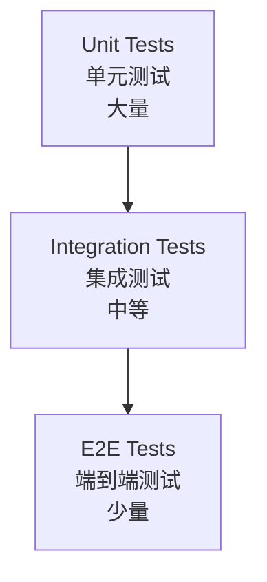

# 测试指南

## 📑 目录

-   [测试概述](#测试概述)
    -   [测试重要性](#测试重要性)
    -   [测试策略](#测试策略)
    -   [测试覆盖率要求](#测试覆盖率要求)
-   [单元测试](#单元测试)
    -   [测试文件位置](#测试文件位置)
    -   [测试框架](#测试框架)
    -   [测试示例](#测试示例)
    -   [测试最佳实践](#测试最佳实践)
-   [集成测试](#集成测试)
    -   [测试文件位置](#测试文件位置-1)
    -   [测试框架](#测试框架-1)
    -   [测试示例](#测试示例-1)
    -   [测试最佳实践](#测试最佳实践-1)
-   [端到端测试](#端到端测试)
    -   [测试文件位置](#测试文件位置-2)
    -   [测试框架](#测试框架-2)
    -   [测试示例](#测试示例-2)
    -   [测试最佳实践](#测试最佳实践-2)
-   [测试命令](#测试命令)
    -   [运行所有测试](#运行所有测试)
    -   [运行指定包的测试](#运行指定包的测试)
    -   [运行单个测试文件](#运行单个测试文件)
    -   [监听模式运行测试](#监听模式运行测试)
    -   [生成测试覆盖率报告](#生成测试覆盖率报告)
-   [测试工具](#测试工具)
    -   [Jest](#jest)
    -   [Supertest](#supertest)
    -   [测试替身](#测试替身)
-   [测试 CI/CD](#测试-cicd)
    -   [持续集成](#持续集成)
    -   [测试报告](#测试报告)
    -   [测试失败处理](#测试失败处理)
-   [常见问题](#常见问题)
    -   [测试相关](#测试相关)
    -   [覆盖率相关](#覆盖率相关)
    -   [CI/CD 相关](#cicd-相关)

---

## 测试概述

### 测试重要性

测试是确保软件质量的重要手段，可以及早发现和修复缺陷，提高代码的可靠性和可维护性。

**测试的价值：**

-   **提前发现缺陷** - 在代码部署前发现并修复问题
-   **保证代码质量** - 确保代码符合预期行为
-   **支持重构** - 在重构时保证功能不受影响
-   **文档作用** - 测试用例可以作为代码的使用示例
-   **提升信心** - 在发布前给予开发者和团队信心

### 测试策略

采用分层测试策略，单元测试、集成测试、端到端测试各司其职，确保快速反馈与可维护性。

**测试金字塔：**



**测试策略说明：**

-   **单元测试** - 测试单个函数、类或组件的逻辑
-   **集成测试** - 测试多个模块或组件之间的交互
-   **端到端测试** - 测试完整的用户流程

### 测试覆盖率要求

为确保代码质量，必须达到以下测试覆盖率要求：

**覆盖率标准：**

-   **核心业务逻辑测试覆盖率** - 须达到 80% 以上
-   **关键路径测试覆盖率** - 须达到 90% 以上
-   **所有公共 API** - 必须具备测试用例

**覆盖率统计：**

-   **语句覆盖率（Statement Coverage）** - 执行的代码行数占总行数的比例
-   **分支覆盖率（Branch Coverage）** - 执行的分支数占总分支数的比例
-   **函数覆盖率（Function Coverage）** - 执行的函数数占总函数数的比例
-   **行覆盖率（Line Coverage）** - 执行的代码行数占总行数的比例

---

## 单元测试

### 测试文件位置

单元测试与被测文件同目录，命名格式 `{filename}.spec.ts`。

**示例：**

```
libs/auth/src/lib/
├── auth.service.ts
├── auth.service.spec.ts
├── auth.controller.ts
├── auth.controller.spec.ts
└── dto/
    ├── auth.dto.ts
    └── auth.dto.spec.ts
```

### 测试框架

使用 Jest 作为单元测试框架，配合 NestJS 的测试工具。

**Jest 特性：**

-   **零配置** - 开箱即用的测试框架
-   **快照测试** - 轻松捕获和测试 UI 输出
-   **并行执行** - 加快测试速度
-   **覆盖率报告** - 内置覆盖率报告生成

**NestJS 测试工具：**

-   **TestingModule** - 创建测试模块
-   **Test.createTestingModule** - 创建测试模块
-   **get** - 获取 Provider 实例
-   **overrideProvider** - 覆盖 Provider

### 测试示例

以下是一个完整的单元测试示例：

```typescript
import { Test, TestingModule } from '@nestjs/testing';
import { AuthService } from './auth.service';
import { JwtUtils } from '@oksai/core';
import { getRepositoryToken } from '@mikro-orm/nestjs';
import { EntityRepository } from '@mikro-orm/core';
import { User, UserRole } from './entities/user.entity';

describe('AuthService', () => {
	let service: AuthService;
	let mockUserRepo: Partial<EntityRepository<User>>;
	let mockJwtUtils: Partial<JwtUtils>;

	beforeEach(async () => {
		// 创建 Mock Repository
		mockUserRepo = {
			findOne: jest.fn(),
			create: jest.fn(),
			persist: jest.fn(),
			flush: jest.fn()
		};

		// 创建 Mock JwtUtils
		mockJwtUtils = {
			generateTokenPair: jest.fn(),
			verifyAccessToken: jest.fn(),
			verifyRefreshToken: jest.fn()
		};

		const module: TestingModule = await Test.createTestingModule({
			providers: [
				AuthService,
				{
					provide: getRepositoryToken(User),
					useValue: mockUserRepo
				},
				{
					provide: JwtUtils,
					useValue: mockJwtUtils
				}
			]
		}).compile();

		service = module.get<AuthService>(AuthService);
	});

	afterEach(() => {
		jest.clearAllMocks();
	});

	it('should be defined', () => {
		expect(service).toBeDefined();
	});

	describe('login', () => {
		it('should login user with valid credentials', async () => {
			// Arrange
			const mockUser = {
				id: '123',
				email: 'user@example.com',
				password: 'hashedPassword',
				firstName: 'John',
				lastName: 'Doe',
				role: UserRole.USER,
				tenantId: '456'
			};

			const credentials = {
				email: 'user@example.com',
				password: 'password'
			};

			mockUserRepo.findOne.mockResolvedValue(mockUser);
			mockJwtUtils.generateTokenPair.mockReturnValue({
				accessToken: 'accessToken',
				refreshToken: 'refreshToken'
			});

			// Act
			const result = await service.login(credentials);

			// Assert
			expect(mockUserRepo.findOne).toHaveBeenCalledWith({
				email: credentials.email
			});
			expect(result).toHaveProperty('accessToken');
			expect(result).toHaveProperty('refreshToken');
			expect(result.user).toHaveProperty('id', '123');
		});

		it('should throw UnauthorizedException when user not found', async () => {
			// Arrange
			const credentials = {
				email: 'nonexistent@example.com',
				password: 'password'
			};

			mockUserRepo.findOne.mockResolvedValue(null);

			// Act & Assert
			await expect(service.login(credentials)).rejects.toThrow('用户名或密码错误');
		});

		it('should throw UnauthorizedException when password is invalid', async () => {
			// Arrange
			const mockUser = {
				id: '123',
				email: 'user@example.com',
				password: 'wrongPassword',
				firstName: 'John',
				lastName: 'Doe',
				role: UserRole.USER,
				tenantId: '456'
			};

			const credentials = {
				email: 'user@example.com',
				password: 'wrongPassword'
			};

			mockUserRepo.findOne.mockResolvedValue(mockUser);

			// Act & Assert
			await expect(service.login(credentials)).rejects.toThrow('用户名或密码错误');
		});
	});

	describe('register', () => {
		it('should register new user with valid data', async () => {
			// Arrange
			const credentials = {
				email: 'newuser@example.com',
				password: 'Password123!',
				firstName: 'Jane',
				lastName: 'Doe'
			};

			const mockUser = {
				id: '789',
				email: 'newuser@example.com',
				password: 'hashedPassword',
				firstName: 'Jane',
				lastName: 'Doe',
				role: UserRole.USER,
				tenantId: '456'
			};

			mockUserRepo.findOne.mockResolvedValue(null);
			mockUserRepo.create.mockReturnValue(mockUser);
			mockJwtUtils.generateTokenPair.mockReturnValue({
				accessToken: 'accessToken',
				refreshToken: 'refreshToken'
			});

			// Act
			const result = await service.register(credentials);

			// Assert
			expect(mockUserRepo.findOne).toHaveBeenCalledWith({
				email: credentials.email
			});
			expect(mockUserRepo.create).toHaveBeenCalled();
			expect(result).toHaveProperty('accessToken');
			expect(result.user).toHaveProperty('id', '789');
		});

		it('should throw ConflictException when email already exists', async () => {
			// Arrange
			const credentials = {
				email: 'existing@example.com',
				password: 'Password123!',
				firstName: 'Jane',
				lastName: 'Doe'
			};

			const existingUser = {
				id: '123',
				email: 'existing@example.com'
			};

			mockUserRepo.findOne.mockResolvedValue(existingUser);

			// Act & Assert
			await expect(service.register(credentials)).rejects.toThrow('此邮箱已被注册');
		});
	});
});
```

### 测试最佳实践

**单元测试最佳实践：**

1. **AAA 模式** - Arrange（准备）、Act（执行）、Assert（断言）
2. **一个测试一个断言** - 每个测试只验证一个行为
3. **描述性测试名称** - 测试名称应该清楚地描述测试内容
4. **使用 Mock** - 使用 Mock 隔离外部依赖
5. **测试边界情况** - 测试正常情况和异常情况
6. **保持测试简单** - 测试应该简单、清晰、易于理解
7. **避免测试实现细节** - 测试行为而非实现

**AAA 模式示例：**

```typescript
it('should login user with valid credentials', async () => {
	// Arrange - 准备测试数据和环境
	const mockUser = { id: '123', email: 'user@example.com' };
	const credentials = { email: 'user@example.com', password: 'password' };
	mockUserRepo.findOne.mockResolvedValue(mockUser);

	// Act - 执行被测试的方法
	const result = await service.login(credentials);

	// Assert - 验证结果
	expect(result).toHaveProperty('accessToken');
});
```

---

## 集成测试

### 测试文件位置

集成测试放置在 `tests/integration/` 目录。

**示例：**

```
tests/
└── integration/
    ├── auth/
    │   ├── auth.controller.integration.spec.ts
    │   └── auth.service.integration.spec.ts
    ├── tenant/
    │   ├── tenant.controller.integration.spec.ts
    │   └── tenant.service.integration.spec.ts
    └── user/
        ├── user.controller.integration.spec.ts
        └── user.service.integration.spec.ts
```

### 测试框架

使用 Jest 和 Supertest 进行集成测试。

**Supertest 特性：**

-   **HTTP 断言** - 提供 HTTP 断言方法
-   **Express 集成** - 与 Express 深度集成
-   **链式调用** - 支持链式调用编写测试

### 测试示例

以下是一个完整的集成测试示例：

```typescript
import { Test, TestingModule } from '@nestjs/testing';
import { INestApplication, ValidationPipe } from '@nestjs/common';
import * as request from 'supertest';
import { AppModule } from '../../apps/base-api/src/app.module';
import { MikroOrmModule } from '@mikro-orm/nestjs';
import { User } from '@oksai/auth';
import { Tenant } from '@oksai/tenant';

describe('Auth Integration Tests', () => {
	let app: INestApplication;
	let authToken: string;

	beforeAll(async () => {
		const moduleFixture: TestingModule = await Test.createTestingModule({
			imports: [AppModule]
		}).compile();

		app = moduleFixture.createNestApplication();
		app.useGlobalPipes(new ValidationPipe());
		await app.init();
	});

	afterAll(async () => {
		await app.close();
	});

	describe('POST /api/v1/auth/register', () => {
		it('should register a new user', () => {
			return request(app.getHttpServer())
				.post('/api/v1/auth/register')
				.send({
					email: 'integration@example.com',
					password: 'Password123!',
					firstName: 'Integration',
					lastName: 'Test'
				})
				.expect(201)
				.expect((res) => {
					expect(res.body.success).toBe(true);
					expect(res.body.data).toHaveProperty('accessToken');
					expect(res.body.data).toHaveProperty('refreshToken');
					expect(res.body.data.user).toHaveProperty('email', 'integration@example.com');
				});
		});

		it('should throw error when email already exists', () => {
			return request(app.getHttpServer())
				.post('/api/v1/auth/register')
				.send({
					email: 'integration@example.com',
					password: 'Password123!',
					firstName: 'Integration',
					lastName: 'Test'
				})
				.expect(409)
				.expect((res) => {
					expect(res.body.success).toBe(false);
					expect(res.body.error.message).toContain('此邮箱已被注册');
				});
		});
	});

	describe('POST /api/v1/auth/login', () => {
		it('should login with valid credentials', () => {
			return request(app.getHttpServer())
				.post('/api/v1/auth/login')
				.send({
					email: 'integration@example.com',
					password: 'Password123!'
				})
				.expect(200)
				.expect((res) => {
					expect(res.body.success).toBe(true);
					expect(res.body.data).toHaveProperty('accessToken');
					expect(res.body.data).toHaveProperty('refreshToken');
					authToken = res.body.data.accessToken;
				});
		});

		it('should throw error with invalid credentials', () => {
			return request(app.getHttpServer())
				.post('/api/v1/auth/login')
				.send({
					email: 'integration@example.com',
					password: 'wrongpassword'
				})
				.expect(401)
				.expect((res) => {
					expect(res.body.success).toBe(false);
					expect(res.body.error.message).toContain('用户名或密码错误');
				});
		});
	});

	describe('GET /api/v1/users/me', () => {
		it('should get current user', () => {
			return request(app.getHttpServer())
				.get('/api/v1/users/me')
				.set('Authorization', `Bearer ${authToken}`)
				.expect(200)
				.expect((res) => {
					expect(res.body.success).toBe(true);
					expect(res.body.data).toHaveProperty('email', 'integration@example.com');
				});
		});

		it('should throw error without token', () => {
			return request(app.getHttpServer()).get('/api/v1/users/me').expect(401);
		});
	});
});
```

### 测试最佳实践

**集成测试最佳实践：**

1. **使用真实的依赖** - 测试真实的数据库和外部服务
2. **使用测试数据库** - 使用独立的测试数据库
3. **清理测试数据** - 每个测试后清理数据
4. **测试完整的流程** - 测试完整的业务流程
5. **使用事务** - 使用事务回滚测试数据
6. **测试错误情况** - 测试正常情况和错误情况

---

## 端到端测试

### 测试文件位置

端到端测试放置在 `apps/base-api/src/e2e/` 目录。

**示例：**

```
apps/base-api/src/e2e/
├── app.e2e-spec.ts
├── auth.e2e-spec.ts
├── tenant.e2e-spec.ts
└── user.e2e-spec.ts
```

### 测试框架

使用 Jest 和 Supertest 进行端到端测试。

**端到端测试配置：**

```typescript
export default {
	preset: 'ts-jest',
	testEnvironment: 'node',
	roots: ['<rootDir>/e2e'],
	testMatch: ['**/*.e2e-spec.ts'],
	moduleNameMapper: {
		'^@/(.*)$': '<rootDir>/../src/$1',
		'^@oksai/(.*)$': '<rootDir>/../../libs/$1/src'
	}
};
```

### 测试示例

以下是一个完整的端到端测试示例：

```typescript
import { Test, TestingModule } from '@nestjs/testing';
import { INestApplication, ValidationPipe } from '@nestjs/common';
import * as request from 'supertest';
import { AppModule } from '../src/app.module';
import { MikroOrmModule } from '@mikro-orm/nestjs';

describe('App E2E Tests', () => {
	let app: INestApplication;
	let authToken: string;
	let userId: string;

	beforeAll(async () => {
		const moduleFixture: TestingModule = await Test.createTestingModule({
			imports: [AppModule]
		}).compile();

		app = moduleFixture.createNestApplication();
		app.useGlobalPipes(new ValidationPipe());
		await app.init();
	});

	afterAll(async () => {
		await app.close();
	});

	describe('完整用户注册和登录流程', () => {
		it('应该完成注册、登录和获取用户信息的完整流程', async () => {
			// 步骤 1：注册用户
			const registerResponse = await request(app.getHttpServer())
				.post('/api/v1/auth/register')
				.send({
					email: 'e2e@example.com',
					password: 'Password123!',
					firstName: 'E2E',
					lastName: 'Test'
				})
				.expect(201);

			expect(registerResponse.body.success).toBe(true);
			expect(registerResponse.body.data.user).toHaveProperty('id');
			userId = registerResponse.body.data.user.id;

			// 步骤 2：登录
			const loginResponse = await request(app.getHttpServer())
				.post('/api/v1/auth/login')
				.send({
					email: 'e2e@example.com',
					password: 'Password123!'
				})
				.expect(200);

			expect(loginResponse.body.success).toBe(true);
			expect(loginResponse.body.data).toHaveProperty('accessToken');
			authToken = loginResponse.body.data.accessToken;

			// 步骤 3：获取用户信息
			const userResponse = await request(app.getHttpServer())
				.get('/api/v1/users/me')
				.set('Authorization', `Bearer ${authToken}`)
				.expect(200);

			expect(userResponse.body.success).toBe(true);
			expect(userResponse.body.data).toHaveProperty('id', userId);
			expect(userResponse.body.data).toHaveProperty('email', 'e2e@example.com');
		});
	});

	describe('权限验证', () => {
		it('应该拒绝未授权的访问', async () => {
			await request(app.getHttpServer()).get('/api/v1/users').expect(401);
		});

		it('应该拒绝没有权限的访问', async () => {
			// 使用普通用户令牌访问管理员接口
			await request(app.getHttpServer())
				.get('/api/v1/admin/users')
				.set('Authorization', `Bearer ${authToken}`)
				.expect(403);
		});
	});

	describe('错误处理', () => {
		it('应该正确处理 404 错误', async () => {
			await request(app.getHttpServer())
				.get('/api/v1/users/nonexistent-id')
				.set('Authorization', `Bearer ${authToken}`)
				.expect(404)
				.expect((res) => {
					expect(res.body.success).toBe(false);
					expect(res.body.error.message).toContain('未找到');
				});
		});

		it('应该正确处理 400 错误', async () => {
			await request(app.getHttpServer())
				.post('/api/v1/auth/register')
				.send({
					email: 'invalid-email',
					password: 'short',
					firstName: 'Test',
					lastName: 'User'
				})
				.expect(400);
		});
	});
});
```

### 测试最佳实践

**端到端测试最佳实践：**

1. **测试关键流程** - 测试最重要的用户流程
2. **使用真实环境** - 使用与生产环境相似的配置
3. **测试跨页面** - 测试跨多个页面的用户流程
4. **使用 Page Object Model** - 使用页面对象模式
5. **清理测试数据** - 每个测试后清理数据
6. **使用等待机制** - 使用适当的等待机制

---

## 测试命令

### 运行所有测试

运行所有测试：

```bash
pnpm test
```

### 运行指定包的测试

运行指定包的测试：

```bash
cd libs/<package-name> && pnpm test
```

**示例：**

```bash
cd libs/auth && pnpm test
```

### 运行单个测试文件

运行单个测试文件：

```bash
cd libs/<package-name> && pnpm test <filename>.spec.ts
```

**示例：**

```bash
cd libs/auth && pnpm test auth.service.spec.ts
```

### 监听模式运行测试

以监听模式运行测试，测试文件变化时自动重新运行：

```bash
cd libs/<package-name> && pnpm run test:watch
```

### 生成测试覆盖率报告

运行测试并生成覆盖率报告：

```bash
cd libs/<package-name> && pnpm run test:cov
```

**覆盖率报告示例：**

```
----------|---------|----------|---------|---------|-------------------
File        | % Stmts | % Branch | % Funcs | % Lines | Uncovered Line #s
----------|---------|----------|---------|---------|-------------------
All files   |   85.32 |    75.45 |   91.23 |   84.56 |
 auth.service.ts |   90.45 |    80.23 |   95.12 |   89.34 | 45,67,89
 auth.controller.ts |   82.34 |    72.45 |   88.56 |   81.23 | 12,34,56,78
----------|---------|----------|---------|---------|-------------------
```

---

## 测试工具

### Jest

Jest 是一个流行的 JavaScript 测试框架，提供完整的测试解决方案。

**Jest 配置：**

```javascript
module.exports = {
	preset: 'ts-jest',
	testEnvironment: 'node',
	roots: ['<rootDir>/src', '<rootDir>/libs'],
	testMatch: ['**/*.spec.ts'],
	moduleNameMapper: {
		'^@oksai/(.*)$': '<rootDir>/../../libs/$1/src',
		'^@/(.*)$': '<rootDir>/src/$1'
	},
	collectCoverageFrom: ['**/*.ts', '!**/*.spec.ts', '!**/*.dto.ts', '!**/*.interface.ts', '!**/node_modules/**']
};
```

**常用 Jest API：**

-   `describe` - 测试套件
-   `it` / `test` - 测试用例
-   `beforeAll` - 所有测试之前执行
-   `afterAll` - 所有测试之后执行
-   `beforeEach` - 每个测试之前执行
-   `afterEach` - 每个测试之后执行
-   `expect` - 断言
-   `jest.fn()` - 创建 Mock 函数
-   `jest.mock()` - Mock 模块

### Supertest

Supertest 是一个 HTTP 测试库，用于测试 Node.js HTTP 服务器。

**Supertest 特性：**

-   **HTTP 断言** - 提供 HTTP 断言方法
-   **Express 集成** - 与 Express 深度集成
-   **链式调用** - 支持链式调用编写测试

**Supertest 示例：**

```typescript
import * as request from 'supertest';

describe('Auth API', () => {
	it('should register a new user', async () => {
		await request(app.getHttpServer())
			.post('/api/v1/auth/register')
			.send({
				email: 'test@example.com',
				password: 'Password123!',
				firstName: 'Test',
				lastName: 'User'
			})
			.expect(201)
			.expect((res) => {
				expect(res.body.success).toBe(true);
			});
	});
});
```

### 测试替身

使用测试替身（Test Doubles）隔离外部依赖。

**测试替身类型：**

-   **Stub** - 提供预定义的响应
-   **Mock** - 记录和验证调用
-   **Spy** - 监听函数调用
-   **Fake** - 简单的实现

**Stub 示例：**

```typescript
const mockUserRepo = {
	findOne: jest.fn().mockResolvedValue(mockUser)
};
```

**Mock 示例：**

```typescript
const mockLogger = {
	log: jest.fn(),
	error: jest.fn()
};

expect(mockLogger.log).toHaveBeenCalledWith('测试日志');
expect(mockLogger.log).toHaveBeenCalledTimes(1);
```

---

## 测试 CI/CD

### 持续集成

在 CI/CD 流水线中自动运行测试。

**GitHub Actions 配置示例：**

```yaml
name: Test

on: [push, pull_request]

jobs:
    test:
        runs-on: ubuntu-latest
        steps:
            - uses: actions/checkout@v3
            - uses: actions/setup-node@v3
              with:
                  node-version: '20'
            - run: pnpm install
            - run: pnpm test
            - run: pnpm run test:cov
            - uses: codecov/codecov-action@v3
              with:
                  files: ./coverage/lcov.info
```

### 测试报告

生成并上传测试报告。

**测试报告工具：**

-   **Jest Coverage** - 内置覆盖率报告
-   **Codecov** - 覆盖率报告上传
-   **SonarQube** - 代码质量分析

**Codecov 配置：**

```yaml
coverage:
    precision: 2
    round: down
    range: '70...100'
    status:
        project:
            default:
                target: 80
                threshold: 1%
```

### 测试失败处理

处理测试失败的情况。

**测试失败处理策略：**

1. **快速反馈** - 尽快发现测试失败
2. **失败原因分析** - 分析测试失败的原因
3. **修复优先级** - 优先修复核心业务测试
4. **失败通知** - 及时通知相关人员

**GitHub Actions 测试失败通知：**

```yaml
- name: Notify on failure
  if: failure()
  uses: actions/github-script@v6
  with:
      script: |
          github.rest.issues.create({
            owner: context.repo.owner,
            repo: context.repo.repo,
            title: '测试失败',
            body: '测试失败，请检查日志'
          });
```

---

## 常见问题

### 测试相关

**Q: 如何运行单个测试用例？**

A: 使用 `.only()` 修饰符运行单个测试用例：

```typescript
describe('AuthService', () => {
	it.only('should login user with valid credentials', async () => {
		// 这个测试会单独运行
	});
});
```

**Q: 如何跳过某个测试？**

A: 使用 `.skip()` 修饰符跳过某个测试：

```typescript
describe('AuthService', () => {
	it.skip('should login user with valid credentials', async () => {
		// 这个测试会被跳过
	});
});
```

**Q: 如何测试异步代码？**

A: 使用 `async/await` 处理异步代码：

```typescript
it('should login user with valid credentials', async () => {
	const result = await service.login(credentials);
	expect(result).toHaveProperty('accessToken');
});
```

### 覆盖率相关

**Q: 如何提高测试覆盖率？**

A: 以下是一些提高测试覆盖率的方法：

1. **添加更多的测试用例** - 覆盖更多的代码路径
2. **测试边界情况** - 测试正常情况和异常情况
3. **使用覆盖率报告** - 识别未覆盖的代码
4. **重构代码** - 简化复杂的代码逻辑

**Q: 覆盖率报告显示某个文件没有覆盖？**

A: 检查以下几点：

1. **测试文件位置** - 确保测试文件位置正确
2. **测试文件命名** - 确保测试文件命名正确（`.spec.ts`）
3. **覆盖率配置** - 确保覆盖率配置正确

### CI/CD 相关

**Q: 如何在 CI/CD 中运行测试？**

A: 在 CI/CD 配置文件中添加测试步骤：

```yaml
steps:
    - run: pnpm install
    - run: pnpm test
    - run: pnpm run test:cov
```

**Q: 如何在 CI/CD 中处理测试失败？**

A: 在 CI/CD 配置文件中添加失败处理：

```yaml
steps:
    - run: pnpm test || echo "测试失败"
```

---

## 版本信息

-   **文档版本：** 1.0.0
-   **最后更新：** 2026-02-04
-   **维护者：** OKSAI 平台团队
