# MCP 服务器架构

**版本**: v1.0
**最后更新**: 2026-02-10
**作者**: MCP 团队

## 系统概览

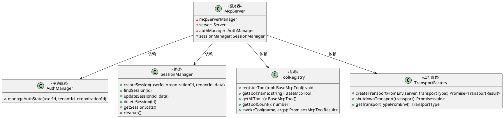

## 类图

### McpServer 类

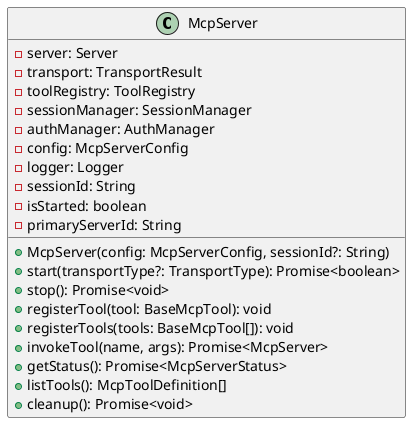

### McpServerManager 类

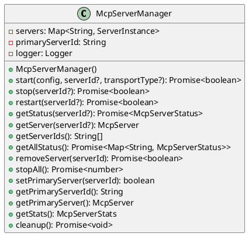

## 组件关系

### 1. 传输层组件

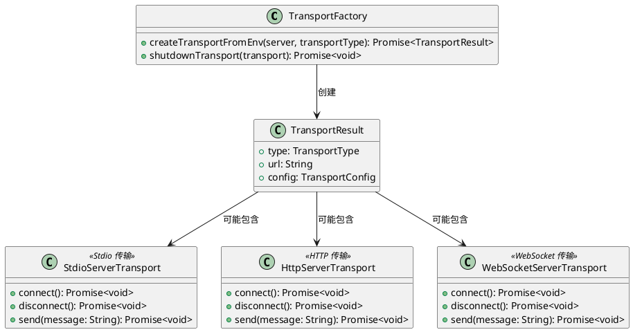

### 2. 工具层组件

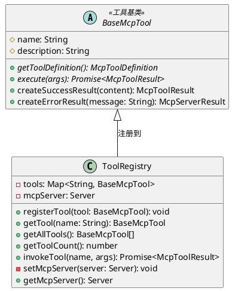

### 3. 会话管理组件

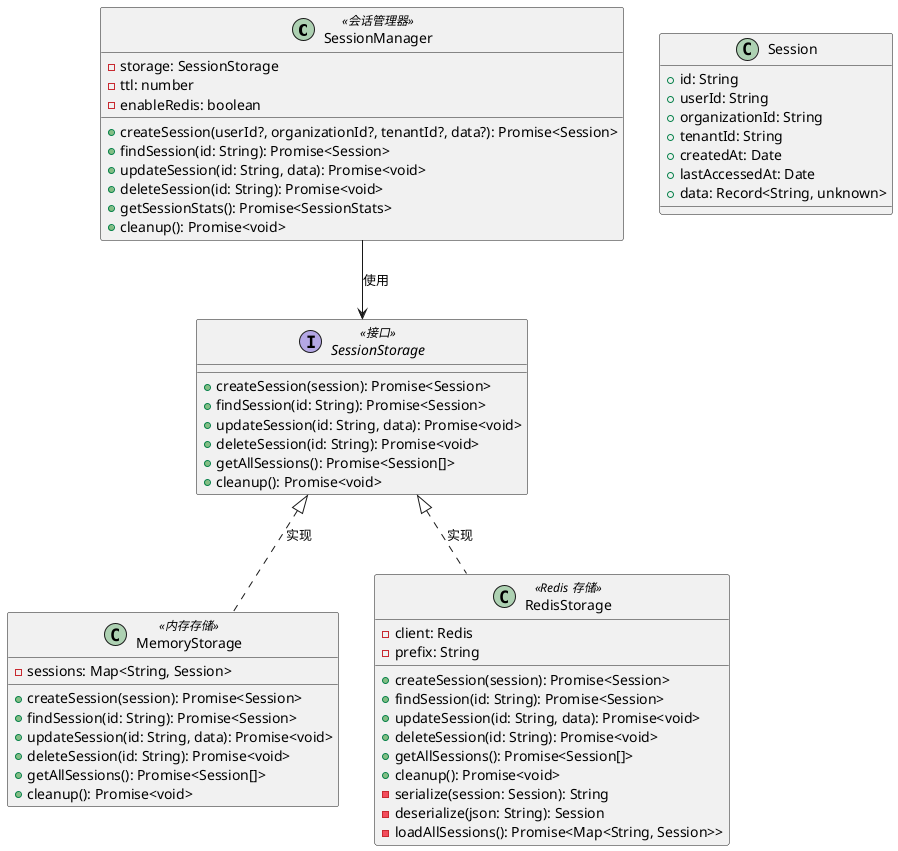

### 4. 认证管理组件

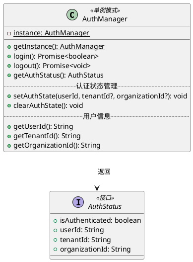

### 5. 服务器管理器组件

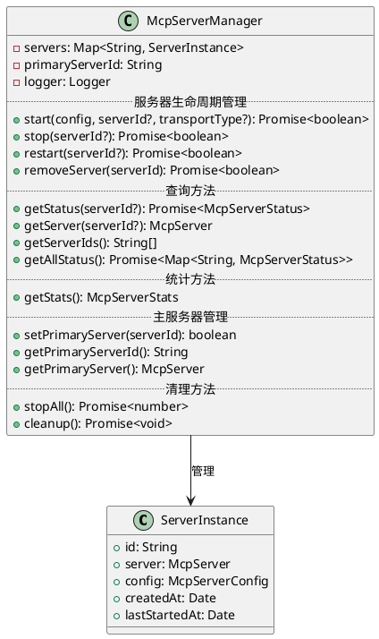

## 请求响应序列图

### MCP 服务器启动流程

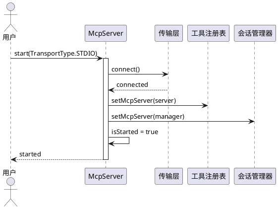

### 工具调用流程

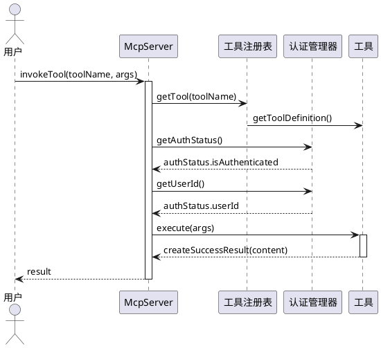

### 会话管理流程

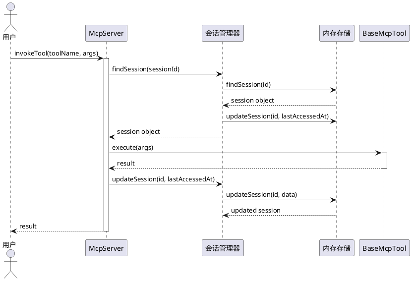

## 部署架构

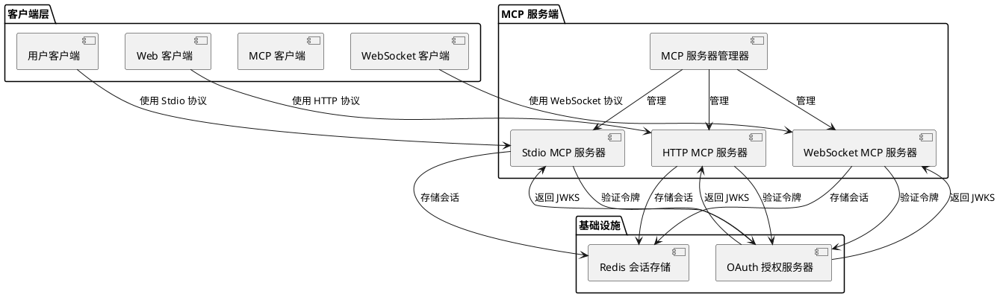

## 测试架构

### 单元测试结构

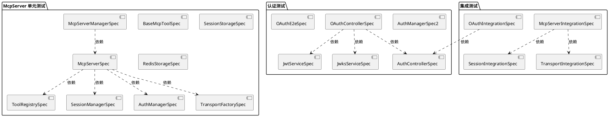

## 状态转换图

### McpServer 状态机

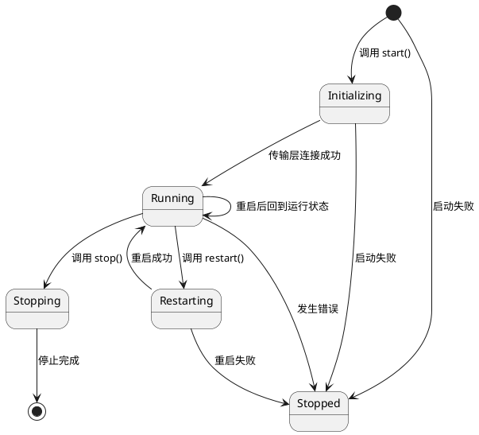

### 工具注册状态机

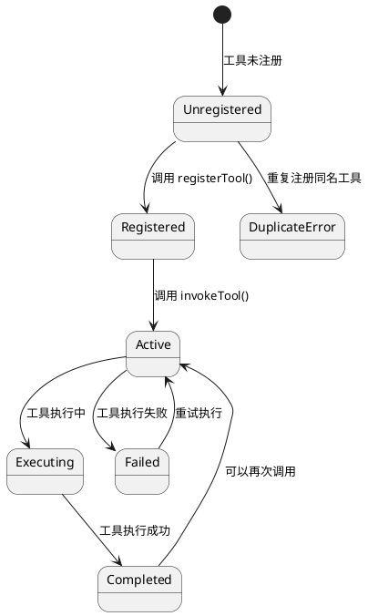

### 会话生命周期状态机

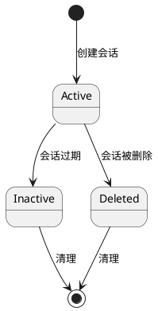

### 认证状态机

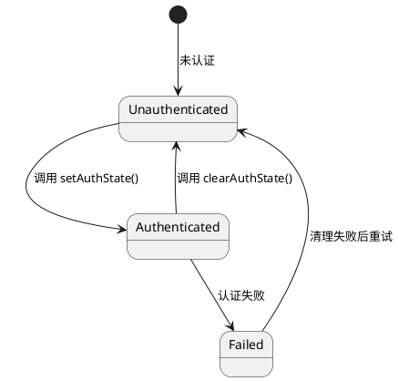

### 传输层状态机

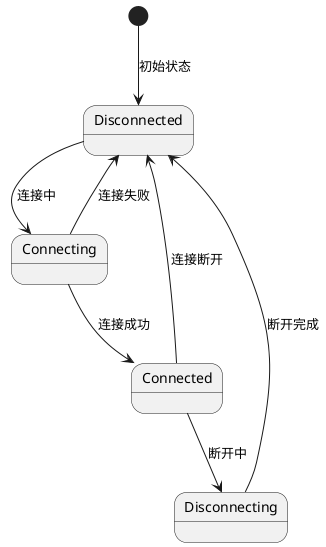

## 接口定义

### 配置接口

```typescript
interface McpServerConfig {
	name: string;
	version: string;
	session?: SessionManagerConfig;
	authEnabled?: boolean;
	transport?: TransportConfig;
}

interface SessionManagerConfig {
	ttl: number;
	enableRedis: boolean;
	redisConfig?: RedisConfig;
}

interface RedisConfig {
	redisUrl?: string;
}
```

### 工具接口

```typescript
interface McpToolDefinition {
	name: string;
	description: string;
	inputSchema: ZodType;
}

interface McpToolResult {
	isError: boolean;
	content: unknown;
	error?: string;
}
```

### 会话接口

```typescript
interface Session {
	id: string;
	userId: string | null;
	organizationId: string | null;
	tenantId: string | null;
	createdAt: Date;
	lastAccessedAt: Date;
	data: Record<string, unknown>;
}

interface SessionStats {
	total: number;
	active: number;
	expired: number;
}

interface SessionStorage {
	createSession(session: Omit<Session, 'id'>): Promise<Session>;
	findSession(id: string): Promise<Session | null>;
	updateSession(id: string, data: Partial<Record<string, unknown>>): Promise<void>;
	deleteSession(id: string): Promise<void>;
}
```

### 认证接口

```typescript
interface AuthStatus {
	isAuthenticated: boolean;
	userId: string | null;
	tenantId: string | null;
	organizationId: string | null;
}
```

### 传输接口

```typescript
enum TransportType {
	STDIO = 'stdio',
	HTTP = 'http',
	WEBSOCKET = 'websocket'
}

interface TransportConfig {
	type: TransportType;
	http?: {
		host: string;
		port: number;
		path: string;
	};
	websocket?: {
		host: string;
		port: number;
		path: string;
	};
}

interface TransportResult {
	type: TransportType;
	transport: StdioServerTransport | HttpServerTransport | WebSocketServerTransport;
	url?: string;
	config: TransportConfig;
}
```

## 架构决策记录

### 1. 为什么使用工厂模式创建传输层？

**问题**: 不同的 AI 助手可能需要不同的传输方式（Stdio、HTTP、WebSocket）

**决策**: 使用工厂模式

-   工厂方法：`TransportFactory.createTransportFromEnv(server, transportType)`
-   优点：
    -   统一传输层创建逻辑
    -   支持通过环境变量配置
    -   易于扩展新的传输类型

### 2. 为什么使用单例模式实现 AuthManager？

**问题**: 多个服务器实例需要共享认证状态

**决策**: 单例模式

-   方法：`AuthManager.getInstance()`
-   优点：
    -   确保全局唯一的认证状态
    -   避免多个实例导致的认证状态不同步
    -   简化 JWT 令牌管理

### 3. 为什么使用 Map 管理会话？

**问题**: 需要支持内存和 Redis 两种存储方式

**决策**: 接口驱动

-   接口：`SessionStorage`
-   实现类：`MemoryStorage`、`RedisStorage`
-   优点：
    -   统一的会话管理接口
    -   易于切换存储实现
    -   避免业务代码直接依赖具体存储实现

### 4. 为什么使用 ToolRegistry 管理工具？

**问题**: 需要动态注册和调用工具

**决策**: 注册表模式

-   方法：`ToolRegistry`
-   优点：
    -   集中式工具管理
    -   提供工具查找和调用接口
    -   支持工具版本控制

### 5. 为什么使用 McpServerManager？

**问题**: 需要管理多个 MCP 服务器实例

**决策**: 管理器模式

-   类：`McpServerManager`
-   方法：`start()`, `stop()`, `restart()`, `removeServer()`, `stopAll()`
-   优点：
    -   统一服务器管理
    -   支持多服务器实例
    -   提供服务器统计信息

## 扩展指南

### 创建自定义工具

```typescript
import { BaseMcpTool, McpToolResult } from '@oksai/mcp-server';

export class MyCustomTool extends BaseMcpTool {
	constructor() {
		super('my_tool', '我的自定义工具');
	}

	async execute(args: Record<string, unknown>): Promise<McpToolResult> {
		const input = args.input as string;

		// 业务逻辑
		const result = processInput(input);

		return this.createSuccessResult({ output: result });
	}
}
```

### 创建自定义传输层

```typescript
import { TransportType } from '@oksai/mcp-server';
import { BaseTransport } from '@oksai/mcp-server';

export class CustomTransport extends BaseTransport {
	async connect(): Promise<void> {
		// 连接逻辑
	}

	async disconnect(): Promise<void> {
		// 断开连接逻辑
	}

	async send(message: string): Promise<void> {
		// 发送消息逻辑
	}
}
```

### 创建自定义会话存储

```typescript
import { SessionStorage, Session } from '@oksai/mcp-server';
import { InjectRepository } from '@mikro-orm/nestjs';
import { Injectable, NotFoundException } from '@nestjs/common';

@Injectable()
export class PostgresSessionStorage implements SessionStorage {
	constructor(
		@InjectRepository(SessionEntity)
		private readonly sessionRepo: EntityRepository<SessionEntity>
	) {}

	async createSession(session: Omit<Session, 'id'>): Promise<Session> {
		// 数据库逻辑
		const entity = this.sessionRepo.create(session);
		await this.sessionRepo.getEntityManager().persistAndFlush(entity);
		return entity;
	}

	async findSession(id: string): Promise<Session | null> {
		// 数据库逻辑
		return await this.sessionRepo.findOne({ id });
	}

	// 其他方法实现...
}
```

## 安全考虑

### 1. 认证集成

```typescript
interface AuthManager {
	/**
	 * 设置认证状态
	 *
	 * @param userId - 用户 ID
	 * @param tenantId - 租户 ID
	 * @param organizationId - 组织 ID
	 */
	setAuthState(userId: string, tenantId?: string, organizationId?: string): void;

	/**
	 * 获取认证状态
	 */
	getAuthStatus(): AuthStatus;
}
```

### 2. 会话安全

```typescript
interface Session {
	id: string;
	userId: string | null;
	tenantId: string | null;
	organizationId: string | null;
	createdAt: Date;
	lastAccessedAt: Date;
	data: Record<string, unknown>;
}
```

### 3. 输入验证

```typescript
interface McpToolInputSchema {
	type: 'object';
	properties: Record<string, unknown>;
	required: string[];
}

interface McpToolOutputSchema {
	type: 'object';
	properties: Record<string, unknown>;
	required: string[];
}
```

## 性能考虑

### 1. 连接池

-   HTTP 传输层使用连接池
-   WebSocket 传输层使用连接池
-   Redis 使用连接池

### 2. 缓存策略

-   Redis 连接池缓存
-   会话缓存
-   工具结果缓存（可选）

### 3. 优化建议

-   使用 Map 查找：`O(1)` 的复杂度
-   使用 Set 去重：`O(n)` 的复杂度
-   使用 Set 成员检查：`O(1)` 的复杂度

## 维护指南

### 代码风格

-   使用中文注释和错误消息
-   遵循项目 AGENTS.md 规范
-   使用 Prettier 格式化代码
-   遵循 ESLint 规则

### 测试指南

-   单元测试覆盖率要求：80%+
-   集成测试覆盖关键流程
-   使用 Mock 隔离外部依赖
-   端口和类型使用中文描述

### 文档更新

-   更新代码时同步更新文档
-   添加示例代码时添加中文注释
-   添加配置说明时添加环境变量说明

## 参考资料

-   [MCP 协议规范](https://spec.modelcontextprotocol.io/)
-   [NestJS 最佳实践](https://docs.nestjs.com/)
-   [TypeScript 最佳实践](https://www.typescriptlang.org/docs/handbook/declaration-files/modules/classes.html)

---

**文档维护**: 本文档随项目进展持续更新，每次重大架构变更后必须更新
**最后更新**: 2026-02-10
