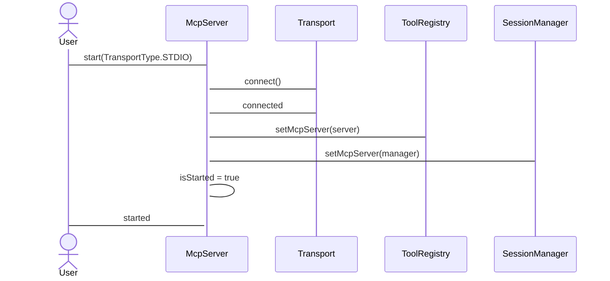
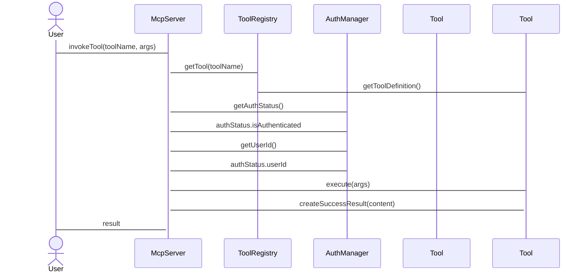
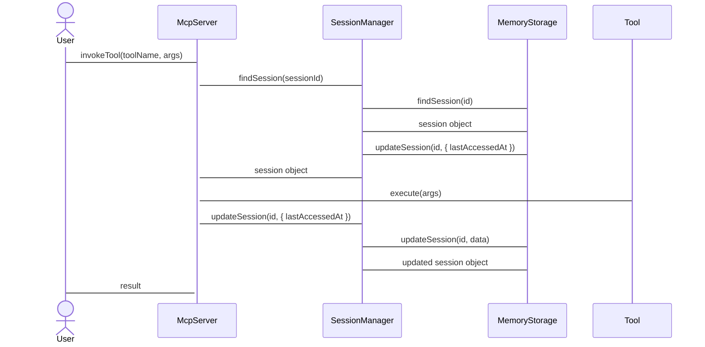

# MCP 服务器架构

**版本**: v1.0
**最后更新**: 2026-02-10
**作者**: MCP 团队

## 系统概览

```mermaid
class McpServer
    << 依赖>> Server
    << 依赖 >> BaseMcpTool
    << 依赖 >> AuthManager
    << 依赖 >> SessionManager
    << 依赖 >> TransportFactory
    - mcpServerManager
    - server: Server
    - authManager: AuthManager
    - sessionManager: SessionManager
end

class AuthManager
    << 单例模式 >>
    manageAuthState(userId, tenantId, organizationId)
end

class SessionManager
    << 管理 >>
    createSession(userId, organizationId, tenantId, data)
    findSession(id)
    updateSession(id, data)
    deleteSession(id)
    getSessionStats()
    cleanup()
end

class ToolRegistry
    << 注册 >>
    registerTool(tool: BaseMcpTool): void
    getTool(name: string): BaseMcpTool | null
    getAllTools(): BaseMcpTool[]
    getToolCount(): number
    invokeTool(name: string, args: Record<string, unknown>): Promise<McpToolResult>
end

class TransportFactory
    << 工厂模式 >>
    createTransportFromEnv(server: Server, transportType: TransportType): Promise<TransportResult>
    shutdownTransport(transport: TransportResult): Promise<void>
    getTransportTypeFromEnv(): TransportType
end
```

## 类图

### McpServer 类

```mermaid
class McpServer {
    - server: Server
    - transport: TransportResult
    - toolRegistry: ToolRegistry
    - sessionManager: SessionManager
    - authManager: AuthManager
    - config: McpServerConfig
    - logger: Logger
    - sessionId: string | null
    - isStarted: boolean
    - primaryServerId: string | null

    + McpServer(config: McpServerConfig, sessionId?: string)
    + start(transportType?: TransportType): Promise<boolean>
    + stop(): Promise<void>
    + registerTool(tool: BaseMcpTool): void
    + registerTools(tools: BaseMcpTool[]): void
    + invokeTool(name: string, args: Record<string, unknown>): Promise<McpServer>
    + getStatus(): Promise<McpServerStatus>
    + listTools(): McpToolDefinition[]
    + cleanup(): Promise<void>
}
```

### McpServerManager 类

```mermaid
class McpServerManager {
    - servers: Map<string, ServerInstance>
    - primaryServerId: string | null
    - logger: Logger

    + McpServerManager()
    + start(config: McpServerConfig, serverId?: string, transportType?: TransportType): Promise<boolean>
    + stop(serverId?: string): Promise<boolean>
    + restart(serverId?: string): Promise<boolean>
    + getStatus(serverId?: string): Promise<McpServerStatus | null>
    + getServer(serverId?: string): McpServer | null
    + getServerIds(): string[]
    + getAllStatus(): Promise<Map<string, McpServerStatus>>
    + removeServer(serverId: string): Promise<boolean>
    + stopAll(): Promise<number>
    + setPrimaryServer(serverId: string): boolean
    + getPrimaryServerId(): string | null
    + getPrimaryServer(): McpServer | null
    + getStats(): { total: number, running: number, stopped: number, primaryServerId: string | null }
    + cleanup(): Promise<void>
}
```

## 组件关系

### 1. 传输层组件

```mermaid
class TransportFactory {
    + createTransportFromEnv(server: Server, transportType: TransportType): Promise<TransportResult>
    + shutdownTransport(transport: TransportResult): Promise<void>
}

class TransportResult {
    type: TransportType
    transport: StdioServerTransport | HttpServerTransport | WebSocketServerTransport
    url?: string
    config: TransportConfig
}
```

### 2. 工具层组件

```mermaid
class BaseMcpTool {
    # 工具名称
    name: string

    # 工具描述
    description: string

    # 工具定义
    abstract getToolDefinition(): McpToolDefinition

    # 工具执行
    abstract execute(args: Record<string, unknown>): Promise<McpToolResult>

    # 创建工具结果
    protected createSuccessResult(content: unknown): McpToolResult
    protected createErrorResult(message: string): McpServerResult
}
```

```mermaid
class ToolRegistry {
    - tools: Map<string, BaseMcpTool>
    - mcpServer: Server

    + registerTool(tool: BaseMcpTool): void
    + getTool(name: string): BaseMcpTool | null
    + getAllTools(): BaseMcpTool[]
    + getToolCount(): number
    invokeTool(name: string, args: Record<string, unknown>): Promise<McpToolResult>

    - setMcpServer(server: Server): void
    + getMcpServer(): Server
}
```

### 3. 会话管理组件

#### SessionManager 类

```mermaid
class SessionManager {
    - storage: SessionStorage
    - ttl: number
    - enableRedis: boolean
    - redisConfig?: RedisConfig

    + createSession(userId?: string, organizationId?: string, tenantId?: string, data?: Record<string, unknown>): Promise<Session>
    + findSession(id: string): Promise<Session | null>
    + updateSession(id: string, data: Partial<Record<string, unknown>>): Promise<void>
    + deleteSession(id: string): Promise<void>
    + getSessionStats(): Promise<SessionStats>
    + cleanup(): Promise<void>
}
```

#### SessionStorage 接口

```mermaid
interface SessionStorage {
    + createSession(session: Omit<Session>)
    + findSession(id: string): Promise<Session | null>
    + updateSession(id: string, data: Partial<Session>): Promise<void>
    deleteSession(id: string): Promise<void>
    getAllSessions(): Promise<Session[]>
    cleanup(): Promise<void>
}
```

#### MemoryStorage 类

```mermaid
class MemoryStorage implements SessionStorage {
    - sessions: Map<string, Session>

    + createSession(session: Omit<Session>): Promise<Session>
    + findSession(id: string): Promise<Session | null>
    + updateSession(id: string, data: Partial<Session>): Promise<void>
    + deleteSession(id: string): Promise<void>
    + getAllSessions(): Promise<Session[]>
    + cleanup(): Promise<void>
}
```

#### RedisStorage 类

```mermaid
class RedisStorage implements SessionStorage {
    - client: Redis
    - prefix: string

    + createSession(session: Omit<Session>): Promise<Session>
    + findSession(id: string): Promise<Session | null>
    + updateSession(id: string, data: Partial<Session>): Promise<void>
    + deleteSession(id: string): Promise<void>
    getAllSessions(): Promise<Session[]>
    + cleanup(): Promise<void>

    private serialize(session: Session): string
    private deserialize(json: string): Session
    private async loadAllSessions(): Promise<Map<string, Session>>
}
```

#### Session 数据结构

```mermaid
class Session {
    id: string
    userId: string | null
    organizationId: string | null
    tenantId: string | null
    createdAt: Date
    lastAccessedAt: Date
    data: Record<string, unknown>
}
```

### 4. 认证管理组件

#### AuthManager 类

```mermaid
class AuthManager {
    # 单例模式
    - instance: AuthManager

    + getInstance(): AuthManager
    + login(): Promise<boolean>
    + logout(): Promise<void>
    + getAuthStatus(): AuthStatus

    # 认证状态管理
    + setAuthState(userId: string, tenantId?: string, organizationId?: string): void
    + clearAuthState(): void

    # 用户信息
    + getUserId(): string | null
    + getTenantId(): string | null
    + getOrganizationId(): string | null
}
```

#### AuthStatus 接口

```mermaid
interface AuthStatus {
    isAuthenticated: boolean
    userId: string | null
    tenantId: string | null
    organizationId: string | null
}
```

### 5. 服务器管理器组件

#### ServerInstance 接口

```mermaid
class ServerInstance {
    id: string
    server: McpServer
    config: McpServerConfig
    createdAt: Date
    lastStartedAt?: Date
}
```

#### McpServerManager 类

```mermaid
class McpServerManager {
    - servers: Map<string, ServerInstance>
    - primaryServerId: string | null
    - logger: Logger

    # 服务器生命周期管理
    + start(config: McpServerConfig, serverId?: string, transportType?: TransportType): Promise<boolean>
    + stop(serverId?: string): Promise<boolean>
    + restart(serverId?: string): Promise<boolean>
    + removeServer(serverId: string): Promise<boolean>

    # 查询方法
    + getStatus(serverId?: string): Promise<McpServerStatus | null>
    + getServer(serverId?: string): McpServer | null
    + getServerIds(): string[]
    + getAllStatus(): Promise<Map<string, McpServerStatus>>

    # 统计方法
    + getStats(): {
        total: number;
        running: number;
        stopped: number;
        primaryServerId: string | null;
    }

    # 主服务器管理
    + setPrimaryServer(serverId: string): boolean
    + getPrimaryServerId(): string | null
    + getPrimaryServer(): McpServer | null

    # 清理方法
    + stopAll(): Promise<number>
    + cleanup(): Promise<void>
}
```

## 请求响应序列图

### MCP 服务器启动流程



### 工具调用流程



### 会话管理流程



## 部署架构

```mermaid
graph TB
    subgraph "客户端层"
        UserClient
        McpClient
        WebClient
        WebSocketClient
    end subgraph

    subgraph "MCP 服务端"
        StdioMcpServer
        HttpMcpServer
        WebSocketMcpServer
        McpServerManager
    end subgraph

    subgraph "基础设施"
        OAuthAuthServer
        SessionStorageRedis
    end subgraph

    UserClient --> StdioMcpServer : 使用 Stdio 协议
    WebClient --> HttpMcpServer : 使用 HTTP 协议
    WebSocketClient --> WebSocketMcpServer : 使用 WebSocket 协议

    McpServerManager --> StdioMcpServer : 管理 Stdio 服务器
    McpServerManager --> HttpMcpServer : 管理 HTTP 服务器
    McpServerManager --> WebSocketMcpServer : 管理 WebSocket 服务器

    StdioMcpServer --> SessionStorageRedis : 存储会话
    HttpMcpServer --> SessionStorageRedis : 存储会话
    WebSocketMcpServer --> SessionStorageRedis : 存储会话

    StdioMcpServer --> OAuthAuthServer : 验证令牌
    HttpMcpServer --> OAuthAuthServer : 验证令牌
    WebSocketMcpServer --> OAuthAuthServer : 验证令牌

    OAuthAuthServer --> StdioMcpServer : 返回 JWKS
    OAuthAuthServer --> HttpMcpServer : 返回 JWKS
    OAuthAuthServer --> WebSocketMcpServer : 返回 JWKS
```

## 测试架构

### 单元测试结构

```mermaid
graph TB
    subgraph "McpServer Tests"
        McpServerSpec
        McpServerManagerSpec
        BaseMcpToolSpec
        ToolRegistrySpec
        SessionManagerSpec
        AuthManagerSpec
        SessionStorageSpec
        RedisStorageSpec
        TransportFactorySpec
    end subgraph

    subgraph "AuthManager Tests"
        AuthManagerSpec
        JwtServiceSpec
        JwksServiceSpec
        OAuthControllerSpec
        AuthControllerSpec
        OAuthE2eSpec
    end subgraph

    subgraph "集成测试"
        McpServerIntegrationSpec
        OAuthIntegrationSpec
        SessionIntegrationSpec
        TransportIntegrationSpec
    end subgraph
    McpServerSpec --> ToolRegistrySpec : 依赖
    McpServerSpec --> SessionManagerSpec : 依赖
    McpServerSpec --> AuthManagerSpec : 依赖
    McpServerSpec -> TransportFactorySpec : 依赖
    McpServerManagerSpec -> McpServerSpec : 依赖

    OAuthControllerSpec -> JwksServiceSpec : 依赖
    OAuthControllerSpec -> JwtServiceSpec : 依赖
    OAuthControllerSpec -> OAuthControllerSpec : 依赖

    McpServerIntegrationSpec -> SessionIntegrationSpec : 依赖
    OAuthIntegrationSpec -> AuthControllerSpec : 依赖
    McpServerIntegrationSpec -> TransportIntegrationSpec : 依赖
end
```

## 状态转换图

### McpServer 状态机

```mermaid
stateDiagram-v2
    [*] --> Stopped: 启动失败
    [*] --> Initializing: 调用 start()

    Initializing --> Running: 传输层连接成功
    Initializing --> Stopped: 启动失败

    Running --> Stopping: 调用 stop()
    Running --> Stopped: 发生错误
    Running --> Restarting: 调用 restart()

    Restarting --> Stopped: 重启失败

    Stopping --> [*]: 停止完成

    Restarting --> Running: 重启成功
    Running -> Running : 重启后回到运行状态
```

### 工具注册状态机

```mermaid
stateDiagram-v2
    [*] --> Unregistered: 工具未注册
    Unregistered --> Registered: 调用 registerTool()
    Unregistered --> DuplicateError: 重复注册同名工具

    Registered -> Active: 调用 invokeTool()

    Active -> Executing: 工具执行中
    Active -> Failed: 工具执行失败

    Executing -> Completed: 工具执行成功
    Completed -> Active: 可以再次调用

    Failed -> Active: 重试执行
```

### 会话生命周期状态机

```mermaid
stateDiagram-v2
    [*] --> Active: 创建会话

    Active -> Inactive: 会话过期
    Active -> Deleted: 会话被删除

    Inactive -> [*] : 清理

    Deleted --> [*] : 清理
```

### 认证状态机

```mermaid
stateDiagram-v2
    [*] --> Unauthenticated: 未认证

    Unauthenticated -> Authenticated: 调用 setAuthState()

    Authenticated -> Unauthenticated: 调用 clearAuthState()

    Authenticated -> Failed: 认证失败

    Failed -> Unauthenticated: 清理失败后重试
```

### 传输层状态机

```mermaid
stateDiagram-v2
    [*] -> Disconnected: 初始状态
    Disconnected -> Connecting: 连接中

    Connecting -> Connected: 连接成功
    Connecting -> Disconnected: 连接失败

    Connected -> Disconnected: 连接断开
    Connected -> Disconnecting: 断开中

    Disconnecting -> Disconnected: 断开完成
```

## 接口定义

### 配置接口

```typescript
interface McpServerConfig {
	name: string;
	version: string;
	session?: SessionManagerConfig;
	authEnabled?: boolean;
	transport?: TransportConfig;
}

interface SessionManagerConfig {
	ttl: number;
	enableRedis: boolean;
	redisConfig?: RedisConfig;
}

interface RedisConfig {
	redisUrl?: string;
}
```

### 工具接口

```typescript
interface McpToolDefinition {
	name: string;
	description: string;
	inputSchema: ZodType;
}

interface McpToolResult {
	isError: boolean;
	content: any;
	error?: string;
}
```

### 会话接口

```typescript
interface Session {
	id: string;
	userId: string | null;
	organizationId: string | null;
	tenantId: string | null;
	createdAt: Date;
	lastAccessedAt: Date;
	data: Record<string, unknown>;
}

interface SessionStats {
	total: number;
	active: number;
	expired: number;
}

interface SessionStorage {
	createSession(session: Omit<Session>): Promise<Session>;
	findSession(id: string): Promise<Session | null>;
	updateSession(id: string, data: Partial<Record<string, unknown>>): Promise<void>;
	deleteSession(id: string): Promise<void>;
}
```

### 认证接口

```typescript
interface AuthStatus {
	isAuthenticated: boolean;
	userId: string | null;
	tenantId: string | null;
	organizationId: string | null;
}
```

### 传输接口

```typescript
enum TransportType {
	STDIO = 'stdio';
	HTTP = 'http';
	WEBSOCKET = 'websocket';
}

interface TransportConfig {
	type: TransportType;
	http?: {
		host: string;
		port: number;
		path: string;
	};
	websocket?: {
		host: string;
		port: number;
		path: string;
	};
}

interface TransportResult {
	type: TransportType;
	transport: StdioServerTransport | HttpServerTransport | WebSocketServerTransport;
	url?: string;
	config: TransportConfig;
}
```

## 架构决策记录

### 1. 为什么使用工厂模式创建传输层？

**问题**: 不同的 AI 助手可能需要不同的传输方式（Stdio、HTTP、WebSocket）

**决策**: 使用工厂模式

-   � 厂方法：`TransportFactory.createTransportFromEnv(server, transportType)`
-   优点：
    -   统一传输层创建逻辑
    -   支持通过环境变量配置
    -   易于扩展新的传输类型

### 2. 为什么使用单例模式实现 AuthManager？

**问题**: 多个服务器实例需要共享认证状态

**决策**: 单例模式

-   方法：`AuthManager.getInstance()`
-   优点：
    -   确保全局唯一的认证状态
    -   避免多个实例导致的认证状态不同步
    -   简化 JWT 令牌管理

### 3. 为什么使用 Map 管理会话？

**问题**: 需要支持内存和 Redis 两种存储方式

**决策**: 接口驱动

-   接口：`SessionStorage`
-   实现类：`MemoryStorage`、`RedisStorage`
-   优点：
    -   统一的会话管理接口
    -   易于切换存储实现
    -   遵免业务代码直接依赖具体存储实现

### 4. 为什么使用 ToolRegistry 管理工具？

**问题**: 需要动态注册和调用工具

**决策**: 注册表模式

-   方法：`ToolRegistry`
-   优点：
    -   集中式工具管理
    -   提供工具查找和调用接口
    -   支持工具版本控制

### 5. 为什么使用 McpServerManager？

**问题**: 需要管理多个 MCP 服务器实例

**决策**: 管理器模式

-   类：`McpServerManager`
-   方法：`start()`, `stop()`, `restart()`, `removeServer()`, `stopAll()`
-   优点：
    -   统一服务器管理
    -   支持多服务器实例
    -   提供服务器统计信息

## 扩展指南

### 创建自定义工具

```typescript
import { BaseMcpTool, McpToolResult } from '@oksai/mcp-server';

export class MyCustomTool extends BaseMcpTool {
	constructor() {
		super('my_tool', '我的自定义工具');
	}

	async execute(args: Record<string, unknown>): Promise<McpToolResult> {
		const input = args.input as string;

		// 业务逻辑
		const result = processInput(input);

		return this.createSuccessResult({ output: result });
	}
}
```

### 创建自定义传输层

```typescript
import { TransportType } from '@oksai/mcp-server';
import { BaseTransport } from '@oksai/mcp-server';

export class CustomTransport extends BaseTransport {
	async connect(): Promise<void> {
		// 连接逻辑
	}

	async disconnect(): Promise<void> {
		// 断开连接逻辑
	}

	async send(message: string): Promise<void> {
		// 发送消息逻辑
	}
}
```

### 创建自定义会话存储

```typescript
import { SessionStorage, Session } from '@oksai/mcp-server';
import { InjectRepository } from '@mikro-orm/nestjs';
import { Injectable } from '@nestjs/common';

@Injectable()
export class PostgresSessionStorage implements SessionStorage {
	constructor(
		@InjectRepository(User)
	private readonly userRepo: EntityRepository<User>
	) {}

	async createSession(session: Omit<Session>): Promise< Session> {
		const user = await this.userRepo.findOne({ id: session.userId });
		if (!user) {
			throw new NotFoundException(`用户 ${session.userId} 未找到`);
		}

		const sessionEntity = new Session({
		... // 字段映射
	} as unknown as Session;

		return await this.userRepo.persist(sessionEntity);
	}

	// 其他方法实现...
}
```

## 安全考虑

### 1. 认证集成

```typescript
interface AuthManager {
	/**
	 * 设置认证状态
	 *
	 * @param userId - 用户 ID
	 * @param tenantId - 租户 ID
	 * @param organizationId - 组织 ID
	 */
	setAuthState(userId: string, tenantId?: string, organizationId?: string): void;

	/**
	 * 获取认证状态
	 */
	getAuthStatus(): AuthStatus;
}
```

### 2. 会话安全

```typescript
interface Session {
	id: string;
	userId: string | null;
	tenantId: string | null;
	organizationId: string | null;
	createdAt: Date;
	lastAccessedAt: Date;
	data: Record<string, unknown>;
}
```

### 3. 输入验证

```typescript
interface McpToolInputSchema {
	type: 'object';
	properties: Record<string, unknown>;
	required: string[];
}

interface McpToolOutputSchema {
	type: 'object';
	properties: Record<string, unknown>;
	required: string[];
}
```

## 性能考虑

### 1. 连接池

-   HTTP 传输层使用连接池
-   WebSocket 传输层使用连接池
-   Redis 使用连接池

### 2. 缓存策略

-   Redis 连接池缓存
-   会话缓存
-   工具结果缓存（可选）

### 3. 优化建议

-   使用 Map 查找：`O(1)` 的复杂度
-   使用 Set 去重：`O(n)` 的复杂度
-   使用 Set 成员检查：`O(1)` 的复杂度

## 维护指南

### 代码风格

-   使用中文注释和错误消息
-   遵循项目 AGENTS.md 规范
-   使用 Prettier 格式化代码
-   遵循 ESLint 规则

### 测试指南

-   单元测试覆盖率要求：80%+
-   集成测试覆盖关键流程
-   使用 Mock 隔离外部依赖
-   端口和类型使用中文描述

### 文档更新

-   更新代码时同步更新文档
-   添加示例代码时添加中文注释
-   添加配置说明时添加环境变量说明

## 参考资料

-   [MCP 协议规范](https://spec.modelcontextprotocol.io/)
-   [NestJS 最佳实践](https://docs.nestjs.com/)
-   [TypeScript 最佳实践](https://www.typescriptlang.org/docs/handbook/declaration-files/modules/classes.html)

---

**文档维护**: 本文档随项目进展持续更新，每次重大架构变更后必须更新
**最后更新**: 2026-02-10
