# OKSAI Platform - 系统架构图

## 整体架构

```plantuml
@startuml
!define RECTANGLE class

package "应用层" {
    [base-api\n(主应用)] as base_api <<Application>>
}

package "核心层" {
    [AuthModule] <<Module>>
    [TenantModule] <<Module>>
    [UserModule] <<Module>>
    [RoleModule] <<Module>>
    [OrganizationModule] <<Module>>
    [AuditModule] <<Module>>
    [AnalyticsModule] <<Module>>
    [ReportingModule] <<Module>>
    [PluginModule] <<Module>>
    [CoreModule] <<Module>>
    [ConfigModule] <<Module>>
    [BootstrapModule] <<Module>>
    [CommonModule] <<Module>>
}

package "基础设施层" {
    [PostgreSQL] <<Database>>
    [Redis] <<Cache>>
    [OpenSearch] <<Search>>
    [Jitsu Analytics] <<Analytics>>
    [Cube OLAP] <<OLAP>>
    [MinIO] <<Storage>>
}

package "外部服务" {
    [SMTP Email] <<Service>>
    [JWT Service] <<Service>>
    [Prometheus] <<Monitoring>>
}

base_api --> [AuthModule] : 使用
base_api --> [TenantModule] : 使用
base_api --> [UserModule] : 使用
base_api --> [RoleModule] : 使用
base_api --> [OrganizationModule] : 使用
base_api --> [AuditModule] : 使用
base_api --> [AnalyticsModule] : 使用
base_api --> [ReportingModule] : 使用
base_api --> [PluginModule] : 使用
base_api --> [CoreModule] : 使用
base_api --> [ConfigModule] : 使用
base_api --> [BootstrapModule] : 使用
base_api --> [CommonModule] : 使用

[AuthModule] --> [UserModule] : 依赖
[AuthModule] --> [TenantModule] : 依赖
[RoleModule] --> [TenantModule] : 依赖
[UserModule] --> [TenantModule] : 依赖
[OrganizationModule] --> [TenantModule] : 依赖
[AuditModule] --> [TenantModule] : 依赖
[AnalyticsModule] --> [TenantModule] : 依赖
[ReportingModule] --> [TenantModule] : 依赖

[CoreModule] --> [PluginModule] : 管理
[PluginModule] --> [AuthPlugin] : 加载
[PluginModule] --> [TenantPlugin] : 加载
[PluginModule] --> [UserPlugin] : 加载
[PluginModule] --> [AuditPlugin] : 加载
[PluginModule] --> [OrganizationPlugin] : 加载
[PluginModule] --> [RolePlugin] : 加载
[PluginModule] --> [AnalyticsPlugin] : 加载
[PluginModule] --> [ReportingPlugin] : 加载

[UserModule] --> [PostgreSQL] : 数据存储
[TenantModule] --> [PostgreSQL] : 数据存储
[RoleModule] --> [PostgreSQL] : 数据存储
[OrganizationModule] --> [PostgreSQL] : 数据存储
[AuditModule] --> [PostgreSQL] : 数据存储
[AnalyticsModule] --> [PostgreSQL] : 数据存储
[ReportingModule] --> [PostgreSQL] : 数据存储

[AuthModule] --> [Redis] : 会话存储
[AuthModule] --> [JWT Service] : Token 生成
[CoreModule] --> [SMTP Email] : 邮件发送

[AnalyticsModule] --> [Jitsu Analytics] : 事件追踪
[CommonModule] --> [Prometheus] : 监控指标

[ReportingModule] --> [Cube OLAP] : 数据分析
[AuditModule] --> [OpenSearch] : 日志搜索

note right of base_api
  OKSAI Platform
  基于 NestJS + MikroORM
  多租户 SAAS 架构
end note
@enduml
```

## 架构说明

### 应用层

-   **base-api**: 主应用入口，负责模块组装和启动

### 核心层

-   **AuthModule**: 身份认证与授权
-   **TenantModule**: 多租户管理
-   **UserModule**: 用户管理
-   **RoleModule**: 角色与权限管理
-   **OrganizationModule**: 组织管理
-   **AuditModule**: 审计日志
-   **AnalyticsModule**: 分析统计
-   **ReportingModule**: 报表生成
-   **PluginModule**: 插件系统
-   **CoreModule**: 核心功能
-   **ConfigModule**: 配置管理
-   **BootstrapModule**: 启动引导
-   **CommonModule**: 通用功能

### 基础设施层

-   **PostgreSQL**: 主数据库
-   **Redis**: 缓存和会话
-   **OpenSearch**: 日志搜索
-   **Jitsu Analytics**: 事件分析
-   **Cube OLAP**: OLAP 数据分析
-   **MinIO**: 对象存储

### 外部服务

-   **SMTP Email**: 邮件发送
-   **JWT Service**: JWT 令牌服务
-   **Prometheus**: 监控指标

## 技术栈

| 层级     | 技术                       |
| -------- | -------------------------- |
| 应用框架 | NestJS                     |
| ORM      | MikroORM                   |
| 数据库   | PostgreSQL                 |
| 缓存     | Redis                      |
| 搜索     | OpenSearch                 |
| 分析     | Jitsu Analytics, Cube OLAP |
| 存储     | MinIO                      |
| 认证     | JWT                        |
| 监控     | Prometheus                 |
| 语言     | TypeScript                 |

## 架构特点

1. **多租户架构**: 通过 TenantModule 实现租户隔离
2. **模块化设计**: 各功能模块独立，便于维护和扩展
3. **插件系统**: 支持动态加载和卸载功能插件
4. **事件驱动**: 通过订阅者模式实现审计和分析
5. **微服务就绪**: 模块可独立部署
6. **高可观测性**: 完整的监控、日志和审计机制
