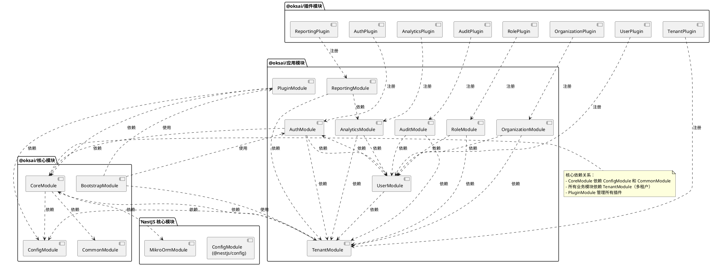

# OKSAI Platform - 模块依赖关系图

## 模块依赖关系

## 依赖层次

### 第一层：核心基础设施

-   **ConfigModule**: 配置管理（最底层）
-   **CommonModule**: 通用功能
-   **MikroOrmModule**: ORM 数据库层

### 第二层：核心业务

-   **CoreModule**: 核心功能（邮件、JWT、模板引擎等）
-   **PluginModule**: 插件系统

### 第三层：租户和认证

-   **TenantModule**: 多租户管理（核心，被其他模块依赖）
-   **AuthModule**: 身份认证与授权

### 第四层：业务模块

-   **UserModule**: 用户管理
-   **RoleModule**: 角色与权限管理
-   **OrganizationModule**: 组织管理
-   **AuditModule**: 审计日志
-   **AnalyticsModule**: 分析统计
-   **ReportingModule**: 报表生成

### 第五层：引导和应用

-   **BootstrapModule**: 应用启动引导
-   **base-api**: 主应用

## 模块职责

| 模块               | 主要职责                      | 依赖模块                             |
| ------------------ | ----------------------------- | ------------------------------------ |
| ConfigModule       | 配置管理                      | 无                                   |
| CommonModule       | 通用功能（监控、日志、工具）  | 无                                   |
| CoreModule         | 核心功能（邮件、JWT、上下文） | ConfigModule, CommonModule           |
| TenantModule       | 租户管理                      | CoreModule, ConfigModule             |
| AuthModule         | 认证与授权                    | TenantModule, UserModule, CoreModule |
| UserModule         | 用户管理                      | TenantModule, AuthModule             |
| RoleModule         | 角色与权限                    | TenantModule, UserModule             |
| OrganizationModule | 组织管理                      | TenantModule, UserModule             |
| AuditModule        | 审计日志                      | TenantModule, UserModule             |
| AnalyticsModule    | 分析统计                      | TenantModule, UserModule             |
| ReportingModule    | 报表生成                      | TenantModule, AnalyticsModule        |
| PluginModule       | 插件系统                      | CoreModule, ConfigModule             |
| BootstrapModule    | 启动引导                      | PluginModule, 业务模块               |

## 设计原则

1. **单一职责**: 每个模块只负责一个业务领域
2. **依赖倒置**: 核心模块不依赖业务模块
3. **接口隔离**: 通过接口定义模块契约
4. **租户隔离**: 所有业务模块都依赖 TenantModule
5. **插件化**: 功能可通过插件系统扩展
