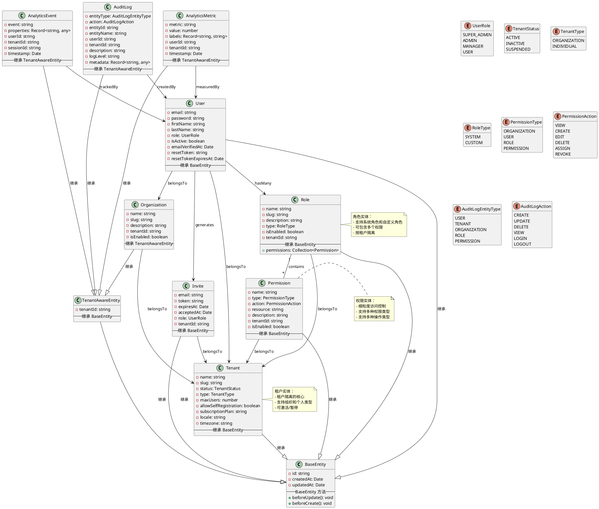

# OKSAI Platform - 核心实体类图

## 实体关系图

## 实体说明

### 核心实体

#### BaseEntity

-   **作用**: 所有实体的基类
-   **字段**:
    -   `id`: 主键（UUID）
    -   `createdAt`: 创建时间
    -   `updatedAt`: 更新时间

#### TenantAwareEntity

-   **作用**: 租户感知实体的基类
-   **字段**:
    -   `tenantId`: 租户 ID，用于多租户隔离

### 业务实体

#### User（用户）

-   **作用**: 系统用户
-   **关系**:
    -   属于一个租户（Tenant）
    -   拥有多个角色（Role）
    -   属于一个或多个组织（Organization）

#### Tenant（租户）

-   **作用**: 多租户隔离的核心
-   **状态**: ACTIVE, INACTIVE, SUSPENDED
-   **类型**: ORGANIZATION, INDIVIDUAL

#### Role（角色）

-   **作用**: 角色管理
-   **类型**: SYSTEM（系统角色）, CUSTOM（自定义角色）
-   **关系**:
    -   属于一个租户（Tenant）
    -   包含多个权限（Permission）

#### Permission（权限）

-   **作用**: 细粒度访问控制
-   **类型**: ORGANIZATION, USER, ROLE, PERMISSION
-   **操作**: VIEW, CREATE, EDIT, DELETE, ASSIGN, REVOKE

#### Organization（组织）

-   **作用**: 组织管理
-   **继承**: TenantAwareEntity（租户感知）

#### AuditLog（审计日志）

-   **作用**: 操作审计跟踪
-   **继承**: TenantAwareEntity（租户感知）
-   **实体类型**: USER, TENANT, ORGANIZATION, ROLE, PERMISSION
-   **操作类型**: CREATE, UPDATE, DELETE, VIEW, LOGIN, LOGOUT

#### AnalyticsEvent（分析事件）

-   **作用**: 事件追踪
-   **继承**: TenantAwareEntity（租户感知）

#### AnalyticsMetric（分析指标）

-   **作用**: 指标统计
-   **继承**: TenantAwareEntity（租户感知）

#### Invite（邀请）

-   **作用**: 用户邀请
-   **关系**:
    -   由用户（User）生成
    -   属于租户（Tenant）

## 实体设计原则

1. **继承关系**:

    - 所有实体继承自 BaseEntity
    - 租户相关实体继承自 TenantAwareEntity

2. **关系类型**:

    - 一对多：1:\*（用户到组织）
    - 多对多：_:_（角色到权限）

3. **租户隔离**:

    - 所有业务实体都包含 tenantId
    - 通过 TenantAwareEntity 强制租户感知

4. **类型安全**:

    - 使用枚举定义状态和类型
    - 避免 magic numbers

5. **审计友好**:
    - 所有实体都继承审计字段
    - 支持操作追踪
