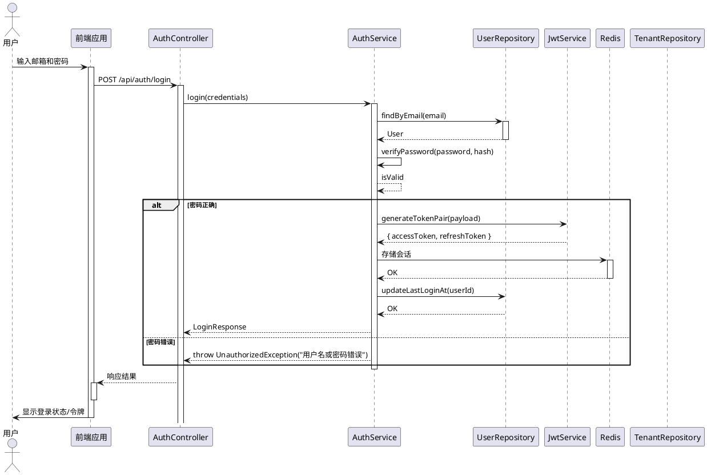
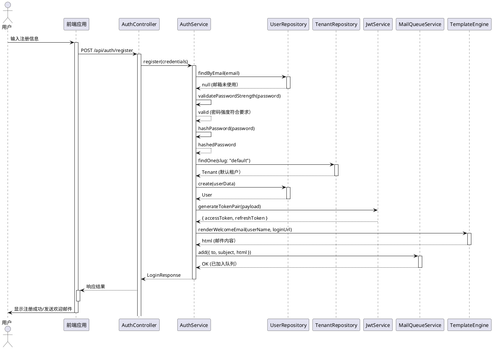
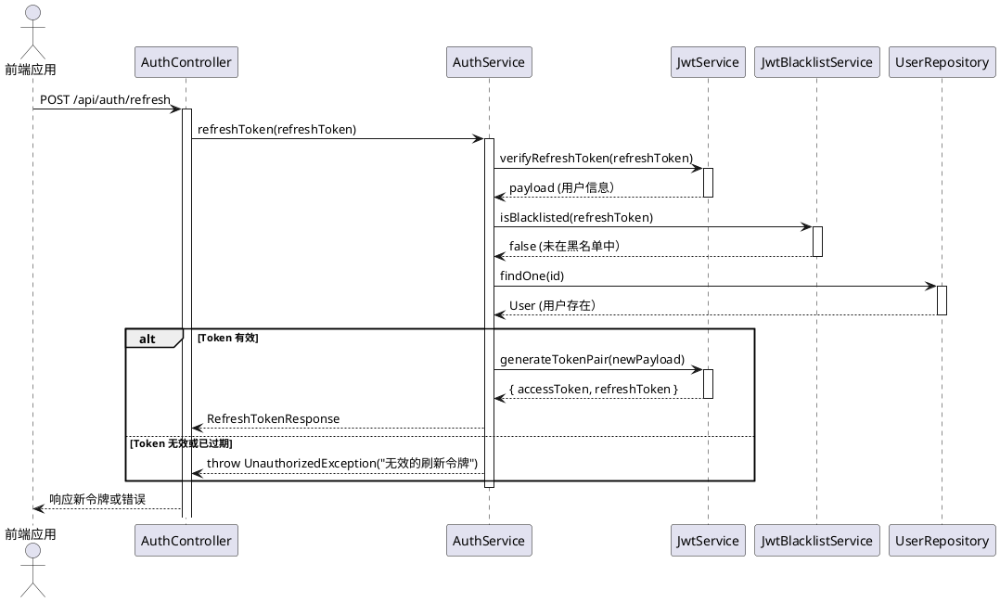
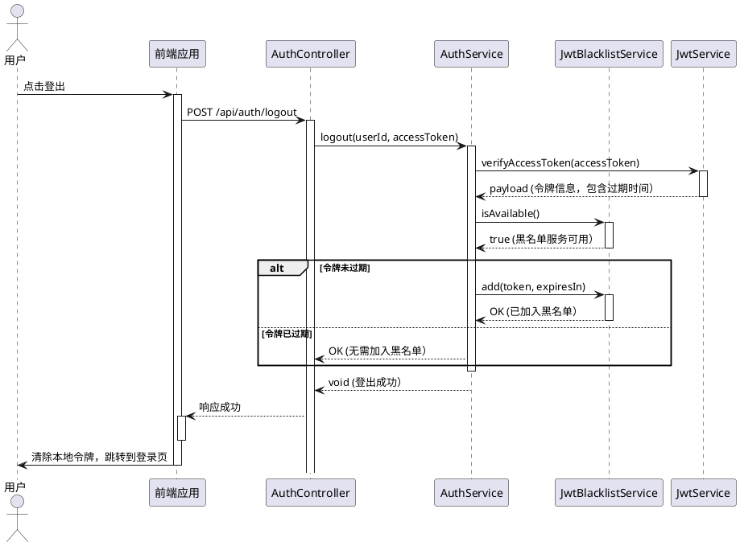
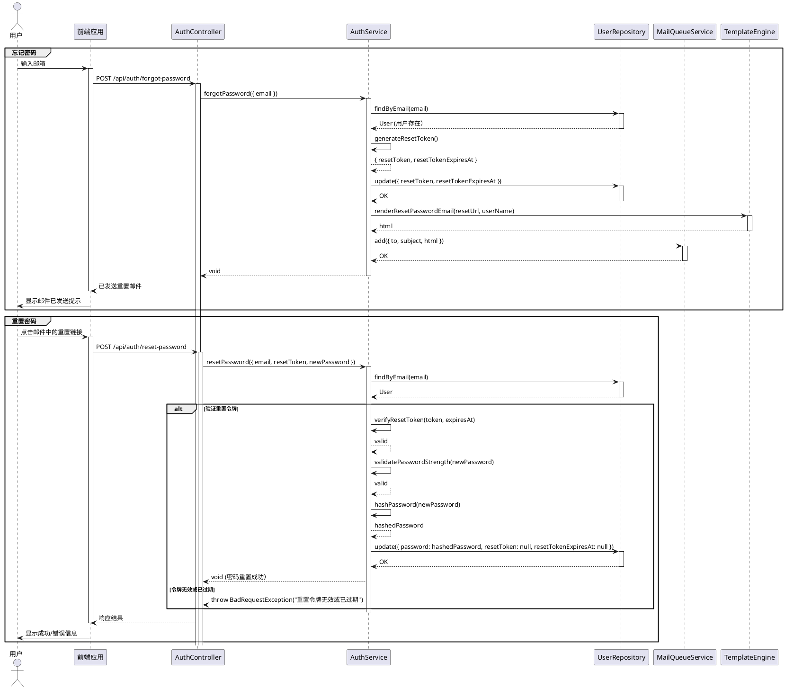

# OKSAI Platform - 认证流程序列图

## 用户登录流程

## 用户注册流程

## Token 刷新流程

## 用户登出流程

## 密码重置流程

## 认证流程说明

### 安全特性

1. **密码哈希**: 使用 bcrypt 等安全哈希算法
2. **JWT 令牌**: 短期访问令牌 + 长期刷新令牌
3. **令牌黑名单**: 登出时将令牌加入黑名单
4. **密码强度**: 注册和重置时验证密码强度
5. **验证邮箱**: 支持邮箱验证（可选）

### 令牌机制

| 令牌类型     | 有效期  | 用途         |
| ------------ | ------- | ------------ |
| AccessToken  | 15 分钟 | API 访问     |
| RefreshToken | 7 天    | 刷新访问令牌 |
| ResetToken   | 1 小时  | 密码重置     |

### 错误处理

| 场景         | 响应状态码 | 错误消息           |
| ------------ | ---------- | ------------------ |
| 用户不存在   | 401        | 用户名或密码错误   |
| 密码错误     | 401        | 用户名或密码错误   |
| 密码强度不足 | 400        | 密码不符合安全要求 |
| 令牌无效     | 401        | 无效的刷新令牌     |
| 令牌已过期   | 401        | 刷新令牌已过期     |
| 邮箱已注册   | 409        | 此邮箱已被使用     |
| 重置令牌过期 | 400        | 重置令牌已过期     |
