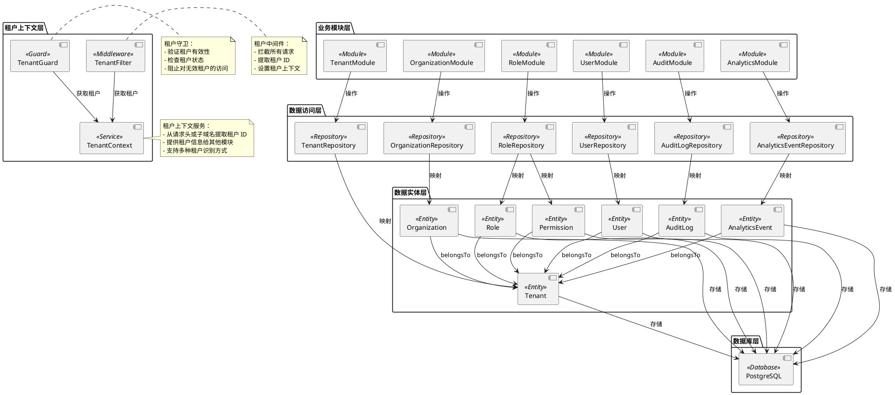
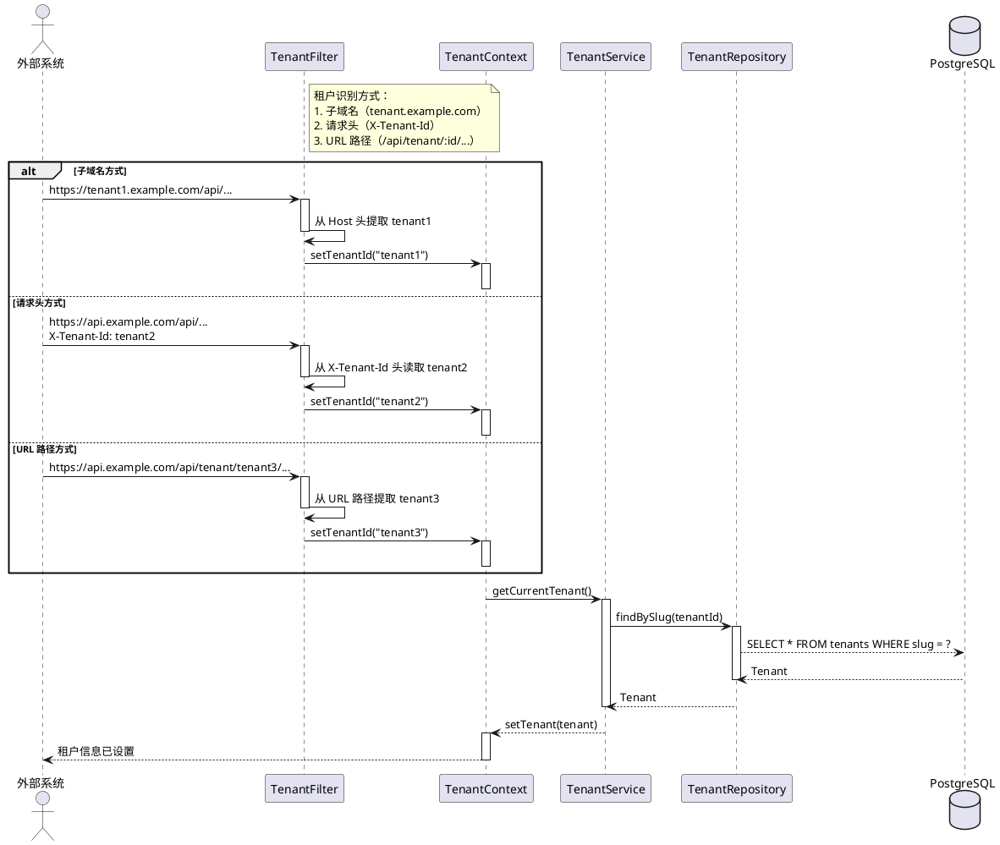
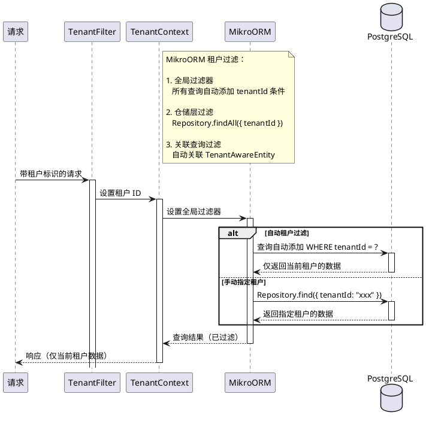
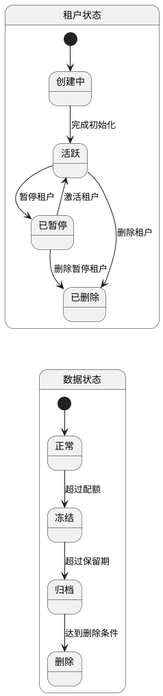
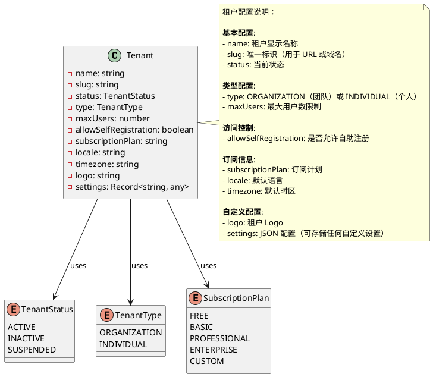

# OKSAI Platform - 多租户架构图

## 租户隔离架构

## 租户识别方式

## 租户数据隔离

## 租户生命周期

## 租户配置项

## 多租户架构特性

### 1. 数据隔离

| 隔离级别         | 说明             | 实现                        |
| ---------------- | ---------------- | --------------------------- |
| **数据库级隔离** | 租户数据物理隔离 | 所有实体包含 tenantId       |
| **查询级隔离**   | 自动过滤查询     | MikroORM 全局过滤器         |
| **应用级隔离**   | 请求上下文隔离   | TenantContext + TenantGuard |

### 2. 租户识别

| 方式         | 使用场景       | 优先级 |
| ------------ | -------------- | ------ |
| **子域名**   | 公网部署       | 高     |
| **请求头**   | 内网或代理部署 | 中     |
| **URL 路径** | 测试或混合部署 | 低     |

### 3. 租户管理

| 操作      | API 端点                       | 权限要求               |
| --------- | ------------------------------ | ---------------------- |
| 创建租户  | POST /api/tenant               | 超级管理员             |
| 查询租户  | GET /api/tenant/:id            | 租户管理员或超级管理员 |
| 更新租户  | PUT /api/tenant/:id            | 租户管理员             |
| 激活/暂停 | PATCH /api/tenant/:id/activate | 租户管理员             |
| 删除租户  | DELETE /api/tenant/:id         | 超级管理员             |

### 4. 租户监控

| 监控项         | 说明                  | 告警条件    |
| -------------- | --------------------- | ----------- |
| **租户用户数** | 当前用户数 / maxUsers | >= 90%      |
| **租户存储**   | 租户数据大小          | >= 配额限制 |
| **租户请求**   | QPS / 限流阈值        | >= 90%      |
| **租户状态**   | 活跃 / 暂停 / 错误    | 状态异常    |

### 5. 安全措施

1. **租户隔离验证**:

    - 所有查询自动添加 tenantId 过滤条件
    - 防止跨租户数据访问

2. **租户访问控制**:

    - TenantGuard 验证请求的租户有效性
    - 检查租户状态（ACTIVE/INACTIVE/SUSPENDED）

3. **数据加密**:

    - 敏感数据按租户加密存储
    - 使用租户特定的加密密钥（可选）

4. **审计日志**:
    - 记录所有跨租户访问尝试
    - 租户管理员操作审计
