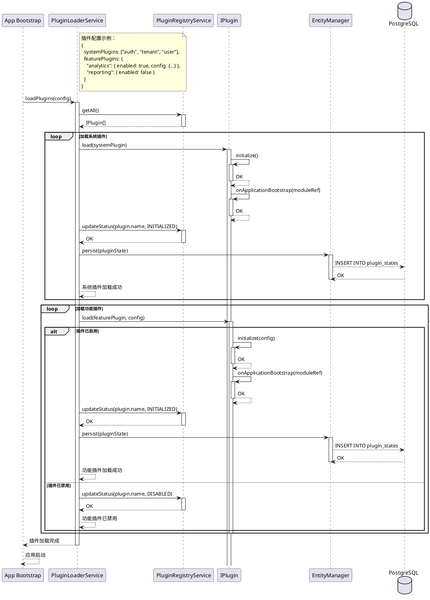
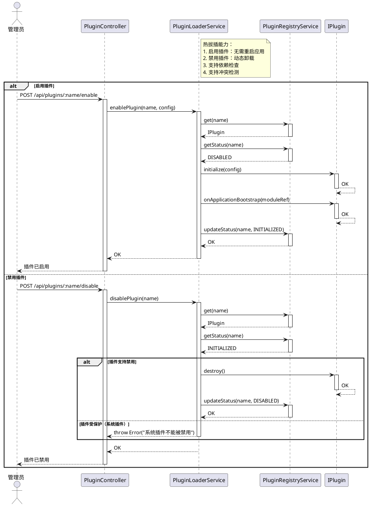
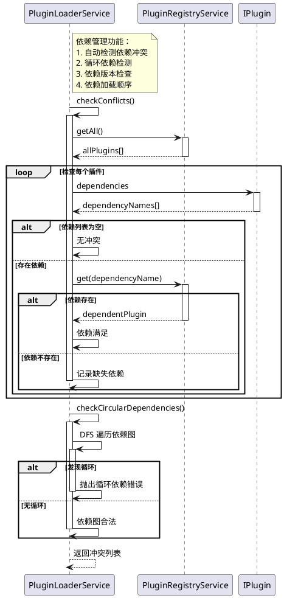
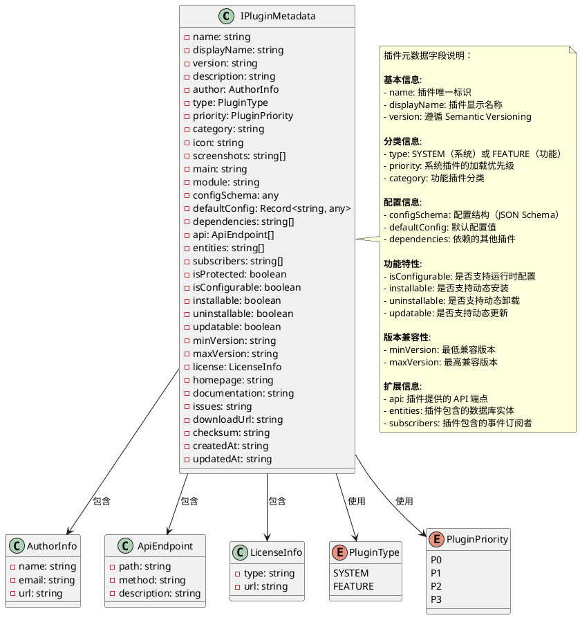

# OKSAI Platform - 插件系统架构图

## 插件系统架构

```plantuml
@startuml
!define RECTANGLE class

package "插件系统核心" {
    [PluginRegistryService] <<Service>>
    [PluginLoaderService] <<Service>>
    [IPlugin] <<Interface>>
    [IPluginMetadata] <<Interface>>
    [ILifecycleHooks] <<Interface>>
}

package "插件类型" {
    [IModulePlugin] <<Interface>>
    [IObjectPlugin] <<Interface>>
    [IPluginState] <<Interface>>
}

package "系统插件" {
    [AuthPlugin] <<Plugin>>
    [TenantPlugin] <<Plugin>>
    [UserPlugin] <<Plugin>>
    [AuditPlugin] <<Plugin>>
    [OrganizationPlugin] <<Plugin>>
    [RolePlugin] <<Plugin>>
}

package "功能插件" {
    [AnalyticsPlugin] <<Plugin>>
    [ReportingPlugin] <<Plugin>>
    [IntegrationPlugin] <<Plugin>>
}

package "插件生命周期" {
    [onApplicationBootstrap] <<Hook>>
    [onApplicationShutdown] <<Hook>>
    [initialize] <<Hook>>
    [destroy] <<Hook>>
}

enum "PluginType" {
    SYSTEM
    FEATURE
}

enum "PluginStatus" {
    UNLOADED
    LOADED
    INITIALIZED
    DISABLED
    FAILED
}

[IPlugin] <|.. [IModulePlugin]
[IPlugin] <|.. [IObjectPlugin]
[IPlugin] --> [IPluginMetadata] : has
[IPlugin] --> [ILifecycleHooks] : implements
[IPlugin] --> [PluginType] : uses
[IPlugin] --> [PluginStatus] : has

[PluginRegistryService] o-- [IPlugin] : manages
[PluginRegistryService] --> [IPluginState] : tracks
[PluginLoaderService] --> [PluginRegistryService] : uses
[PluginLoaderService] --> [IPlugin] : loads/unloads

[IPlugin] --> [onApplicationBootstrap] : implements
[IPlugin] --> [onApplicationShutdown] : implements
[Plugin] --> [initialize] : implements
[Plugin] --> [destroy] : implements

[AuthPlugin] ..|> [IPlugin] : implements
[TenantPlugin] ..|> [IPlugin] : implements
[UserPlugin] ..|> [IPlugin] : implements
[AuditPlugin] ..|> [IPlugin] : implements
[OrganizationPlugin] ..|> [IPlugin] : implements
[RolePlugin] ..|> [IPlugin] : implements

[AnalyticsPlugin] ..|> [IPlugin] : implements
[ReportingPlugin] ..|> [IPlugin] : implements
[IntegrationPlugin] ..|> [IPlugin] : implements

note right of PluginRegistryService
  插件注册表：
  - 管理所有已注册的插件
  - 维护插件状态
  - 提供插件查询接口
  - 支持依赖管理
end note

note right of PluginLoaderService
  插件加载器：
  - 加载和初始化插件
  - 支持热拔插（启用/禁用）
  - 管理插件生命周期
  - 处理插件依赖
end note

note top of IPlugin
  插件接口定义：
  - 继承 ILifecycleHooks
  - 实现 IModulePlugin 或 IObjectPlugin
  - 包含 IPluginMetadata 元数据
end note

@enduml
```

## 插件加载流程



## 插件热拔插流程



## 插件依赖管理



## 插件元数据



## 插件系统特性

### 1. 插件类型

| 类型         | 说明               | 示例                 | 特点                    |
| ------------ | ------------------ | -------------------- | ----------------------- |
| **系统插件** | 系统必需，强制加载 | Auth, Tenant, User   | 不能禁用，优先加载      |
| **功能插件** | 可选功能，动态管理 | Analytics, Reporting | 可启用/禁用，支持热拔插 |

### 2. 插件生命周期

| 阶段     | 钩子方法                       | 说明             |
| -------- | ------------------------------ | ---------------- |
| **注册** | -                              | 插件注册到注册表 |
| **加载** | initialize(config)             | 初始化插件配置   |
| **启动** | onApplicationBootstrap(module) | 应用启动时调用   |
| **运行** | -                              | 插件正常运行     |
| **停止** | destroy()                      | 销毁插件资源     |
| **卸载** | -                              | 从注册表移除     |

### 3. 插件状态

| 状态            | 说明               | 转换条件   |
| --------------- | ------------------ | ---------- |
| **UNLOADED**    | 插件已注册但未加载 | 注册时     |
| **LOADED**      | 插件加载中         | 初始化前   |
| **INITIALIZED** | 插件已初始化       | 初始化成功 |
| **DISABLED**    | 插件已禁用         | 禁用操作   |
| **FAILED**      | 插件加载失败       | 初始化失败 |

### 4. 插件优先级

| 优先级 | 说明       | 加载顺序   | 使用场景     |
| ------ | ---------- | ---------- | ------------ |
| **P0** | 最高优先级 | 最先加载   | 核心系统插件 |
| **P1** | 高优先级   | 第二批加载 | 重要系统插件 |
| **P2** | 中等优先级 | 第三批加载 | 辅助系统插件 |
| **P3** | 低优先级   | 最后加载   | 可选系统插件 |

### 5. 插件管理 API

| 操作         | HTTP 方法 | 路径                         | 权限要求 |
| ------------ | --------- | ---------------------------- | -------- |
| 列出插件     | GET       | /api/plugins                 | 管理员   |
| 获取插件详情 | GET       | /api/plugins/:name           | 管理员   |
| 启用插件     | POST      | /api/plugins/:name/enable    | 管理员   |
| 禁用插件     | POST      | /api/plugins/:name/disable   | 管理员   |
| 重新加载插件 | POST      | /api/plugins/:name/reload    | 管理员   |
| 获取插件配置 | GET       | /api/plugins/:name/config    | 管理员   |
| 更新插件配置 | PUT       | /api/plugins/:name/config    | 管理员   |
| 检查插件冲突 | GET       | /api/plugins/check-conflicts | 管理员   |

### 6. 插件安全特性

1. **隔离性**:

    - 插件运行在独立的上下文中
    - 插件错误不影响主应用

2. **权限控制**:

    - 系统插件受保护，不能被禁用
    - 功能插件可由管理员管理

3. **依赖验证**:

    - 自动检查依赖是否存在
    - 检测循环依赖
    - 版本兼容性检查

4. **沙箱机制**:

    - 插件 API 受权限控制
    - 插件数据库访问受限
    - 插件无法访问其他插件内部

5. **审计追踪**:
    - 记录所有插件操作
    - 追踪插件加载/卸载
    - 监控插件运行状态
