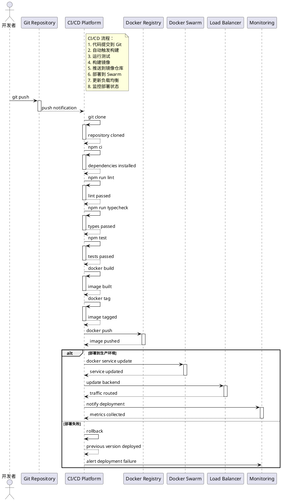
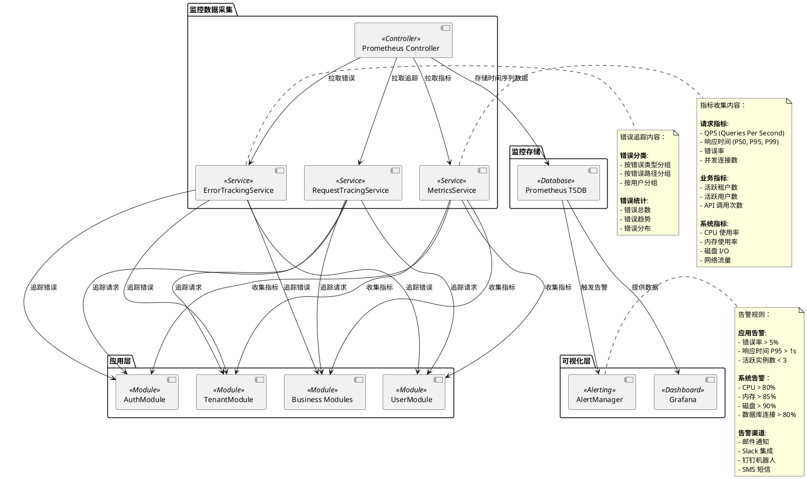

# OKSAI Platform - 部署架构图

## 生产环境部署架构

```plantuml
@startuml
!define RECTANGLE class

package "客户端层" {
    [Web 应用] <<Frontend>>
    [移动应用] <<Mobile>>
}

package "负载均衡层" {
    [Nginx Ingress] <<Load Balancer>>
}

package "应用层" {
    [base-api\n(Instance 1)] <<App>> {
        [AuthModule]
        [TenantModule]
        [UserModule]
    }
    [base-api\n(Instance 2)] <<App>> {
        [AuthModule]
        [TenantModule]
        [UserModule]
    }
    [base-api\n(Instance 3)] <<App>> {
        [AuthModule]
        [TenantModule]
        [UserModule]
    }
}

package "数据层" {
    [PostgreSQL\n(Primary)] <<Database>> {
        [Tenant Database]
        [User Database]
        [Role Database]
    }
    [Redis Cluster] <<Cache>> {
        [Redis Master]
        [Redis Slave 1]
        [Redis Slave 2]
    }
    [OpenSearch Cluster] <<Search>> {
        [OpenSearch Node 1]
        [OpenSearch Node 2]
        [OpenSearch Node 3]
    }
}

package "分析层" {
    [Jitsu Analytics] <<Analytics>>
    [Cube OLAP] <<OLAP>>
}

package "存储层" {
    [MinIO Gateway] <<Storage>> {
        [MinIO Server 1]
        [MinIO Server 2]
    }
}

package "监控层" {
    [Prometheus Server] <<Monitoring>>
    [Grafana Dashboard] <<Dashboard>>
}

package "外部服务" {
    [SMTP Server] <<Email>>
    [CDN Service] <<CDN>>
}

[Web 应用] --> [Nginx Ingress] : HTTPS
[移动应用] --> [Nginx Ingress] : HTTPS

[Nginx Ingress] --> [base-api\n(Instance 1)] : 负载均衡
[Nginx Ingress] --> [base-api\n(Instance 2)] : 负载均衡
[Nginx Ingress] --> [base-api\n(Instance 3)] : 负载均衡

[base-api\n(Instance 1)] --> [PostgreSQL\n(Primary)] : 数据访问
[base-api\n(Instance 2)] --> [PostgreSQL\n(Primary)] : 数据访问
[base-api\n(Instance 3)] --> [PostgreSQL\n(Primary)] : 数据访问

[base-api\n(Instance 1)] --> [Redis Cluster] : 缓存/会话
[base-api\n(Instance 2)] --> [Redis Cluster] : 缓存/会话
[base-api\n(Instance 3)] --> [Redis Cluster] : 缓存/会话

[base-api\n(Instance 1)] --> [OpenSearch Cluster] : 日志搜索
[base-api\n(Instance 2)] --> [OpenSearch Cluster] : 日志搜索
[base-api\n(Instance 3)] --> [OpenSearch Cluster] : 日志搜索

[base-api\n(Instance 1)] --> [Jitsu Analytics] : 事件追踪
[base-api\n(Instance 2)] --> [Jitsu Analytics] : 事件追踪
[base-api\n(Instance 3)] --> [Jitsu Analytics] : 事件追踪

[base-api\n(Instance 1)] --> [Cube OLAP] : 数据分析
[base-api\n(Instance 2)] --> [Cube OLAP] : 数据分析
[base-api\n(Instance 3)] --> [Cube OLAP] : 数据分析

[base-api\n(Instance 1)] --> [MinIO Gateway] : 文件存储
[base-api\n(Instance 2)] --> [MinIO Gateway] : 文件存储
[base-api\n(Instance 3)] --> [MinIO Gateway] : 文件存储

[base-api\n(Instance 1)] --> [SMTP Server] : 邮件发送
[base-api\n(Instance 2)] --> [SMTP Server] : 邮件发送
[base-api\n(Instance 3)] --> [SMTP Server] : 邮件发送

[base-api\n(Instance 1)] --> [Prometheus Server] : 指标暴露
[base-api\n(Instance 2)] --> [Prometheus Server] : 指标暴露
[base-api\n(Instance 3)] --> [Prometheus Server] : 指标暴露

[Prometheus Server] --> [Grafana Dashboard] : 监控数据

[MinIO Gateway] --> [CDN Service] : 静态资源分发

note right of base-api\n(Instance 1)
  应用实例：
  - NestJS + Node.js
  - PM2 进程管理
  - 3 个实例（高可用）
  - 共享数据层
end note

note right of PostgreSQL\n(Primary)
  数据库配置：
  - PostgreSQL 14+
  - 主从复制（读写分离）
  - 连接池管理
  - 定期备份
end note

note right of Redis Cluster
  缓存配置：
  - Redis 6+
  - 主从架构
  - Sentinel 哨兵
  - 数据持久化
end note

@enduml
```

## Docker 编排

```plantuml
@startuml
database "Docker 网络" {
    network "overlay" {
        [base-api Network]
        [Database Network]
        [Monitoring Network]
    }
}

participant "Docker Compose" as compose
participant "Docker Swarm" as swarm

note right of compose
  服务容器：

  **应用服务**:
  - base-api: 3 replicas
  - Nginx: 1 replica

  **数据服务**:
  - PostgreSQL: 1 primary, 2 replicas
  - Redis: 1 master, 2 slaves
  - OpenSearch: 3 nodes

  **分析服务**:
  - Jitsu: 1 instance
  - Cube: 1 instance

  **存储服务**:
  - MinIO: 4 servers

  **监控服务**:
  - Prometheus: 1 instance
  - Grafana: 1 instance
end note

compose --> [base-api Network] : overlay
compose --> [Database Network] : overlay
compose --> [Monitoring Network] : overlay

[base-api Network] --> [base-api\n(Container)] : 连接
[Database Network] --> [PostgreSQL\n(Container)] : 连接
[Database Network] --> [Redis\n(Container)] : 连接

[Monitoring Network] --> [Prometheus\n(Container)] : 连接
[Monitoring Network] --> [Grafana\n(Container)] : 连接

swarm --> [base-api\n(Service)] : 部署
swarm --> [PostgreSQL\n(Service)] : 部署

note right of swarm
  Docker Swarm 配置：

  **服务模式**:
  - Replicated mode: base-api, PostgreSQL
  - Global mode: Nginx, Prometheus

  **网络**:
  - Overlay network for service communication
  - Internal network for database access

  **存储**:
  - Volume mounts for data persistence
  - Separate volumes for each service

  **健康检查**:
  - HTTP health check for base-api
  - TCP check for PostgreSQL, Redis
  - Command check for OpenSearch
end note

@enduml
```

## CI/CD 流程



## 监控体系



## 部署配置说明

### 环境配置

| 环境           | 实例数 | 副本 | 请求量     | SLA   |
| -------------- | ------ | ---- | ---------- | ----- |
| **开发环境**   | 1      | 1    | ~100/s     | 99%   |
| **测试环境**   | 2      | 1    | ~1,000/s   | 99%   |
| **预生产环境** | 3      | 2    | ~10,000/s  | 99.5% |
| **生产环境**   | 3+     | 3+   | ~100,000/s | 99.9% |

### 容器资源配置

| 服务           | CPU     | 内存 | 存储  | 说明        |
| -------------- | ------- | ---- | ----- | ----------- |
| **base-api**   | 2 cores | 4GB  | 20GB  | 每个实例    |
| **PostgreSQL** | 4 cores | 8GB  | 100GB | 主节点      |
| **Redis**      | 1 core  | 2GB  | 5GB   | Master 节点 |
| **OpenSearch** | 4 cores | 8GB  | 50GB  | 每个节点    |
| **MinIO**      | 2 cores | 4GB  | 500GB | 每个服务器  |
| **Prometheus** | 2 cores | 4GB  | 50GB  | 监控数据    |
| **Grafana**    | 1 core  | 2GB  | 20GB  | 仪表板      |

### 安全措施

1. **网络安全**:

    - TLS/SSL 加密通信
    - VPN 内网隔离
    - 防火墙规则

2. **容器安全**:

    - 容器镜像扫描
    - 最小化基础镜像
    - 非 root 用户运行

3. **数据安全**:

    - 数据库连接加密
    - 密钥管理服务
    - 定期备份和加密

4. **访问控制**:

    - RBAC 权限管理
    - API 访问限流
    - 请求签名验证

5. **应急响应**:
    - 自动故障转移
    - 备份快速恢复
    - 灾难恢复计划
