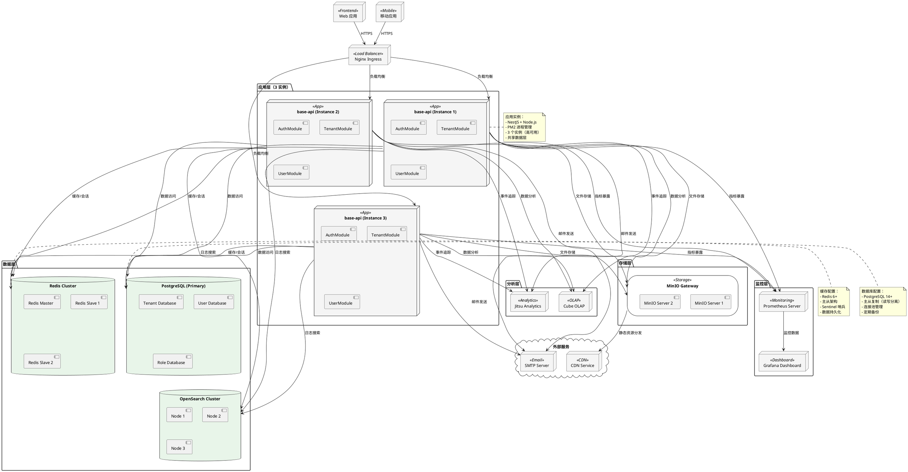
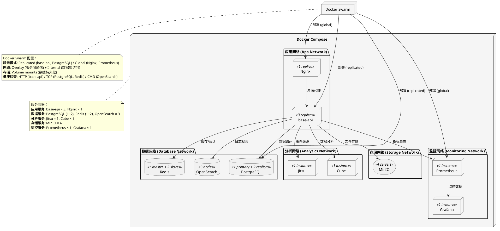
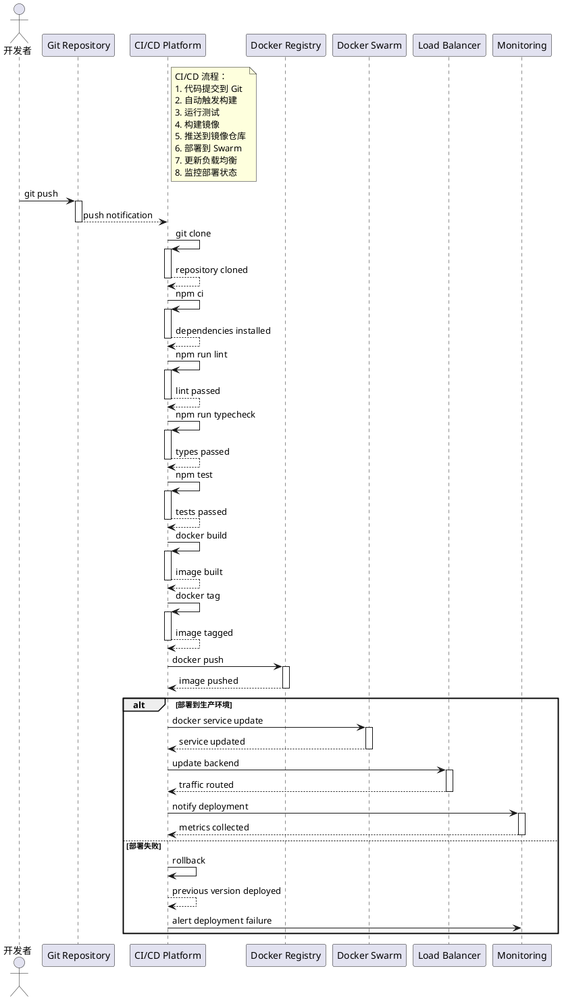
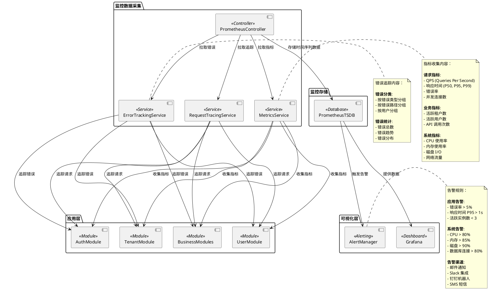

# OKSAI Platform - 部署架构图

## 生产环境部署架构

## Docker 编排

## CI/CD 流程

## 监控体系

## 部署配置说明

### 环境配置

| 环境           | 实例数 | 副本 | 请求量     | SLA   |
| -------------- | ------ | ---- | ---------- | ----- |
| **开发环境**   | 1      | 1    | ~100/s     | 99%   |
| **测试环境**   | 2      | 1    | ~1,000/s   | 99%   |
| **预生产环境** | 3      | 2    | ~10,000/s  | 99.5% |
| **生产环境**   | 3+     | 3+   | ~100,000/s | 99.9% |

### 容器资源配置

| 服务           | CPU     | 内存 | 存储  | 说明        |
| -------------- | ------- | ---- | ----- | ----------- |
| **base-api**   | 2 cores | 4GB  | 20GB  | 每个实例    |
| **PostgreSQL** | 4 cores | 8GB  | 100GB | 主节点      |
| **Redis**      | 1 core  | 2GB  | 5GB   | Master 节点 |
| **OpenSearch** | 4 cores | 8GB  | 50GB  | 每个节点    |
| **MinIO**      | 2 cores | 4GB  | 500GB | 每个服务器  |
| **Prometheus** | 2 cores | 4GB  | 50GB  | 监控数据    |
| **Grafana**    | 1 core  | 2GB  | 20GB  | 仪表板      |

### 安全措施

1. **网络安全**:

    - TLS/SSL 加密通信
    - VPN 内网隔离
    - 防火墙规则

2. **容器安全**:

    - 容器镜像扫描
    - 最小化基础镜像
    - 非 root 用户运行

3. **数据安全**:

    - 数据库连接加密
    - 密钥管理服务
    - 定期备份和加密

4. **访问控制**:

    - RBAC 权限管理
    - API 访问限流
    - 请求签名验证

5. **应急响应**:
    - 自动故障转移
    - 备份快速恢复
    - 灾难恢复计划
